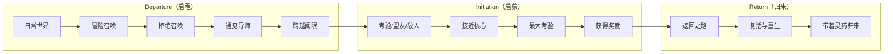
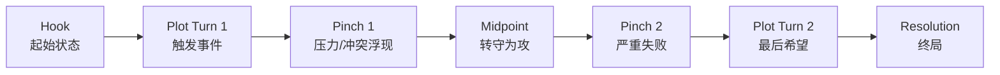
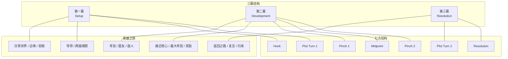

# 补充课03：英雄之旅与七点结构

## Learning Objectives

- 理解英雄之旅（Hero's Journey / Monomyth）的核心三阶段
- 掌握 12 个阶段的英雄之旅简化模型
- 掌握七点结构（Seven-Point Structure）的六个转折点
- 比较两者与三幕结构的关系
- 判断在什么情况下使用哪种结构

---

## 两种结构的定位

主课程的 [[0008-three-act-structure|三幕结构]] 是西方叙事最基础的骨架。英雄之旅和七点结构都是三幕结构的具体化变体 —— 它们把三幕中的"重要节点"进一步细化，为编剧提供更详细的路线图。

- **英雄之旅（Hero's Journey）：** 来源于 Joseph Campbell 的比较神话学研究，强调**角色的心理转变历程**。
- **七点结构（Seven-Point Structure）：** 来源于 Dan Wells 的叙事模型，强调**故事转折的逻辑因果链**。

两者描述的是同一个故事发动机，只是拆解的视角不同。

---

## 英雄之旅：Campbell 的 Monomyth

Joseph Campbell 在《千面英雄》（The Hero with a Thousand Faces, 1949）中研究了世界各地的神话后发现，几乎所有英雄故事都遵循一个共同的结构模式。他称之为 **Monomyth（单一神话）**。

### 三阶段核心

### 12 个阶段详解

| 阶段 | 功能 | 电影例子（《Star Wars: A New Hope》） |
|---|---|---|
| **启程（Departure）** | | |
| 1. 日常世界（Ordinary World） | 展示英雄在冒险前的普通生活 | Luke 在 Tatooine 星球的农场劳作 |
| 2. 冒险召唤（Call to Adventure） | 一个事件打破日常 | R2-D2 带来的 Leia 全息信息 |
| 3. 拒绝召唤（Refusal of the Call） | 英雄因恐惧或责任不愿出发 | Luke 对 Obi-Wan 说"我要帮叔叔收割" |
| 4. 遇见导师（Meeting the Mentor） | 导师提供指导、工具或训练 | Obi-Wan 教 Luke 使用原力 |
| 5. 跨越阈限（Crossing the Threshold） | 英雄离开日常世界，进入冒险世界 | Luke 的家被毁，他决定跟随 Obi-Wan |
| **启蒙（Initiation）** | | |
| 6. 考验、盟友、敌人（Tests, Allies, Enemies） | 英雄在新世界中学习规则，建立关系 | Han Solo 加入，Millennium Falcon 上的冒险 |
| 7. 接近核心（Approach to the Inmost Cave） | 英雄接近最危险的地方 | 接近 Death Star |
| 8. 最大考验（Ordeal） | 英雄面临最大的危机或死亡威胁 | 营救 Leia 时的战斗 |
| 9. 获得奖励（Reward / Seizing the Sword） | 英雄取得目标 | 救出 Leia，获得 Death Star 数据 |
| **归来（Return）** | | |
| 10. 返回之路（The Road Back） | 带着奖励返回，但仍有追兵 | 被 Tie Fighter 追击 |
| 11. 复活与重生（Resurrection） | 英雄面临最终净化考验 | Luke 摧毁 Death Star 的最后一击 |
| 12. 带着灵药归来（Return with the Elixir） | 英雄带回改变世界的东西 | 颁奖仪式，Luke 成为英雄 |

> [!NOTE]
> 并非所有电影都严格使用全部 12 个阶段。英雄之旅是一个**模板（Template）** 而非**公式（Formula）**。你完全可以根据需要省略或合并某些阶段。

---

## 七点结构：Dan Wells 的逻辑链

Dan Wells 在 2011 年的写作研讨会中提出了七点结构（Seven-Point Structure）。它比英雄之旅更紧凑，强调**前后对称的因果逻辑**。

### 七个节点

| 节点 | 功能 | 与三幕对应 |
|---|---|---|
| **1. Hook（钩子 / 起始状态）** | 故事开始时主角的状态 —— 通常是"缺乏某种东西"或"被困在某状态" | 第一幕前半段 |
| **2. Plot Turn 1（第一转折）** | 一个事件打破 Hook 状态的平衡，故事开始 | Catalyst / First Turning Point |
| **3. Pinch 1（第一施压）** | 对手展示力量，主角意识到冲突的严重 | 第二幕前半段 |
| **4. Midpoint（中点）** | 主角从被动转为主动，开始反击 | Midpoint |
| **5. Pinch 2（第二施压）** | 似乎一切都要失败，最大的挫折 | Second Turning Point / "All Seems Lost" |
| **6. Plot Turn 2（第二转折）** | 主角发现最后的办法或突破 | 第三幕开始 |
| **7. Resolution（终局）** | 最终达成目标，主角的状态与 Hook 形成对比 | Climax + Resolution |

> [!TIP]
> 七点结构的**核心思想是对称**：Resolution 是 Hook 的反面。如果 Hook 是"主角懦弱"，Resolution 就是"主角勇敢"；如果 Hook 是"主角孤独"，Resolution 就是"主角找到了归属"。Plot Turn 1 和 Plot Turn 2 是对称的触发点，Pinch 1 和 Pinch 2 是对称的压力点。

---

## 并排比较：三幕 / 英雄之旅 / 七点结构

> [!NOTE]
> 三幕结构是"骨架"，英雄之旅是"心理旅程"，七点结构是"因果逻辑链"。它们描述的是同一个故事，只是在不同抽象层次上。**不要把它们当作竞争关系，而是互补的工具。**

---

## 何时使用哪种结构

| 结构 | 最适合的场景 | 不适用的情况 |
|---|---|---|
| **三幕结构** | 几乎所有叙事 | 极简实验电影（如完全无情节的影片） |
| **英雄之旅** | 成长主题、奇幻/科幻冒险、主角变化明显的剧情 | 多重主角的群戏、反派主角的故事（可用"反派版"调整） |
| **七点结构** | 类型片（惊悚、动作、悬疑需要严密因果链时）；短篇写作 | 松散叙事、意识流或章节式结构 |

### 实际项目中的组合使用

很多专业编剧会同时参考多种结构：

1. 用**三幕结构**确定整体布局（哪里是开头、中间、结尾）
2. 用**英雄之旅**校准主角的心理成长轨迹
3. 用**七点结构**检查因果链是否断裂

> [!WARNING]
> 结构是**分析工具**，不是**写作公式**。如果你在写初稿时被结构束缚住了手脚，先放下结构，把故事写完。修改时再用这些工具去审视和优化。

---

## 实践练习

### 练习 A：英雄之旅分析

选择一部符合英雄之旅模式的电影（《Star Wars》、《The Matrix》、《The Lord of the Rings》等），在 12 个阶段中至少识别出 8 个。记录每个阶段对应的场景。

### 练习 B：七点结构规划

使用七点结构为你的下一个剧本概念做规划：

| 节点 | 你的内容 |
|---|---|
| Hook（主角的起始状态） | |
| Plot Turn 1（什么打破了起始状态） | |
| Pinch 1（对手第一次展示力量） | |
| Midpoint（主角从被动转为主动的关键决定） | |
| Pinch 2（最大的失败/挫折） | |
| Plot Turn 2（最后的突破/希望） | |
| Resolution（终局，与 Hook 形成对比） | |

参考答案模板：以《The Matrix》为例

| 节点 | 内容 |
|---|---|
| Hook | Neo 是一名黑客，感到世界不对劲，但找不到答案 |
| Plot Turn 1 | Morpheus 联系 Neo，给出红蓝药丸选择 |
| Pinch 1 | Neo 进入 Matrix 训练，发现代理人的强大 |
| Midpoint | Neo 接受"我是救世主"的使命，决定救 Morpheus |
| Pinch 2 | Morpheus 被俘，Neo 和 Trinity 被认为没有胜算 |
| Plot Turn 2 | 先知预言被重新解读 —— Neo 的能力超出想象 |
| Resolution | Neo 击败代理人，从"迷茫的黑客"变成"觉醒的救世主" |

---

## 本章小结

- **英雄之旅**（Monomyth）是 Campbell 从全球神话中提炼的叙事模式，强调英雄的心理转变。12 个阶段分布在三幕中：启程（第一幕）、启蒙（第二幕）、归来（第三幕）。
- **七点结构**是 Dan Wells 提出的逻辑化叙事模型，强调序列间的因果对称：Resolution 是 Hook 的反面，Plot Turn 1 和 2 对称，Pinch 1 和 2 对称。
- 三幕结构是**骨架**，英雄之旅是**心理路径**，七点结构是**因果链**。三者可以组合使用。
- 这些结构是分析工具，不是死板公式。理解它们的逻辑后，你可以根据需要灵活调整。

---

## 下一步

- **下一课：** [[s04-save-the-cat|补充课04：Save the Cat 节拍表]] — 将三幕结构细化到 15 个具体节拍，这是 Hollywood 最实用的剧本写作清单
- **课后练习：**
  1. 以你最近看过的一部电影为例，分别用三幕结构、英雄之旅和七点结构画出它的结构图。哪种结构最能清晰地解释这部电影为什么有效？
  2. 如果你的剧本概念用七点结构检查发现"Pinch 2"远不如"Pinch 1"有冲击力，你需要做什么调整？
- **自我测验：**
  1. Campbell 的英雄之旅的三阶段核心名称是什么？
  2. 英雄之旅中"拒绝召唤"的功能是什么？
  3. 七点结构的"Pinch"和"Plot Turn"有什么区别？
  4. 七点结构的核心对称原则是什么？
  5. 这些结构是规则还是工具？为什么？

参考答案

1. Departure（启程）→ Initiation（启蒙）→ Return（归来）。
2. "拒绝召唤"展示英雄的恐惧和犹豫，让观众理解英雄将要面对的挑战是真实的、令人畏惧的。它为后续"跨越阈限"蓄势 —— 克服恐惧的英雄才更有魅力。
3. "Pinch"（施压）是对手展示力量的时刻，主角处于被动；"Plot Turn"（情节转折）是故事重心的主动变化，主角做出选择开启新阶段。
4. Resolution 是 Hook 的反面（如果 Hook 是"主角懦弱"，Resolution 就是"主角勇敢"）；Plot Turn 1 和 Plot Turn 2 是对称的触发点；Pinch 1 和 Pinch 2 是对称的压力点。
5. 它们是工具，不是规则。结构帮助你理解和优化故事，但不应该限制你的创造力。当你被结构束缚时，放下它，写完再修改。

---

> **参考：** [[reference/glossary|编剧术语表]]