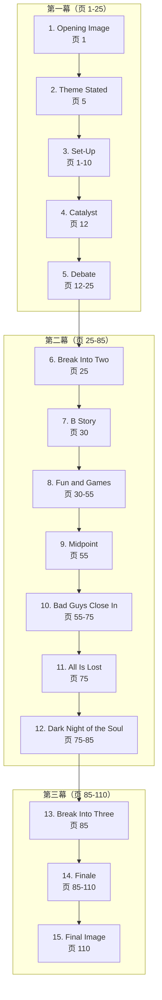

# 补充课04：Save the Cat 节拍表

## Learning Objectives

- 掌握 Save the Cat 的 15 个节拍及其在剧本中的分布
- 理解每个节拍的功能和时机
- 学会将 15 个节拍缩放到短片项目
- 认识到节拍表作为工具与作为公式的区别

---

## 从宏观到更细的粒度

主课程的 [[0008-three-act-structure|三幕结构]] 提供了宏观骨架，[[s03-hero-journey-seven-point|补充课03的英雄之旅与七点结构]] 增加了心理路径和因果逻辑。现在要向更细的粒度前进。

Blake Snyder 的《Save the Cat》（2005）是过去二十年在 Hollywood 编剧圈最具影响力的写作方法之一。它的核心是一个 **15 节拍节拍表（15-Beat Sheet）**，将三幕结构细化为一张从第 1 页到第 110 页的精准路线图。

### 名称的由来

"Save the Cat" 这个名字本身就是一个节拍 —— Snyder 说，你需要让观众在第一幕中**看到主角做一件令人喜欢的事**，比如救一只猫。这并不一定真的要救猫，而是要**在早期建立观众对主角的同情**。

> [!NOTE]
> "Save the Cat" 这个设计揭示了一个深层原则：观众不需要主角是好人（Hero），但需要主角是**可认同的（Relatable）**。一个"救猫"的动作比任何背景故事都更能建立情感连接。

---

## 15 节拍详解

下面的节拍表和页数分布假设一部标准 Hollywood 长片约 110 页。

### 第一幕：设置（页 1-25）

| 节拍 | 位置 | 功能 | 例子 |
|---|---|---|---|
| **1. Opening Image（开场画面）** | 页 1 | 用视觉传达故事开始前主角的**状态**，通常与 Final Image 形成对比 | 《The Social Network》开场：Mark Zuckerberg 穿着拖鞋在酒吧奔跑，格格不入 |
| **2. Theme Stated（主题陈述）** | 页 5 | 通常由一个次要角色说出故事的**主题**—— 主角此时不会理解，但故事的走向将证明这句话 | 《The Godfather》：Don Corleone 对 Sonny 说"一个不关心家庭的男人永远不是真正的男人" |
| **3. Set-Up（设置）** | 页 1-10 | 展示主角的日常生活、性格缺陷、缺失的东西。所有需要被打破的元素 | 《Legally Blonde》开场：Elle Woods 是完美的"校园芭比"，但她的价值被低估 |
| **4. Catalyst（催化剂）** | 页 12 | 打破日常世界的事件。故事真正开始。与三幕结构的 Catalyst 一致 | 《Die Hard》：John McClane 到达 Nakatomi Plaza，发现圣诞派对变成了人质事件 |
| **5. Debate（辩论）** | 页 12-25 | 主角犹豫："我要不要去做？"有时表现为角色问自己"我要不要回去？" | 《The Matrix》：Neo 被 Morpheus 告知真相后，在红蓝药丸之间犹豫 |

> [!TIP]
> Debate 是很多新手编剧会**跳过**的节拍。主角在 Catalyst 之后立刻接受任务，看起来效率很高，但实际上失去了一个让观众理解主角内心冲突的机会。先"不愿意"，然后才"愿意"，角色的转变才有份量。

### 第二幕：发展与对抗（页 25-85）

| 节拍 | 位置 | 功能 | 例子 |
|---|---|---|---|
| **6. Break Into Two（进入第二幕）** | 页 25 | 主角做出决定，进入"新世界"。第一幕结束 | 《The Wizard of Oz》：龙卷风把 Dorothy 带到 Oz |
| **7. B Story（B 故事）** | 页 30 | 主情节之外的次要故事线，通常是**爱情线**或**主题线**。B Story 中的人会帮助主角理解主题 | 《When Harry Met Sally》：Harry 和 Sally 之间的长期友谊/爱情线 |
| **8. Fun and Games（游戏时间）** | 页 30-55 | 预告片中的大部分内容。展示主角在新世界中的**探索和尝试**。如果是爱情片，这里是"他们甜蜜的约会阶段"；如果是冒险片，这里是"英雄试炼" | 《Star Wars》：Luke 学习原力、驾船逃离 Death Star、营救 Leia |
| **9. Midpoint（中点）** | 页 55 | 故事发生转折。要么主角取得"虚假胜利"（然后变糟），要么遭遇"重大失败"（然后反弹）。中点之后的情绪基调发生变化 | 《The Lord of the Rings: The Fellowship of the Ring》：Boromir 的背叛和 Gandalf 的"死亡" |
| **10. Bad Guys Close In（坏人逼近）** | 页 55-75 | 中点到第二转折点之间的阶段。压力增大，问题累积，主角的内部冲突和外部冲突同时升级 | 《The Empire Strikes Back》：从 Hoth 逃离到 Han Solo 被冻结 |
| **11. All Is Lost（一切尽失）** | 页 75 | 一个毁灭性的事件发生。似乎所有希望都已破灭。与三幕结构的"Burn it to the ground"一致 | 《Toy Story 3》：Woody 和朋友们被困在垃圾处理厂，即将被焚烧 |
| **12. Dark Night of the Soul（灵魂暗夜）** | 页 75-85 | All Is Lost 后主角的消化期。他感到失败、绝望、不知如何继续。这是角色成长前的"最低点" | 《Rocky》：Rocky 在冠军赛前的夜晚告诉 Adrian "我赢不了的" |

> [!WARNING]
> 不要把 Dark Night of the Soul 简单理解为"主角很难过"。这应该是**主角旧有信念的崩塌时刻** —— 他之前赖以生存的某种错误观念在这时被彻底击碎。只有旧的信念崩塌，新的信念才能建立。

### 第三幕：解决（页 85-110）

| 节拍 | 位置 | 功能 | 例子 |
|---|---|---|---|
| **13. Break Into Three（进入第三幕）** | 页 85 | 主角从旧信念中苏醒，领悟了解决问题需要的**新方法或新心态**。故事进入最终阶段 | 《The Sixth Sense》：Cole 告诉 Malcolm "我可以看到死人"，接受了自己的能力 |
| **14. Finale（终场高潮）** | 页 85-110 | 主角运用在第三幕学到的新方法，解决中央故事问题，击败对手，达成目标 | 《Jaws》：Quint、Brody 和 Hooper 最终猎杀鲨鱼 |
| **15. Final Image（终场画面）** | 页 110 | 展示主角经历了故事后的**新状态**。与 Opening Image 形成视觉和主题上的对比 | 《The Social Network》终场：Mark 一直在刷新 Erica 的朋友申请页面，他成功了，但他孤独 |

> [!TIP]
> Final Image 必须与 Opening Image 形成对比。Opening Image 是"主角有什么问题"，Final Image 是"主角解决了问题 —— 或者没解决，但观众理解了他为什么没解决"。这种对比是观众在潜意识中感受到的"故事完整性"。

---

## Save the Cat 与三幕结构的对照

| 三幕 | Save the Cat 节拍 |
|---|---|
| **第一幕** | Opening Image, Theme Stated, Set-Up, Catalyst, Debate, Break Into Two |
| **第二幕前半段** | B Story, Fun and Games, Midpoint |
| **第二幕后半段** | Bad Guys Close In, All Is Lost, Dark Night of the Soul |
| **第三幕** | Break Into Three, Finale, Final Image |

> [!NOTE]
> 注意三幕结构的"Break Into Two"对应的不是 Catalyst 而是第 25 页的决定点。Catalyst（页 12）让故事开始，Break Into Two（页 25）才让主角真正"进入新世界"。

---

## 将节拍表缩放到短片

如果写的是短片（比如 15 页），15 个节拍需要等比压缩，有些节拍可以合并甚至省略：

| 节拍 | 110 页长片位置 | 15 页短片位置 |
|---|---|---|
| Opening Image | 页 1 | 页 1 |
| Theme Stated | 页 5 | 页 1-2（可更快） |
| Set-Up | 页 1-10 | 页 1-3 |
| Catalyst | 页 12 | 页 3-4 |
| Debate | 页 12-25 | 页 4-5 |
| Break Into Two | 页 25 | 页 5 |
| B Story | 页 30 | 可选，可能无 |
| Fun and Games | 页 30-55 | 页 5-8 |
| Midpoint | 页 55 | 页 8 |
| Bad Guys Close In | 页 55-75 | 页 8-11 |
| All Is Lost | 页 75 | 页 11 |
| Dark Night of the Soul | 页 75-85 | 页 11-12 |
| Break Into Three | 页 85 | 页 12 |
| Finale | 页 85-110 | 页 12-14 |
| Final Image | 页 110 | 页 14-15 |

> [!WARNING]
> 短片没有 10 页从容地做 Set-Up。你的 Catalyst 可能在第 2 页或第 3 页就出现了。在短片里，"速度"是生存之道。可以考虑省略 Theme Stated（用视觉传达）和 Debate（用动作传达）。

---

## 工具，不是规则

Save the Cat 节拍表是一个非常实用的工具，但需要正确认识它的位置：

| 工具属性 | 说明 |
|---|---|
| **它是模板** | 提供经过检验的故事节奏，但不是死规格 |
| **它可以被打破** | 有些优秀的电影故意打破节拍顺序 |
| **它基于 Hollywood 类型片** | 不一定适用于实验电影或跨文化叙事 |
| **它是分析工具** | 最好在修改时使用，而不是在初稿时限制自己 |

> [!TIP]
> 先用直觉写完初稿，然后用 Save the Cat 节拍表去分析："我的 Catalyst 出现得太晚了吗？我的 Dark Night of the Soul 是否真正改变了主角的信念？" 用节拍表来找到问题，而不是限制创作。

---

## 实践练习

### 练习 A：节拍识别

选择一部你熟悉的商业电影（推荐《Toy Story》、《Legally Blonde》、《Die Hard》等 Snyder 本人也分析过的电影），在观看时记录 15 个节拍各自出现的时间和内容。

### 练习 B：节拍规划

用 15 节拍表规划你自己的剧本概念。不需要写详细的场景，只需要为每个节拍写一两句话说明在这个故事中它是什么。

参考答案示例：《Toy Story》15 节拍

| 节拍 | 内容 |
|---|---|
| Opening Image | Andy 房间里的玩具在"活动"—— 这是一个玩具的世界 |
| Theme Stated | Woody 对 Buzz 说："你不只是一个玩具，你是 Andy 的玩具"（主题：存在的意义在于被爱） |
| Set-Up | Woody 是 Andy 最爱的玩具，领导者地位稳固 |
| Catalyst | Andy 生日，Buzz Lightyear 出现了 |
| Debate | Woody 尝试接受 Buzz，但内心嫉妒 |
| Break Into Two | Woody 试图把 Buzz 推到桌子后面，但意外把他推出了窗外 |
| B Story | Sid 和他的狗 Scud（黑暗版"玩具世界"） |
| Fun and Games | Buzz 和 Woody 闯入 Sid 的家，遇到变异玩具 |
| Midpoint | Buzz 看到电视广告，意识到自己只是一个玩具（身份危机） |
| Bad Guys Close In | Sid 准备用火箭炸掉 Buzz，Woody 被 Scud 追赶 |
| All Is Lost | Buzz 放弃，Woody 被困在箱子下 |
| Dark Night of the Soul | Buzz 接受了自己是玩具的事实，但不觉得自己有存在的意义 |
| Break Into Three | Woody 说服 Buzz："你是 Andy 的玩具，这就是你的意义" |
| Finale | Woody 和 Buzz 合作逃脱 Sid，追上了搬家卡车 |
| Final Image | 玩具们和谐地在一起，Woody 和 Buzz 并肩站在 Andy 的床上 |

---

## 本章小结

- **Save the Cat 节拍表** 是 Blake Snyder 提出的 15 节拍线性结构，是对 [[0008-three-act-structure|三幕结构]] 的最细化版本。
- **第一幕（页 1-25）：** Opening Image → Theme Stated → Set-Up → Catalyst → Debate → Break Into Two
- **第二幕前半段（页 25-55）：** B Story → Fun and Games → Midpoint
- **第二幕后半段（页 55-85）：** Bad Guys Close In → All Is Lost → Dark Night of the Soul
- **第三幕（页 85-110）：** Break Into Three → Finale → Final Image
- **核心原则：** Opening Image 与 Final Image 形成对比；Theme 在页 5 被陈述，在第三幕被证明；Midpoint 改变情绪基调；Dark Night of the Soul 是旧信念的崩塌。
- 节拍表是**分析工具**，不是创作公式。先写后改，用节拍表检查和优化。

---

## 下一步

- **下一课：** [[s05-character-arcs|补充课05：角色弧光 — 从扁平到变化]] — 从结构转向角色，深入探索角色如何在故事中变化
- **课后练习：**
  1. 找一部节拍表不太"标准"但仍然成功的电影（如《Pulp Fiction》或《Eternal Sunshine of the Spotless Mind》），用 15 节拍去分析它。哪些节拍被重新排列了？哪些被省略了？为什么？
  2. 用 15 节拍表重新审视你正在写的剧本。哪个节拍最弱？是 Debate 被跳过了？还是 Dark Night of the Soul 不够彻底？
- **自我测验：**
  1. "Save the Cat" 这个名字指的是什么节拍？它的功能是什么？
  2. Theme Stated 通常在第几页？由谁说？
  3. Fun and Games 在预告片中的比例为什么这么大？
  4. Dark Night of the Soul 与 All Is Lost 的区别是什么？
  5. Opening Image 和 Final Image 之间需要什么关系？

参考答案

1. "Save the Cat" 是 Set-Up 阶段中的一个设计 —— 主角做一件让人喜欢的事来赢得观众的同情。不需要真的救猫，核心是建立观众对主角的情感认同。
2. Theme Stated 通常在约页 5，通常由**次要角色**（而不是主角）说出。主角此时不理解这句话的含义，故事的发展将证明它是正确的。
3. Fun and Games 是"预告片内容"，因为它展示了电影最吸引人的特质 —— 在新世界中的探索、幽默、动作或浪漫。这是观众买票来看的部分。
4. All Is Lost 是**外部事件** —— 一个灾难性的事件发生（如伙伴死亡）。Dark Night of the Soul 是**内部反应** —— 主角在事件后的绝望和旧信念的崩塌。先有外部打击，后有内部崩溃。
5. Opening Image 和 Final Image 需要形成**对比**：前者展示"主角有什么问题"，后者展示"主角经历了故事后变成了什么"。这个对比是观众感受到"故事完整性"的关键。

---

> **参考：** [[reference/glossary|编剧术语表]]