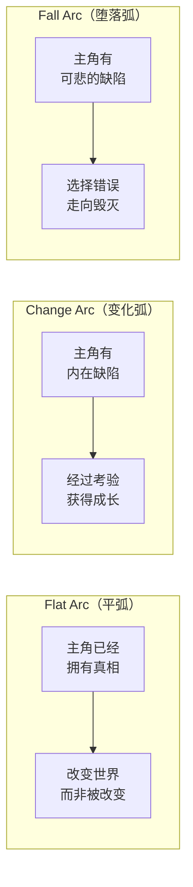
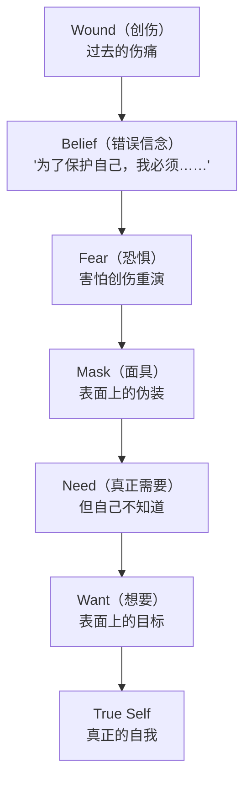
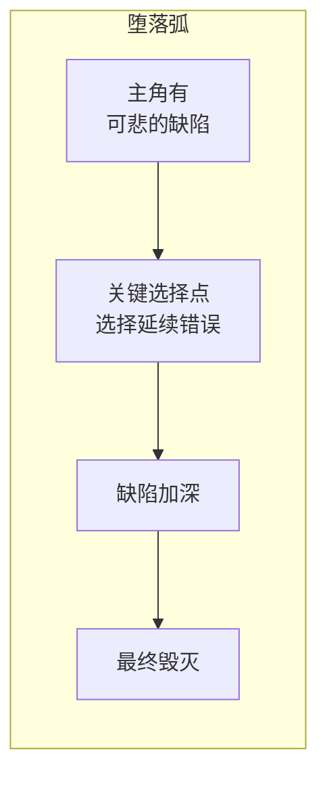

# 补充课05：角色弧光 — 从扁平到变化

## Learning Objectives

- 掌握三种角色弧光的定义和适用场景
- 理解 Flat Arc（平弧）何时是更好的选择
- 掌握 Change Arc（变化弧）的内部机制
- 理解 Fall Arc / Tragic Arc（堕落弧）的结构
- 学会使用 Wound → Belief → Fear → Mask → Need → Want → True Self 模型构建角色
- 分析《The Last of Us》中的弧光案例

---

## 为什么弧光重要

[[0006-ideas-research|创意与调研]] 一课中提到了角色在故事中的重要性。现在我们要把焦点完全放在角色弧光（Character Arc）上。

**弧光（Arc）** 是角色在故事中经历的内在变化轨迹。没有弧光的角色不是"角色"，是"功能"—— 他们推动了情节，但观众不会真正关心他们。

最简单的问题：**故事结束时，你的主角和开始时有什么不同？**

如果答案是否定的，你的故事可能缺一个角色弧光。

---

## 三种弧光类型



| 类型 | 核心问题 | 典型故事 |
|---|---|---|
| **Flat Arc（平弧）** | 主角已经是对的，他需要改变的是世界 | James Bond, Indiana Jones, 超级英雄系列 |
| **Change Arc（变化弧 / Positive Arc）** | 主角是错的，他需要克服缺陷才能成功 | 大多数成长故事 |
| **Fall Arc（堕落弧 / Tragic Arc）** | 主角被自己的缺陷吞噬，拒绝改变 | 悲剧（《Macbeth》、《The Godfather》） |

---

## Flat Arc（平弧）：主角改变世界

### 工作原理

Flat Arc 的主角并不是"没有弧光"—— 他的弧光在于**他始终相信自己的核心价值观，并通过行动改变了周围的世界**。

> [!NOTE]
> Flat Arc 的主角通常在第一幕就已经拥有了"真相"或"正确的价值观"。故事的任务不是让他学到什么，而是**证明他的价值观是正确的**。

### 适用于

- **系列化角色**：James Bond、Sherlock Holmes、Indiana Jones —— 观众不希望他们改变
- **道德明确的类型片**：超级英雄电影中，英雄的信念是"正义必能胜"
- **主角作为变革代理人**：当主角的功能是改变体制而非被体制改变

### Flat Arc 的结构

```
故事开始: 主角 = 有坚定的正确信念
故事过程: 外部力量挑战这个信念
故事结局: 主角证明信念正确，世界因此改变
```

### 例子

- **《The Great Gatsby》：** Gatsby 始终相信"过去的爱情可以被挽回"，他不改变，但观众对他的信念的看法被改变了
- **《James Bond》：** Bond 永远是 Bond。他的弧线不是内在成长，而是在每一次任务中重新证明自己的能力和信念

> [!WARNING]
> Flat Arc 不等于"无趣"。Flat Arc 的主角必须有**极高的人格魅力、行动力或智慧**来维持观众的兴趣，因为观众不会因"他变了"而被吸引。

---

## Change Arc（变化弧）：主角被改变

这是最常见的弧光类型。主角带着内在缺陷进入故事，在冲突和考验中成长，最终克服缺陷。

### 内在旅程模型



### 七要素详解

| 要素 | 定义 | 例子（《Finding Nemo》Marlin） |
|---|---|---|
| **Wound（创伤）** | 角色过去的伤痛，通常是故事开始前发生的事 | 妻子和儿女被鲨鱼杀死，只剩 Nemo |
| **Belief（错误信念）** | 从创伤中得出的扭曲结论 —— 不是真的，但角色深信不疑 | "我必须保护 Nemo，世界太危险了" |
| **Fear（恐惧）** | 角色最害怕发生的事 —— 通常与创伤直接相关 | 害怕失去 Nemo |
| **Mask（面具）** | 角色在外部展现的人格 —— 用来保护自己不受创伤重现 | 过度保护、焦虑、控制欲强 |
| **Need（真正需要）** | 角色**自己不知道**但真正需要的东西 —— 故事结束时他应该获得的 | 学会放手、信任 Nemo 能照顾自己 |
| **Want（想要）** | 角色**自己认为**想要的东西 —— 表面的目标 | "把 Nemo 安全找回来" |
| **True Self（真正的自我）** | 故事结束时，角色克服创伤后的理想状态 | 平衡的爱与信任的 Marlin |

> [!TIP]
> **Need vs Want 是角色设计中最重要的张力之一。** Want 驱动情节（主角在追逐什么），Need 驱动主题（主角真正需要什么）。当 Want 和 Need 冲突时，角色必须做出选择 —— 这就是戏剧性所在。

### Change Arc 的三幕节奏

```
第一幕: 展示角色的 Wound, Belief, Mask, Want
        — 观众看到角色有问题，但他自己看不到
第二幕: 考验积累，Want 不断受挫
        — 观众的视角逐渐转移到 Need 上
        — 中点开始，角色隐约意识到 Need
第三幕: 角色被迫在 Want 和 Need 之间做出选择
        — 选择 Need → 成长，获得 True Self
        — 选择 Want → 可能转向 Fall Arc
```

---

## Fall Arc（堕落弧）：拒绝改变

Fall Arc 和 Change Arc 的起点非常相似：角色都有缺陷和创伤。区别在于**在关键选择点，角色选择了继续走错误的路**。



### 与 Change Arc 的区别

| 节点 | Change Arc | Fall Arc |
|---|---|---|
| 起点 | 有缺陷但可改正 | 有缺陷但被放大 |
| 中点选择 | 开始意识到 Need | 拒绝接受 Need |
| 第三幕 | 选择 Need → True Self | 选择 Want → 更深堕落 |
| 结局 | 积极成长 | 悲剧/毁灭 |

### 例子

- **《The Godfather》：** Michael Corleone 从"我不想参与家族生意"的战争英雄开始，最终成为比父亲更冷酷的黑手党首领。他每一步的选择都是"为了家族"，但每一步都离自己的初衷更远。
- **《Breaking Bad》：** Walter White 从"为了家人"制毒到"因为我擅长这个"的纯粹堕落。

> [!NOTE]
> Fall Arc 最有力的特点是**让观众看到"如果是我，我可能也会这样选择"**。堕落弧不应该是"纯粹的邪恶"，而应该是一步一步的自我毁灭，每一步都合情合理，但加在一起却走向深渊。

---

## 角色驱动 vs 情节驱动

参见主课程 [[0006-ideas-research|创意与调研]] 中关于角色 vs 概念的讨论。

| 维度 | 角色驱动（Character-driven） | 情节驱动（Plot-driven） |
|---|---|---|
| 弧光类型 | 通常是 Change Arc 或 Fall Arc | 通常是 Flat Arc |
| 故事重心 | 角色的内心变化 | 外部事件的推进 |
| 观众关注 | "他会变成什么样？" | "接下来会发生什么？" |
| 典型代表 | 《The Shawshank Redemption》、《Lost in Translation》 | 《Jurassic Park》、《Die Hard》 |

> [!QUESTION]
> 你的故事是角色驱动还是情节驱动？如果你的主角换一个人故事仍然成立，那它可能更像情节驱动。如果换了主角故事就完全失效了，那它就是角色驱动。

---

## 游戏案例分析：《The Last of Us》

《The Last of Us》是展示弧光设计的教科书级案例，因为它包含了两个不同的弧光轨迹。

### Ellie：Change Arc

| 要素 | Ellie 的旅程 |
|---|---|
| **Wound** | 在隔离区长大，失去所有亲近的人 |
| **Belief** | "我只能靠自己，没有人会留下来" |
| **Fear** | 被抛弃、独自一人 |
| **Mask** | 早熟、刻薄、不依赖任何人的外表 |
| **Need** | 学会信任他人，找到值得为之战斗的东西 |
| **Want** | 到达火萤，证明自己的免疫有意义 |
| **True Self** | 愿意为所爱之人牺牲的人 |

Ellie 从"没人会留下"到最终选择"我会留下（陪 Joel）"—— 她克服了被抛弃的恐惧。

### Joel：Fall Arc

| 要素 | Joel 的旅程 |
|---|---|
| **Wound** | 女儿 Sarah 在疫情爆发的第一天被杀 |
| **Belief** | "保护自己和他人的唯一方式是不再在乎任何人" |
| **Fear** | 再次经历失去所爱之人的痛苦 |
| **Mask** | 冷漠、务求生存的走私者 |
| **Need** | 学会继续爱、信任和放手 |
| **Want** | 把 Ellie 安全送到火萤 |
| **True Self（拒绝的）** | 但 Joel 在最后关头**拒绝了 Need** |

Joel 的弧光之所以是 Fall Arc 而非 Change Arc，关键在结局：他选择牺牲拯救人类的可能性来救 Ellie，本质上是为了**避免再次经历失去的痛苦**。他在最后一刻做出了看似爱、实则恐惧的选择。

> [!TIP]
> 一个故事之所以能同时容纳 Ellie 的 Change Arc 和 Joel 的 Fall Arc，是因为两人的弧光**互为镜像**：Ellie 学会了信任（Change），Joel 选择了逃避信任（Fall）。一个积极，一个悲剧，但都由"信任"这个主题统一。

---

## 实践练习

### 练习：构建角色的内在旅程

为你正在创作的角色填写以下表格：

| 要素 | 你的角色 |
|---|---|
| **Wound（创伤）** — 角色过去经历了什么？ | |
| **Belief（错误信念）** — 从创伤中得出的结论是什么？ | |
| **Fear（恐惧）** — 角色最害怕发生什么？ | |
| **Mask（面具）** — 角色在外部如何表现自己？ | |
| **Need（真正需要）** — 角色需要学会什么（自己不知道）？ | |
| **Want（想要）** — 角色认为自己想要什么？ | |
| **Arc Type（弧光类型）** — 你的角色是什么弧光？ | |
| **True Self（真正的自我）** — 故事结束时（或终点）角色变成了什么样？ | |

<details><summary>参考答案模板：以《The Shawshank Redemption》Andy 为例</summary>

| 要素 | Andy |
|---|---|
| Wound | 妻子出轨后被诬陷谋杀，含冤入狱 |
| Belief | "只要按规矩来，正义终会到来"（后转变为"正义需要自己去争取"）|
| Fear | 在监狱中失去希望和尊严 |
| Mask | 冷静、有条理、与所有人保持距离 |
| Need | 重新找回自由和希望 —— 不是"出狱"（外在），而是"不被监狱吞噬自我"（内在） |
| Want | 在 Shawshank 中生存下来并找到越狱的机会 |
| Arc Type | Change Arc —— 从被动相信正义到主动争取自由 |
| True Self | 一个即使在最黑暗的环境中也能保持内心自由并最终获得身体自由的人 |

</details>

---

## 本章小结

- **三种弧光类型**：
  - **Flat Arc（平弧）**：主角已经正确，他改变的是周围的世界。适用于系列化角色和道德明确的类型片。
  - **Change Arc（变化弧）**：主角有内在缺陷，在故事中成长并克服缺陷。最常见的弧光类型。
  - **Fall Arc（堕落弧）**：主角在关键选择点拒绝了改变，走向毁灭。让观众看到"合情合理的悲剧"。
- 角色内在旅程的七要素模型：**Wound → Belief → Fear → Mask → Need → Want → True Self**。其中 **Need vs Want 的张力**是角色设计的核心。
- 角色驱动 vs 情节驱动的区分帮助你在构思时明确重心。

---

## 下一步

- **回到主课程：** [[0008-three-act-structure|第08课：三幕式故事结构]] 将弧光与结构对齐，理解角色变化如何在三幕中展开
- **课后练习：**
  1. 选一个你最喜欢的电影角色，分析他们的 Wound、Belief、Fear、Mask、Need、Want。
  2. 判断他们是 Flat Arc、Change Arc 还是 Fall Arc。如果是 Flat Arc，他们改变世界的方式是什么？如果是 Change Arc，他们在哪个关键节点放弃了 Want 选择了 Need？如果是 Fall Arc，他们在哪个节点拒绝了 Need？
  3. 将你的分析结果与 [[0009-beats-scenes-sequences|节拍、场景与序列]] 中的场景层级对照，看看角色的弧光转折体现在哪些具体的场景中。
- **自我测验：**
  1. 三种角色弧光的名称是什么？各自的核心区别是什么？
  2. Flat Arc 的主角在故事开始时有什么特质？
  3. Need 和 Want 的区别是什么？为什么这种张力重要？
  4. Fall Arc 和 Change Arc 的起点相似，区别在哪？
  5. 《The Last of Us》中 Ellie 和 Joel 的弧光分别是哪种类型？

<details><summary>参考答案</summary>

1. Flat Arc（平弧）、Change Arc（变化弧/积极弧）、Fall Arc（堕落弧/悲剧弧）。区别在于：Flat Arc 的主角改变世界；Change Arc 的主角改变自己（成长）；Fall Arc 的主角拒绝改变（毁灭）。
2. Flat Arc 的主角在故事开始时已经拥有"正确"的信念或价值观。故事的任务不是让他改变，而是让他证明自己是正确的，并影响周围的人或世界。
3. Need（真正需要）是角色**自己不知道但真正缺乏的东西**，涉及内心成长；Want（想要）是角色**自己认为想要的东西**，驱动外部情节。当两者冲突时，角色必须做出选择 —— 这是戏剧性的核心来源。
4. 两者起点相似：角色都有缺陷或创伤。区别在关键选择点：Change Arc 的主角选择面对 Need、克服缺陷；Fall Arc 的主角拒绝 Need、延续错误，走向更深的堕落和毁灭。
5. Ellie 是 Change Arc（从害怕被抛弃到学会信任和爱）；Joel 是 Fall Arc（从封闭自己到在最后关头以"爱"之名拒绝放手，本质上是被自己的恐惧驱动）。

</details>

---

> **参考：** [[reference/glossary|编剧术语表]] | [[0006-ideas-research|第06课：创意与调研]]