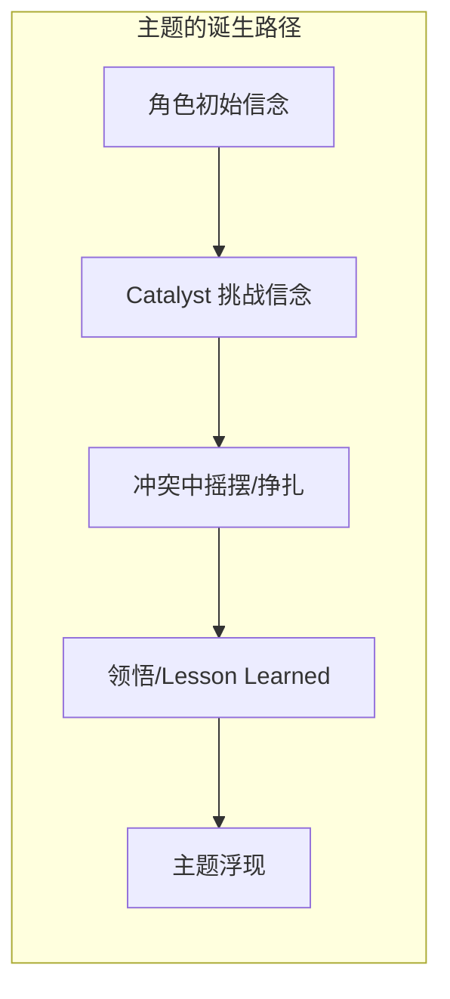

# 补充课06：主题 — 故事的核心表达

## Learning Objectives

- 理解主题（Theme）与道德（Moral）和前提（Premise）的根本区别
- 掌握主题如何通过角色弧光自然呈现
- 学习 Save the Cat 的 "Theme Stated" 节拍及其应用
- 了解影视主题与游戏主题的差异——交互式主题探索
- 能够从已知电影中准确识别出核心主题

---

## 1. 什么是主题

### 1.1 主题不是道德

许多初学者会混淆主题（Theme）和道德（Moral）。两者的区别至关重要：

| 概念 | 定义 | 例子 |
|---|---|---|
| **道德（Moral）** | 一个明确的、说教性的结论 | "诚实是最好的策略" |
| **前提（Premise）** | 故事的基本设定 | "一个说谎的男人被发现后失去了妻子" |
| **主题（Theme）** | 故事表面之下探讨的核心议题 | "真相与信任的关系" |

> [!TIP]
> 主题不是一个句子，而是一个**问题**。好的故事不告诉观众应该怎么想，而是邀请观众共同思考。
>
> Film 主题："What does it mean to be free?"
> Game 主题："Is choice an illusion?"

### 1.2 主题 vs 前提（Premise）

前提是故事的具体起点，主题是故事的抽象内核。

```
Premise: 一名银行家被冤入狱，在狱中度过二十年。
Theme:   在绝望中坚持希望——希望是否真的可以穿透高墙？
```

> [!NOTE]
> 同一个前提可以承载不同的主题。《肖申克的救赎》讲的是「希望」；如果换一个编剧来写，同一个故事可能变成「复仇」或「救赎」。前提是骨架，主题是灵魂。

### 1.3 主题的特征

- **普遍性（Universal）** — 主题应当触及人类共通的情感与困境
- **可探讨性（Debatable）** — 主题不应该有标准答案
- **贯穿性（Pervasive）** — 主题应当渗透到故事的每一个层面：情节、对白、视觉符号

---

## 2. 主题从角色弧光中生长

主题不是编剧硬塞进故事的，而是从[[s05-character-arcs|补充课05：角色弧光]]中自然生长出来的。

### 2.1 角色相信什么

每个主角在故事开始时都有一套**信念系统**（Belief System）。这套信念在故事过程中被挑战，最终被重塑——这个过程就是主题呈现的过程。



### 2.2 经典公式

> 主题 = 主角在故事中**学会的东西**

- 如果主角学会了"信任他人是值得的" → 主题是信任
- 如果主角学会了"有些牺牲是必要的" → 主题是牺牲
- 如果主角学会了"过去无法逃避" → 主题是直面历史

### 2.3 例子：《肖申克的救赎》（The Shawshank Redemption）

| 元素 | 内容 |
|---|---|
| **主题** | 希望（Hope） |
| **Andy 的初始信念** | 只要保持希望，就能生存 |
| **Red 的初始信念** | 希望是危险的东西，会让人发疯 |
| **主题浮现的时刻** | Red 最终选择追随 Andy 去芝华塔尼欧——他学会了希望 |
| **视觉主题符号** | 越狱的洞、海报、雨中的双臂、太平洋海滩 |

> [!QUESTION]
> 为什么通过 Red 的视角而不是 Andy 的视角来呈现主题效果更好？因为 Red 是**变化者**（the one who changes），他是观众在故事中的替身。Andy 从头到尾都是坚定的，他的信仰不是"学会的"，而是"坚守的"。

---

## 3. Theme Stated — "主题被点明"节拍

### 3.1 Save the Cat 的 Beat Sheet

Blake Snyder 在 Save the Cat 中提出了 Beat Sheet，其中第 5 个节拍就是 **Theme Stated（主题被点明）**，通常发生在第 5 页左右。

这个节拍的特征是：

- 通常由一个**非主角**的角色说出一句关于主题的提示
- 主角**听到了但不在意**——因为他还未准备好理解
- 故事结束时，主角会用行动来回应这句话

### 3.2 经典案例

**《泰坦尼克号》**

> Jack: "I'm the king of the world!"
> 主题：挣脱社会枷锁，拥抱自由

**《星球大战：新希望》**

> Obi-Wan: "You've taken your first step into a larger world."
> 主题：超越平凡，成为更伟大的存在

**《功夫熊猫》**

> Master Oogway: "Yesterday is history, tomorrow is a mystery, but today is a gift. That is why it's called the present."
> 主题：活在当下，相信自己

> [!WARNING]
> Theme Stated 不是主角的台词——如果主角从一开始就理解了主题，那么故事就没有成长空间了。主角必须在故事的结尾用自己的行动来印证这句话。

---

## 4. 影视主题与游戏主题的差异

### 4.1 线性 vs 交互式呈现

| 维度 | 电影/电视剧 | 电子游戏 |
|---|---|---|
| **主题呈现方式** | 叙事的自然流露 | 通过玩家选择和交互揭示 |
| **观众/玩家角色** | 旁观者（Observer） | 参与者（Participant） |
| **主题确定性** | 编剧决定的单一主题 | 多个潜在主题，取决于玩家选择 |
| **情感投入** | 共情（Empathy） | 代理感（Agency） |

### 4.2 游戏中的主题探索

游戏的主题不是通过角色"说什么"来呈现，而是通过玩家"做什么"来体验的。

#### 案例：《巫师 3：狂猎》（The Witcher 3: Wild Hunt）

**主题：Lesser Evil — 在两害之间选择**

在《巫师 3》的世界里，几乎没有纯粹的善恶二分。每一个选择都是灰色的：

- 一个村庄被怪物威胁，但怪物背后有悲惨的过去
- 两条政治道路都是腐败的，但其中一条可能更少流血
- 拯救一个人可能意味着牺牲更多人

> [!TIP]
> 游戏编剧的技巧在于：**设计选择时，让每个选项都有合理的道德依据**。如果有一个选项是"纯粹正确"的，那么主题就不成立了。正如 Geralt 常说的："Evil is evil. Stregobor, Renfri... lesser, greater, middling... it's all the same."

#### 案例：《最后生还者》（The Last of Us）

**主题：爱是否值得毁灭世界**

游戏结尾的争议性选择（Ellie 可能被牺牲以制造疫苗，但 Joel 选择了救她）完美地抛出了主题问题：如果拯救全人类的代价是失去你爱的人，你还会做"正确"的事吗？

---

## 5. 练习：识别电影主题

### 练习说明

观看/回忆以下三部电影，分析它们的主题：

1. **《寄生虫》（Parasite）**
2. **《盗梦空间》（Inception）**
3. **《疯狂动物城》（Zootopia）**

对每部电影，回答以下问题：

- 主题是什么？（用一两个关键词或一个开放问题来表达）
- 主角的初始信念是什么？最终信念是什么？
- 主题在哪个关键场景中被最有力地呈现？
- 有没有 Theme Stated 的时刻？谁说的？

<details>
<summary>点击查看参考答案</summary>

**《寄生虫》（Parasite）**

- 主题：阶级的不可逾越 / Class divide is inescapable
- 主角初始信念：通过欺骗可以跨越阶级界限
- 主角最终领悟：阶级的鸿沟是不可跨越的（洪水场景：穷人的地下室被淹，富人的花园照常派对
- 主题被最有力呈现的时刻：地下室"鬼魂"的出现——穷人永远隐藏在富人生活的下层空间
- Theme Stated 时刻：母亲说的"如果有钱，我也会很善良"（讽刺性地揭示了善良与财富的关系）

**《盗梦空间》（Inception）**

- 主题：现实与梦境的边界 / What is reality?
- Cobb 的初始信念：回家比一切都重要，哪怕混淆现实与梦境
- Cobb 的最终状态：不再在乎自己是不是在梦中——选择了相信
- 主题被最有力呈现的时刻：结尾的陀螺——观众被留在不知道答案的状态中
- Theme Stated 时刻：Mal 说"你不再知道什么是真实了"——Cobb 没有听进去

**《疯狂动物城》（Zootopia）**

- 主题：偏见与刻板印象 / Prejudice and breaking stereotypes
- Judy 的初始信念：只要努力就能打破偏见
- Judy 的成长：认识到自己也有偏见（对狐狸的刻板印象）
- 主题被最有力呈现的时刻：Judy 在记者会上说"可能是肉食动物的生物本能"——她重复了她正在对抗的偏见
- Theme Stated 时刻：年轻的 Judy 说"我可以改变世界"——她当时并不知道改变世界首先要改变自己

</details>

---

## 6. 主题创作检查清单

在为你的剧本确定主题时，自问以下问题：

- [ ] 我的故事在探讨一个**问题**还是一个**结论**？（问题更好）
- [ ] 主角在故事开始时的信念是什么？
- [ ] 主角在故事结束时的信念发生了什么变化？
- [ ] 这种变化如何体现在**行动**上（不只是说出来的话）？
- [ ] 有没有一个配角或契机在早期点明了主题？（Theme Stated）
- [ ] 我的主题是否融入了**视觉符号系统**？
- [ ] 如果改编成游戏，玩家的**选择**是否会与主题产生对话？

---

> 主题不是故事的装饰品——它是故事存在的理由。当你不知道你的故事在讲什么的时候，观众更不可能知道。从主题出发，每一个场景、每一句对白、每一个角色都有了方向和重量。