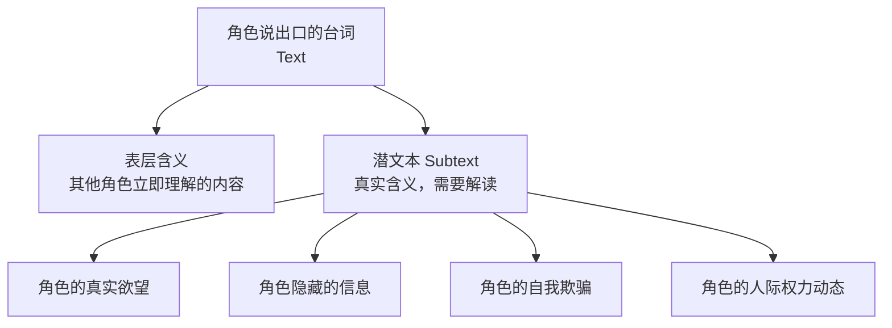
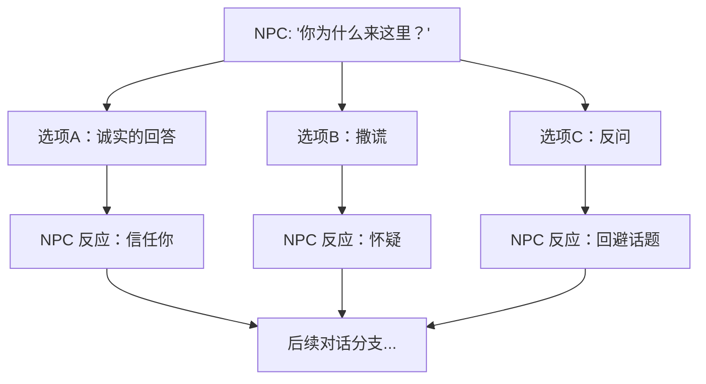

# 补充课07：潜文本与对白艺术

## Learning Objectives

- 理解潜文本（Subtext）的定义及其在场景中的核心作用
- 掌握冰山原则（Iceberg Principle）在对白中的应用
- 识别常见的对白写作陷阱：on-the-nose 写作和 exposition dump
- 学会运用讽刺、暗示、误导、留白等潜文本技巧
- 了解游戏对话系统（对话树、环形菜单、Paragon/Renegade）的叙事逻辑
- 能够将有问题的直白对白改写成蕴含潜文本的对白

---

## 1. 什么是潜文本

### 1.1 定义

潜文本（Subtext）是指角色说出口的台词之下的**真实含义**。它是角色没有说出来的欲望、恐惧、谎言和隐藏的目的。



> [!NOTE]
> 一个简单但深刻的公式：
>
> **Text + Context + Delivery = Meaning**
>
> 同样一句 "I'm fine."，在医院病床说、在分手时说、在被上司责骂后说——含义完全不同。

### 1.2 为什么潜文本重要

没有潜文本的场景是平的。当角色"有什么说什么"时，观众没有参与感。潜文本邀请观众成为**意义的共同创造者**（Co-creator of meaning）。

| 有潜文本 | 没有潜文本 |
|---|---|
| "你要去哪里？"（其实是在说"不要离开我"） | "请不要离开我，我还爱你" |
| "这件衣服很适合你"（其实是在说"我在乎你"） | "我很在乎你" |
| "你看起来很累"（其实是在说"我们得谈谈"） | "我们需要谈谈这件事" |

---

## 2. 冰山原则

### 2.1 Hemingway 的冰山理论

Ernest Hemingway 提出了著名的**冰山原则**（Iceberg Theory）：

> "If a writer of prose knows enough about what he is writing about, he may omit things that he knows and the reader, if the writer is writing truly enough, will have a feeling of those things as strongly as though the writer had stated them."

—— Ernest Hemingway, *Death in the Afternoon*

翻译过来就是：**一部好作品只露出八分之一的冰山。剩下的八分之七在水面之下，但读者能感受到它的存在。**

### 2.2 在对白中的应用

在对白写作中，冰山原则意味着：

- **台词文本** = 冰山的尖顶（八分之一）
- **角色的真实意图** = 水下的冰山（八分之七）
- **观众的任务** = 通过上下文推断水下冰山的形状

> [!TIP]
> **经验法则**：每次写完一段对白，问自己——这段对白是否是角色"可以直接说出来的话"？如果是，它很可能不够好。真实的对话中，人们几乎从来不说自己真正想说的。

---

## 3. 常见的对白陷阱

### 3.1 On-the-Nose Writing（直白写作）

这是初学者最常犯的错误——角色的台词精确地表达他们的感受和想法。

**问题版：**

> JOHN: 我很生气你背叛了我。
>
> SARAH: 我知道我做错了，但我当时别无选择。
>
> JOHN: 我不信任你了，我们的关系完蛋了。

**改写版：**

> JOHN: 你昨晚几点回来的？
>
> SARAH: 你没睡？
>
> JOHN: 你手机一直关机。
>
> SARAH: 没电了。
>
> JOHN: 你每次都这么说。
>
> (Sarah 低下头，没有反驳)

> [!WARNING]
> On-the-nose 写作的根源是对观众的不信任。编剧害怕观众不理解角色的感受，所以让角色全部说出来。但优秀的编剧恰恰相反——他们**信任观众的理解力**。

### 3.2 Exposition Dump（信息倾倒）

角色像百科全书一样向观众或另一个角色解释背景信息。

**问题版：**

> MARY: 这条项链是我祖母留给我的。她在我出生那年去世了。她年轻时是一名芭蕾舞者，在巴黎演出时遇到了我祖父。这条项链是他送给她的定情信物。

**改写版：**

> MARY: （盯着项链）她说人这一辈子总要相信一次。
>
> TOM: 你相信了吗？
>
> MARY: 我把项链留下来了。这就是我的回答。
>
> （我们不知道她相信了什么——但信息通过情感而不是事实传达给了我们）

> [!NOTE]
> 关于如何自然地融入背景信息，回顾 [[0013-8-steps-writing-screenplay|第13课：撰写剧本的 8 个步骤]] 中 Step 2 关于写实对白的原则。

---

## 4. 潜文本技巧

### 4.1 讽刺（Irony）

当角色说的话与实际情况相反时产生讽刺。观众知道真相，角色不知道。

**例子**：《奥赛罗》中 Iago 反复说"Honest Iago"——他说的每一个字都意味着相反的意思。

### 4.2 暗示（Implication）

角色不直接说出来，而是通过间接的方式让对方（和观众）自己推导出含义。

> A: "你确定这个办法能行吗？"
> B: "我做了十年了。"
> （潜文本：你是在质疑我的专业能力吗？）

### 4.3 误导（Misdirection）

让角色讨论一个话题来掩盖他们真正在乎的事情。

**例子**：两个角色激烈争论"该走哪条路"，实际上是在争论"该不该还信任对方"。

### 4.4 留白（What's NOT Said）

最重要的台词是那些**没有说出口**的台词。

- 角色在应该说话的时候保持沉默
- 角色改变了话题
- 角色用行动代替了语言
- 角色只说了一半就被打断

> [!TIP]
> 一个强烈的练习：写一段对白，然后**删除所有角色直接表达情感的台词**。剩下的就是潜文本。

### 4.5 重复与变奏

当角色重复某个词或短语时，它的含义可能在变化。

**例子**：在《当哈利遇见莎莉》中，Harry 反复说"男人和女人不能成为朋友"——每次出现的语调、上下文和含义都不同，最后这句话本身变成了潜文本（其实他在说"我喜欢你"）。

---

## 5. 案例：《社交网络》（The Social Network）的对白分析

### 5.1 经典场景

Mark Zuckerberg 和 Eduardo Saverin 在酒吧的开场对话——表面上是在讨论 Harvard 的社交圈和 Final Clubs，实际上是建立两个角色的世界观冲突。

| 文本（Text） | 潜文本（Subtext） |
|---|---|
| Mark: "Do you know what's interesting about the sign-up sheets at the Final Clubs?" | Mark 在说：我在乎的是社会系统的漏洞和逻辑 |
| Eduardo: "You need to get out more." | Eduardo 在说：你的思维方式有问题。你被排斥在社交圈之外，你需要改变 |
| Mark: "They're exclusive. They're exclusionary. They create an environment where..." | Mark 在说：我被排斥了，但我比他们聪明。我会用自己的方式赢 |
| Eduardo: "I'm not going to be your 'punching bag' tonight." | Eduardo 在说：我知道你在发泄，但我不想成为你愤怒的对象 |

> [!NOTE]
> Aaron Sorkin 的对白以快速、机智著称，但更深层的技术是：**每一个台词都在推进角色关系的变化**。没有一句话是"填充"的——每一句话要么在建立权力动态，要么在暴露角色的真实欲望。

---

## 6. 游戏对话系统

### 6.1 对话树（Dialogue Tree）

对话树是游戏中最常见的对话系统，玩家在分支节点选择不同回应。



### 6.2 潜文本在游戏中的特殊性

游戏中的潜文本多了一层——**玩家的选择本身就是潜文本**。

- 当玩家选择一个"讽刺"的回应选项时，潜文本是：玩家角色比看起来更聪明/更有防御性
- 当玩家选择"沉默"时，潜文本是：玩家在保留信息或表达冷漠
- 当玩家选择"Paragon"选项时，潜文本是：玩家角色相信系统是可以修复的

### 6.3 Paragon / Renegade 系统（质量效应系列）

Mass Effect 的 Paragon（模范）和 Renegade（叛逆）系统本质上是一个**潜文本的量化工具**：

- Paragon 选项的潜文本：我选择相信对话、合作、信任制度
- Renegade 选项的潜文本：我选择效率、威慑、怀疑制度

> [!WARNING]
> Paragon/Renegade 系统的批评者指出：它把潜文本变成了明确的二元选择，减少了灰色地带。这也是为什么后来的游戏（如《巫师 3》和《Disco Elysium》）转向了更模糊的选择框架——让潜文本保持在水面之下。

### 6.4 环形菜单（Radial Menu）

在《辐射》和《极乐迪斯科》中使用的环形菜单系统，让玩家通过**情绪状态**而不是**内容逻辑**来选择回应：

```
[愤怒] → 潜文本：我被激怒了，我必须反击
[同情] → 潜文本：我能理解你，我们是一边的
[质疑] → 潜文本：我不信任你，我需要更多信息
[幽默] → 潜文本：我不想正面回应这个问题
```

---

## 7. 练习：将直白对白改写成潜文本对白

### 练习说明

以下对白是典型的 on-the-nose 写作。请将其改写成含有**潜文本**的版本。不要直接表达情感或意图——让观众通过上下文和潜台词来理解。

**原始场景**：妻子（Anna）发现丈夫（Tom）在说谎，他根本没有加班。

> ANNA: 我知道你没有加班。你在骗我。
>
> TOM: 对不起骗了你。我只是不知道该怎么跟你沟通我的压力。
>
> ANNA: 我希望你能对我诚实。我们是夫妻，应该互相坦诚。
>
> TOM: 你说得对。我以后不会再撒谎了。

<details>
<summary>点击参考改写</summary>

> **参考版本一：压抑型**
>
> ANNA: 你衬衫上是什么？
>
> TOM: 什么？
>
> ANNA: 领口那里。
>
> TOM: （低头看）...记号笔。Kyle 非要在办公室玩飞镖。
>
> ANNA: 你们办公室不是白板墙吗？
>
> TOM: 所以我们才用记号笔。
>
> （Anna 看着他。Tom 没有移开目光，但一秒钟后才回答。）
>
> ---
>
> **参考版本二：对抗型**
>
> ANNA: 你给办公室打过电话。
>
> TOM: 什么时候？
>
> ANNA: 你出发之前。你说的"加班"。Sarah 说你发消息说今晚不回公司。
>
> TOM: 你查我？
>
> ANNA: 我在查你有没有丢。这是两回事。
>
> TOM: 我没丢。我还在。就在这儿。
>
> （沉默。Anna 看着他，等他再说点什么。Tom 没有。）

**技术分析**：

- 版本一用**细节**（记号笔墨水）代替了直接的质问。Tom 的回应越来越慢，暗示他在编造。
- 版本二用**语义错位**（"查你有没有丢" vs "查我"）来代替直接的"你不信任我"。
- 两个版本都没有使用"骗"、"谎"、"信任"、"对不起"这些直接词汇。

</details>

---

## 8. 对白潜文本快速检查表

写完对白后，逐项检查：

- [ ] 角色的每一句台词是否能被理解为**他真正想说的内容的替代品**？
- [ ] 如果去掉所有上下文，读者是否仍然能感受到场景的张力？
- [ ] 是否存在至少一个"什么都没说，但什么都说了"的时刻（沉默、转移话题、肢体动作）？
- [ ] 角色们是否在**不同层面上对话**——一个人说事实，另一个说情感？
- [ ] 这是否是角色**可能真的会说的话**，还是编剧为了推进情节硬塞的台词？
- [ ] 如果是一个游戏对话选项，每一个选项是否有不同的**潜文本颜色**（情绪/态度）？

---

> 对白的魔力不在于角色说了什么，而在于他们没有说什么。当你笔下的角色开口时，读者应该能听到水面之下冰山的轰鸣。