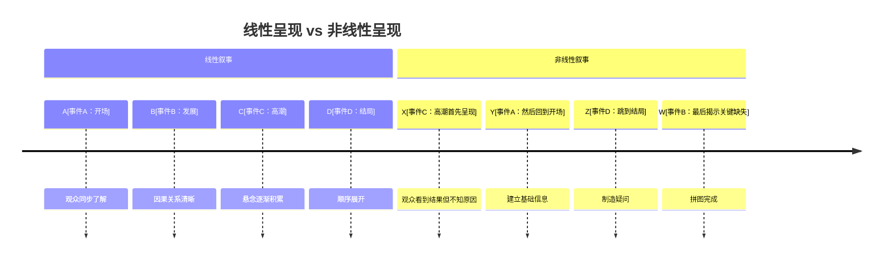
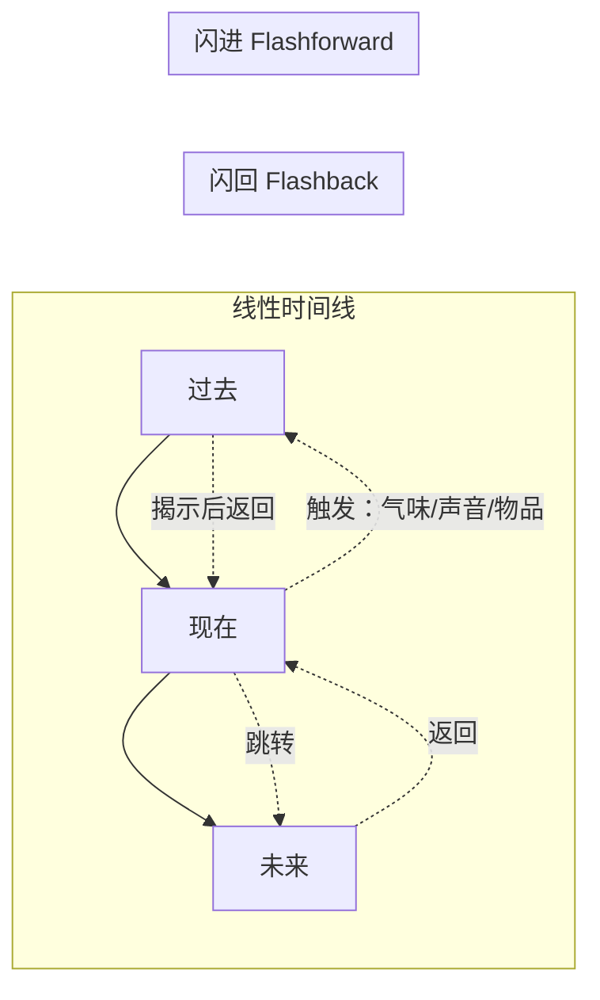
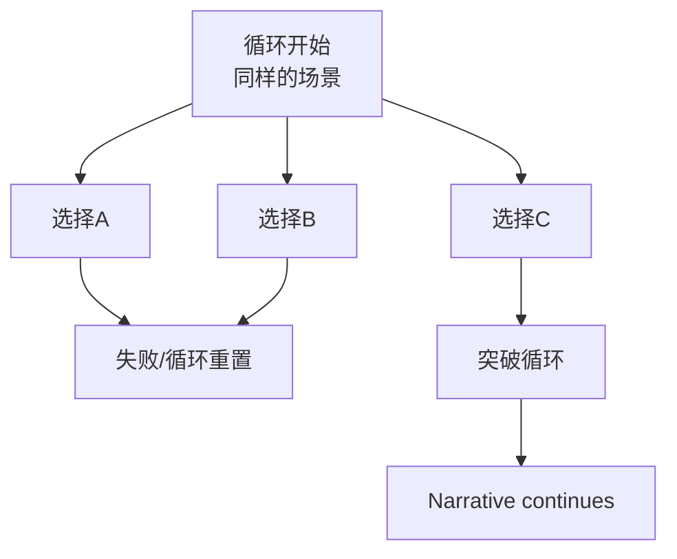
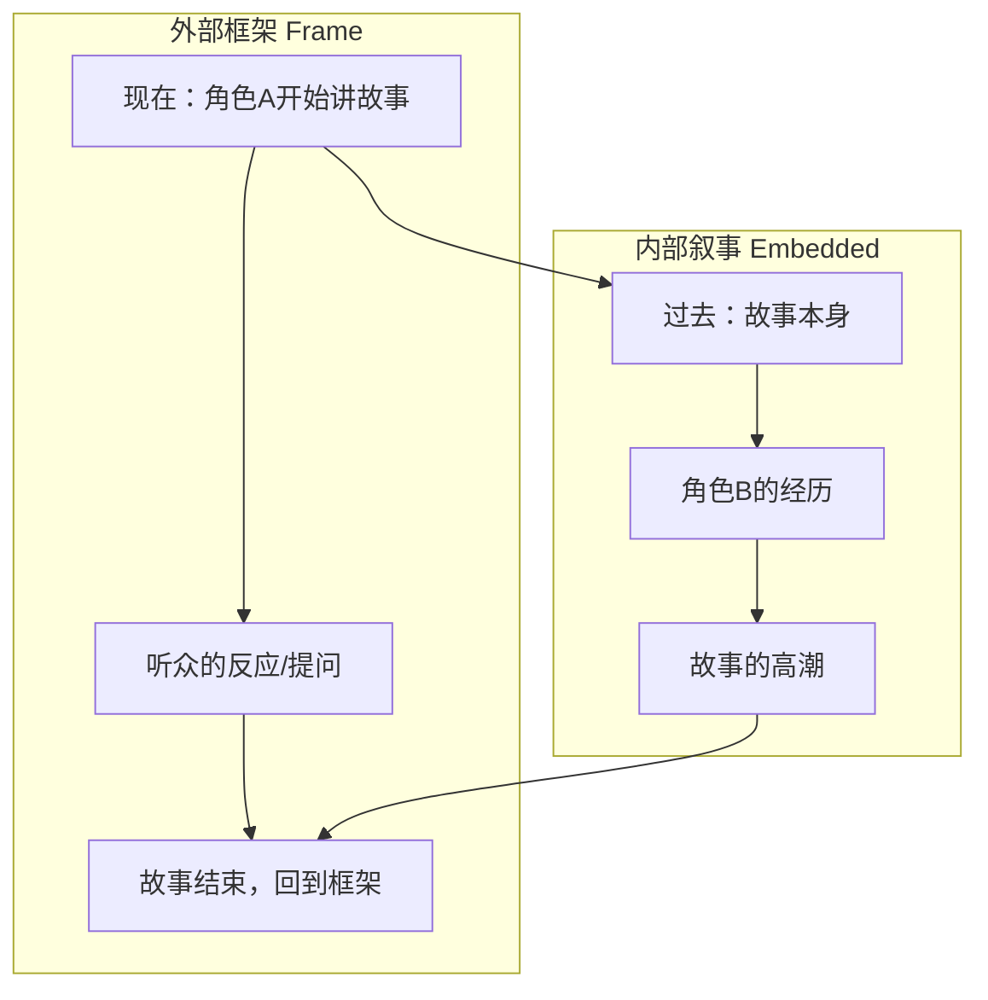

# 补充课08：非线性叙事与时间操纵

## Learning Objectives

- 理解线性叙事与非线性叙事的根本差异
- 掌握五种核心时间操纵技法：in medias res、闪回、闪进、平行时间线、时间循环
- 理解框架叙事（Frame Narrative）的结构原理
- 能够判断非线性结构是否有必要——"服务故事，而不是增加混乱"
- 通过影视和游戏案例学习时间操纵的设计思路

---

## 1. 线性 vs 非线性叙事

### 1.1 定义

**线性叙事（Linear Narrative）**：事件按照时间顺序呈现——A 发生后 B，B 发生后 C，观众与角色同步前进。

**非线性叙事（Nonlinear Narrative）**：事件不按照时间顺序呈现——观众在时间线索中跳跃，需要自己拼凑出完整的时间线。



> [!NOTE]
> 非线性叙事的核心不是"打乱顺序"，而是**重新安排信息交付的顺序**以达到特定的情感效果。编剧仍然知道完整的时间线——他们只是在选择什么时候告诉观众哪一块信息。

### 1.2 为什么使用非线性结构

| 目的 | 说明 |
|---|---|
| **制造悬念** | 先展示结果，再追溯原因（"他是怎么到这步田地的？"） |
| **控制信息流** | 延迟关键信息以最大化揭示时刻的情感冲击 |
| **建立主题关联** | 将不同时间点的事件并置，让观众发现因果关系 |
| **模仿记忆机制** | 人类记忆不是线性的——非线性叙事更接近真实的心理体验 |
| **创造参与感** | 观众必须主动拼凑故事，成为意义的共同创造者 |

---

## 2. 五种核心时间操纵技法

### 2.1 In Medias Res（中间开始）

**定义**：故事从情节的中间甚至高潮处开始，然后在适当的时候回述之前的事件。

**技术要点**：

- 开场序列通常是一个**高张力场景**（动作、追逐、对峙）
- 然后打出一个标题如"72 hours earlier"或"Three days ago"
- 开场场景与主线叙事的连接点需要精心设计——观众需要知道"我们在往回走"

**案例：《杀死比尔 Vol.1》**

影片开场是 The Bride 满脸是血地躺在地上，Bill 对她说了一句话，然后开枪。影片的大部分时间在闪回中展开——这不仅仅是为了炫技，而是**让我们在知道结局（The Bride 没有被杀死）后，带着复仇的期待来看前因**。

> [!WARNING]
> In medias res 的问题在于：如果开场场景过于精彩，观众回到"平淡的开始"时可能会失去耐心。解决方法：确保开场场景的**情感核心**足够强大，让观众愿意花时间了解"为什么会走到这一步"。

### 2.2 闪回（Flashback）与闪进（Flashforward）

**闪回**：回到过去，揭示导致当前情境的原因。
**闪进**：跳到未来，展示可能的后果或预告即将发生的事情。



**闪回的黄金法则**：

1. **必须有触发点** — 闪回不能被"随意"插入，必须由当前场景中的某个元素（一个声音、一个气味、一个物品）触发
2. **必须提供不可替代的信息** — 如果闪回的信息可以通过当前场景的对话来传递，那就不要用闪回
3. **必须改变观众对当前场景的理解** — 闪回不是填充背景，而是重新定义观众此刻的感知

**案例：《迷失》（Lost）**

每集中段的闪回不仅是角色背景故事，更是**主题的对位**——当前场景中角色面临的选择，在闪回中有一个平行选择。观众通过观察"当时的他做了怎样的决定"来理解"现在的他为什么是这样的人"。

> [!TIP]
> 优秀的闪回不仅是"告诉你过去发生了什么"，而是"让你重新理解现在正在发生的事情"。

### 2.3 平行时间线（Parallel Timelines）

**定义**：两条或多条时间线上的事件同时展开，通过剪辑交错呈现。

**技术要点**：

- 每条时间线最好有**不同的视觉标记**（色调、画幅比、字体）
- 平行时间线通常在**主题层面**而不是情节层面有交集
- 观众在观影过程中逐渐发现两条时间线的关联

**案例：《降临》（Arrival）**

《降临》是平行时间线运用的杰作——表面上是闪进，实际上是**时间感知的重构**。Louise 在学习 Heptapod 的语言后，她的时间感知变成了非线性的。影片的"闪进"实际上是她的**真实的未来体验**。

最终揭示：影片开头和结尾的场景是同一时间点——开头我们以为是"闪回"的片段，实际上是她尚未经历的未来。这一结构本身就是主题的呈现：**如果你知道一生中所有悲欢离合，你会选择去经历吗？**

### 2.4 时间循环（Time Loop）

**定义**：角色经历同一段时间的重复循环，每次循环中都保留部分或全部记忆。

**结构模型**：



**案例：《土拨鼠之日》（Groundhog Day）**

经典的时间循环结构，每次循环都有一个明确的**情感目标**：主角从"利用循环满足私欲"→"利用循环学习技能"→"利用循环帮助他人"→"真正活在当下"。循环的次数不是重点，**角色的变化才是**。

**案例：《Braid》**

游戏中的时间操纵是有代价的：主角可以倒转时间，但某些元素（钥匙、已死的敌人）不跟随时间倒转。这种机制本身就是主题的隐喻——**有些错误是无法挽回的，即使你能倒转时间**。

### 2.5 框架叙事（Frame Narrative）

**定义**：故事中包含另一个故事。"讲故事的人"构成外部框架（Frame），故事内容是内部叙事（Embedded Narrative）。

**结构**：



**案例：《阿甘正传》（Forrest Gump）**

影片用 Forrest 在长椅上向陌生人讲述自己一生的框架叙事。这个框架的作用：

- 提供喜剧节奏（听众的反应）
- 建立 Forrest 的叙述者性格（真诚、直接、不加修饰）
- 让观众意识到"这个故事是从一个特定视角讲述的"——连接到了[[s10-unreliable-narrator|补充课10：不可靠叙述者]]的概念

---

## 3. 非线性结构设计原则

### 3.1 服务故事，而不是增加混乱

这是最重要的原则。在决定使用非线性结构之前，问自己：

- [ ] 线性版本是否更有效？如果线性版本更好，那就不要用非线性
- [ ] 非线性结构是否增强了我希望观众体验的情感？
- [ ] 观众是否有足�的线索来理解时间跳跃？
- [ ] 时间操纵是否与**主题**相关？还是只是为了"看起来酷"？

> [!WARNING]
> 最糟糕的非线性叙事是那种"为了非线性而非线性"的结构。如果打乱时间线没有增加情感深度或主题复杂性，那么你只是在给观众制造不必要的困惑。

### 3.2 信号与规则

非线性叙事需要给观众明确的**时间信号**：

- **视觉信号**：色调变化、画幅比变化、字幕提示（"Three days earlier"）
- **叙事信号**：角色的年龄/外貌变化、技术/环境的变化
- **听觉信号**：音乐主题的变化、音效的差异

不要假设观众能跟上你的时间跳跃。**给每个时间段落一个标志性的锚点。**

### 3.3 完美非线性叙事的三个标准

1. **可理解性（Comprehensibility）**：第一次观看时，观众能否跟上主要情节？
2. **必要性（Necessity）**：非线性结构是否比线性结构更有力？
3. **一致性（Consistency）**：故事的时间规则是否自洽？（No "time travel rules that change midway"）

---

## 4. 案例深度分析

### 4.1 《记忆碎片》（Memento）—— 逆向叙事

**结构设计**：

- 彩色片段：倒叙（从结尾开始，一步步往前）
- 黑白片段：正叙（按时间顺序）
- 两条线在影片结尾处相遇

**为什么非线性对这部电影是必要的？**

Memento 的结构强迫观众体验主角 Leonard 的**主观体验**——他患有前向性遗忘症（anterograde amnesia），无法形成新记忆。观众就像 Leonard 一样，不知道刚刚发生了什么，只能通过零散的线索拼凑真相。

> [!TIP]
> 这是非线性叙事的最高境界：**结构本身就是主题的表达**。Memento 不是"把一个线性故事打乱"，而是"用非线性结构来模拟角色的内心体验"。

### 4.2 《低俗小说》（Pulp Fiction）—— 环形叙事

**结构设计**：故事不是按顺序讲的，而是形成了一个"环形"——结尾的时间点实际上发生在影片中间部分的时间点之前。

**为什么要这样安排？**

- 打乱时间线模糊了传统的"因果链"——观众无法用"因为他做了A，所以B发生了"的逻辑来理解故事
- 环形结构强调了**偶然性**和**命运的主题**——所有角色都在同一个世界中穿行，他们的相遇是注定的
- 最后一场（"I'm pretty fucking far from okay"）在时间上其实是较早的——昆汀把这个场景放在最后，让观众带着对角色的全新理解离开影院

### 4.3 《十三机兵防卫圈》（13 Sentinels: Aegis Rim）—— 十三条交错时间线

**结构设计**：13 个可操作角色，每个人物有自己的故事章节，覆盖的时间跨度从 1945 年到 2065 年。玩家从一个角色的只言片语中看到另一个角色故事的另一面。

**结构分析**：

- 每个角色都只掌握真相的一部分
- 玩家需要从 13 个不同的视角"拼出"完整故事
- 时间跨度为一百多年，但所有角色在"此刻"汇合

> [!NOTE]
> 13 Sentinels 展示了一个极端复杂的非线性叙事如何能成功：**核心逻辑必须自洽**。尽管时间线交错复杂，但所有时间线遵循统一的世界规则。玩家不断获得"原来如此！"的兴奋体验——这就是非线性叙事的最高回报。

---

## 5. 练习：设计一个非线性结构

### 练习说明

选择以下一个故事前提，设计一个非线性叙事结构。

**选项 A**：一名侦探调查一桩谋杀案，最终发现自己在时间循环中，他每一次调查都在加速凶手的行动。

**选项 B**：三个陌生人在同一场车祸中丧生，但他们的故事分别在 1999 年、2009 年、2019 年开始——他们在不同时间线上的选择最终导致了同一场车祸。

**选项 C**：一个老人临终前向孙子讲述自己年轻时的故事。孙子发现祖父的故事与历史记录不一致——不是祖父记错了，而是他隐瞒了某个关键真相。

为你的选择回答以下问题：

1. 线性版本的"正常"时间线是什么？
2. 非线性版本会从哪里开始？（In medias res 的起�？）
3. 闪回/闪进的触发点是什么？
4. 观众会在什么时候获得"原来如此"的揭示时刻？
5. 非线性结构是否增强了主题表达？

<details>
<summary>点击参考思路：选项A — 时间循环侦探</summary>

**线性时间线**：

```
第一天：侦探接手案件 → 第二天：访问第一个证人 → 第三天：访问第二个证人
→ 第四天：发现关键线索 → 第五天：追踪凶手 → 第六天：凶手再次作案
→ 第七天：对峙 → 第八天：抓获凶手
```

**非线性结构设计**：

```
开场（In Medias Res）：侦探在雨夜追捕凶手，但眼看要成功时"眼前一闪"——他回到了第一天。
标题卡："Loop 47"

第一幕：快速展示前几次循环的碎片（每个循环用不同的色调）
第二幕：侦探逐渐意识到循环的规则——凶手的行动速度与侦探的进展成正比
第三幕：侦探找到了唯一的解法——"失败"才是关键，他需要让凶手以为他输了
```

**为什么非线性增强了故事**：

- 观众和主角同时发现"这不是第一次了"——共享惊奇体验
- 时间循环机制本身就是主题：**有时候退一步才能前进**
- 非线性结构让观众体验到了重复的"重量"——每次循环都多一层疲惫感

</details>

---

> 非线性叙事不是用来迷惑观众的障眼法——它是精确的手术刀，用来在你的故事中切出最能让观众产生情感共振的剖面。当你操纵时间时，你的目标不是让观众"感到困惑"或"觉得酷"，而是让他们在拼图完成的那一刻，感受到一个线性叙事无法抵达的情感高度。