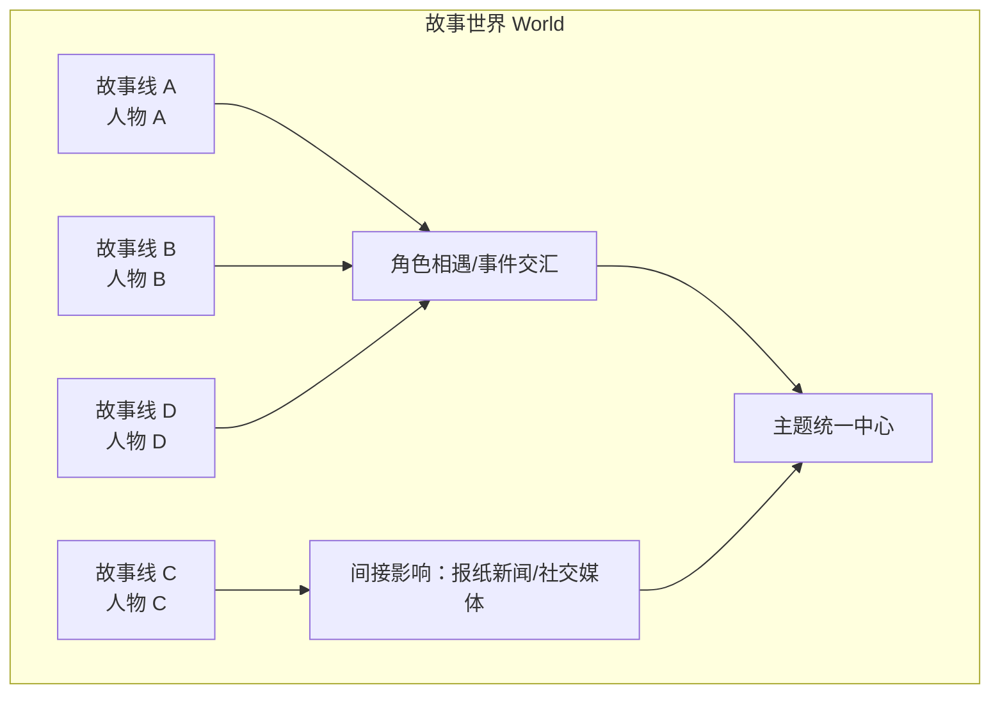
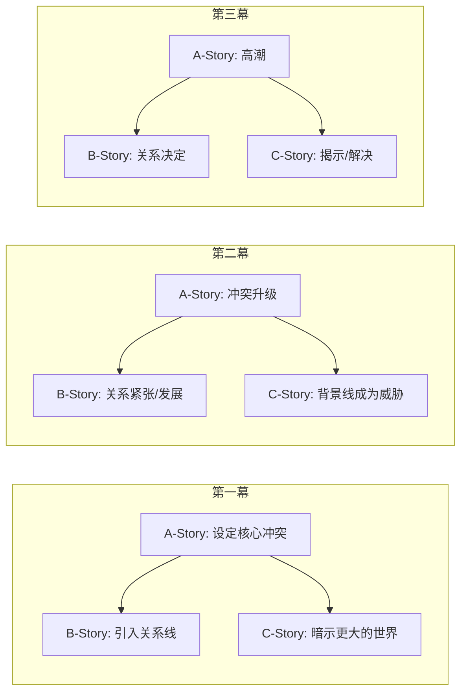

# 补充课09：多线叙事与交织结构

## Learning Objectives

- 区分多主角叙事与群像剧（Ensemble Cast）的差异
- 理解网络叙事的结构模型——独立故事如何主题性地连接
- 掌握平行蒙太奇和交叉剪辑的技法
- 学习 A-story、B-story、C-story 的编织策略
- 判断何时使用多线叙事、何时坚持单线叙事
- 了解游戏中的多线叙事实现（多主角切换、多起源故事）

---

## 1. 多主角 vs 群像剧

### 1.1 关键区别

| 维度 | 多主角叙事（Multiple Protagonists） | 群像剧（Ensemble Cast） |
|---|---|---|
| **定义** | 故事追随两个或以上独立的主角，每人有自己的弧光 | 没有明确的核心主角，故事围绕一群人展开 |
| **焦点** | 每个主角有自己的发展线，最终可能交汇 | 没有一个人的故事比另一个人更重要 |
| **观众认同** | 观众认同多个角色，但可能有一个"灵魂主角" | 观众认同群体本身，而不是某个个体 |
| **例子** | GTA V（三个主角轮流操控） | 《老友记》（六人同等重要） |
| **结构形式** | 交替章节或分段叙事 | 交织在同一空间中 |

> [!NOTE]
> 这不是一个严格的二分法。许多作品处于光谱的中间地带。《教父2》既有 Michael 的"多主角"线（两条时间线），也有家族的"群像"感。

### 1.2 多主角的挑战

> [!WARNING]
> 每增加一个主角，观众的**情感投资**就会被稀释。一个主角有 100% 的情感带宽，两个主角各有 50%，四个主角各占 25%。这就是为什么多主角叙事需要**更长的时间**来建立角色连接——你不能期望观众在 10 分钟内同时爱上三个角色。

**解决方案**：

- 给每个主角一个清晰的**初始欲望**（观众只需要知道"这个人想要什么"就够了）
- 用不同的**类型/风格**区分各条线（一条线是悬疑，一条线是爱情）
- 确保交汇的时刻有足够的情感回报

---

## 2. 网络叙事（Network Narrative）

### 2.1 定义

网络叙事（Network Narrative）是指多个看似无关的故事线通过**主题的共振**或**偶然的相遇**而连接成一个整体的结构形式。

### 2.2 连接方式

网络叙事中的各条线可以通过以下方式连接：

1. **直接相遇（Physical Encounter）** — 角色在某个节点遇见对方
2. **间接影响（Ripple Effect）** — 一条线的结果影响了另一条线的世界
3. **主题平行（Thematic Parallel）** — 人物在不同情境下面对同样的选择
4. **地点连接（Location Nexus）** — 所有角色在某个地点交汇
5. **事件连接（Event Nexus）** — 一个事件影响所有角色

### 2.3 案例：《撞车》（Crash）

影片中的角色跨越种族、阶级和职业，他们的故事线通过各种冲突和偶遇交织在一起：

- 锁匠和他的女儿 → 波斯店主 → 夫妻检察官 → 警察搭档 → TV 导演
- 连接方式：**连锁反应**——一个人的行为直接导致了下一个人的困境

> [!TIP]
> 《撞车》的编剧 Paul Haggis 的写作方法是：**先设计主题和态度，再设计人物，最后设计事件**。换言之，不是"两个故事可以在一起"所以放在一起，而是"这两个故事在讲同一件事"所以必须放在一起。

### 2.4 案例：《木兰花》（Magnolia）

Paul Thomas Anderson 的《木兰花》使用了更复杂的网络叙事结构：9 个主要角色，故事跨度不足 24 小时，所有连接在影片最后"青蛙雨"的超现实场景中达到高潮。

**结构特点**：

- 角色之间的连接是**宽松的**——有些角色互不相识，但他们的困境是平行的
- 连接方式是**主题性的**：所有角色都在与"父亲"相关的问题中挣扎
- 最后的高潮不是情节汇合，而是**主题汇合**——青蛙雨不是解释"发生了什么"，而是"他们在经历同一件事"

---

## 3. A-Story、B-Story、C-Story 的编织

### 3.1 定义

在剧本结构中，通常有三层故事线：

| 故事线 | 功能 | 情感重量 | 占有时间 |
|---|---|---|---|
| **A-Story** | 主要情节线（Main Plot） | 核心目标/冲突 | 约 60-70% |
| **B-Story** | 次要情节线（Subplot） | 爱情/友情/主题对位 | 约 20-25% |
| **C-Story** | 背景/氛围线 | 世界/配角深度 | 约 5-10% |

### 3.2 编织原则

**编织的关键规则**：

1. **每条线都要有自己的节拍** — B-Story 不是"在 A-Story 暂停时填充时间"的。B-Story 要有自己的 Catalysts、Midpoint、Climax
2. **各条线的节奏要错开** — 如果 A-Story 在紧张中，B-Story 可以提供一个"呼吸时刻"；当 A-Story 放缓时，B-Story 可以加温
3. **主题统一性** — 所有故事线应当在主题层面互相辉映。如果你写的是关于"信任"的电影，A-Story（拯救世界需要信任）、B-Story（恋爱关系中的信任）、C-Story（幕后人物的信任背叛）都在讲同一件事
4. **交汇点要设计** — 至少在两个关键节点各条线应当交汇：中点附近（各条线互相影响）和高潮处（各条线同时解决）

### 3.3 交叉剪辑（Cross-Cutting）

交叉剪辑是将多条故事线在时间上交替呈现的剪辑手法。它制造了"同时性"（S Simultaneity）的错觉——即使各条线发生在不同的空间，观众感知它们在"同一个世界"中。

**经典案例：《教父》的洗礼蒙太奇**：

Michael 在教堂参加洗礼（B-Story 的情感高地），同时交叉剪辑他的手下处决所有敌对家族首领（A-Story 的高潮）。两条线通过对位（sacred vs profane）产生了一个高于任何一个故事的意义：**Michael 在上帝面前宣誓的同时，正在成为他曾经发誓永远不会成为的人**。

> [!NOTE]
> 交叉剪辑的最高境界不是"同时展示多个事件"，而是**在冲突的并置中产生新的意义**。

---

## 4. 何时使用多线叙事

### 4.1 多线叙事的适合场景

| 适合多线叙事 | 不适合多线叙事 |
|---|---|
| 史诗型故事：一个宏大的世界/主题 | 角色研究：聚焦于一个角色的内心旅程 |
| 群像剧：多个角色同样重要 | 短片：时长不足以建立多条线 |
| 主题复杂：需要从多个视角探讨一个问题 | 悬疑推理：需要严格控制信息流 |
| 大跨度故事：不同时空/社会阶层 | 亲密故事：两个人的关系动态 |

> [!TIP]
> 请回顾 [[0014-9-steps-short-film|第14课：撰写短片的 9 个步骤]]。短片几乎永远不适合多线叙事——因为你没有足够的时间让每条线产生情感重量。每多一条线，你都需要额外的"建立时间"来让观众在乎。

### 4.2 多线叙事的风险与对策

| 风险 | 对策 |
|---|---|
| **观众混淆**：忘了每条线在讲什么 | 每条线有鲜明的视觉/风格/类型标记 |
| **情感稀释**：观众不在乎任何一条线 | 每条线在开场 5 分钟内就建立清晰的情感欲望 |
| **比例失控**：某条线占据了太多时间 | 严格按照"比例预算"分配时间——A 60%, B 25%, C 15% |
| **交汇牵强**：强行让角色相遇 | 交汇必须在**主题层面**有意义，而不仅仅是为了方便剧情 |

---

## 5. 游戏中的多线叙事

### 5.1 GTA V — 三主角切换

GTA V 的核心创新之一是**玩家可以在三个主角之间随时切换**：

| 角色 | 叙事功能 | 类型 | 视角 |
|---|---|---|---|
| **Michael** | 传统主角/退休罪犯 | 家庭+犯罪 | 中年危机视角 |
| **Franklin** | 街头新人/上升者 | 街头+野心 | 年轻一代视角 |
| **Trevor** | 混乱代理/反派主角 | 疯狂+自由 | 不可预测视角 |

**结构优势**：

- 三个角色覆盖了同一个世界的不同层面（豪宅、街头、沙漠）
- 切换机制让玩家从多个角度理解同一个任务——同一个抢劫任务，Michael 看到的是"计划"，Trevor 看到的是"暴力"，Franklin 看到的是"机会"
- 三条线在游戏的最终任务中物理交汇——三个角色共同参与一个任务

### 5.2 Dragon Age: Origins — 六种起源故事

游戏开局的"起源故事"（Origin Stories）是游戏多线叙事的独特形式：

- 玩家选择角色背景（人类贵族、矮人王子、精灵法师、城市精灵、矮人平民、魔法师）
- 每个起源故事有完全不同的开场时长约 45-60 分钟
- 所有起源在主线故事中汇合（"First Join"事件后合并）

**结构意义**：起源故事让同一段主线故事对不同的玩家产生了完全不同的情感含义——矮人王子回到 Orzammar 时感受到的是"权力的失落"，而矮人平民感受到的是"我终于回来了"。

### 5.3 Disco Elysium — 思维内阁（Thought Cabinet）

Disco Elysium 的"思维内阁"可以被视为一种**内部多线叙事**：

- 玩家的 24 种技能（Logic、Empathy、Electrochemistry 等）各自代表一个"声音"
- 这些"声音"在玩家的头脑中同时争论——这就是一个**内部的群像剧**
- 每条"声音线"都有自己的人格、议程和情感倾向

> [!NOTE]
> Disco Elysium 展示了多线叙事的终极形态：不必有多个角色。**一个角色的大脑内部就可以有足够的多声部交响**。这为编剧提供了一个新的可能性——当外部多线叙事不够有说服力时，考虑将"内部冲突"作为多线叙事的替代方案。

---

## 6. 练习：编织三条故事线

### 练习说明

为一个长片故事设计 A-Story、B-Story 和 C-Story。你可以使用以下前提，也可以使用自己的剧本想法。

**前提**：一个大型音乐节的前 48 小时。三个主角：音乐节主办人（正在面临破产）、一个首次登台的新人歌手（怯场）、一个来"找人"的观众（有秘密目的）。

| 元素 | A-Story（主办人） | B-Story（歌手） | C-Story（观众） |
|---|---|---|---|
| **欲望** | 拯救音乐节（避免破产） | 完成首演（克服恐惧） | 找到失踪的人 |
| **障碍** | 资金断裂+天气恶化 | 极度怯场+团队施压 | 人海茫茫+不能暴露目的 |
| **主题连接** | 为了事业牺牲一切 | 为了梦想面对恐惧 | 为了过去赌上一切 |
| **第一幕节拍** | 发现资金缺口 | 被告知压轴演出 | 混入音乐节 |
| **第二幕节拍** | 做出道德妥协 | 排练崩溃 | 发现线索但被阻止 |
| **交汇点1** | 歌手在后台看到主办人在哭 | 主办人给歌手打气（不知道她在撒谎） | 观众偷听到两人的对话 |
| **交汇点2（高潮）** | 音乐节即将取消 | 歌手决定克服恐惧上台 | 观众要找的人出现在舞台上 |
| **主题共鸣** | 所有人都在以不同的方式"上台" | 上台是面对自己 | 上台是为了找回过去 |

**编织说明**：

- 三条线在交汇点 1 通过"一个空间中的三个视角"交叉
- 三条线在交汇点 2 在物理上汇合在同一舞台——观众、表演者、主办人同时达到各自的高潮
- 每条线都有完整的弧光，但它们共同的主题是"面对自己的恐惧，走上属于自己的舞台"

点击查看编织节奏建议

**第一幕（约 25 分钟）**：
- 开场：三条线各自独立建立，每条线约 5 分钟
- 节奏：A→B→C，快速切换，观众知道三条线存在但还不知道它们将如何连接
- 每 3 分钟切换一次

**第二幕（约 50 分钟）**：
- 线间切换越来越频繁，各条线的冲突相互影响
- 中段：交汇点 1（后台偶遇）
- 后半段：三条线各自面临"恶化的局面"

**第三幕（约 25 分钟）**：
- 三条线加速交叉，切换更快（每 1-2 分钟）
- 汇合于交汇点 2（舞台场景）
- 各线的解决依次发生

---

> 多线叙事的魔力不在于"同时讲几个故事"，而在于"几个故事合在一起讲了一个更大的故事"。当你编织 A、B、C 三条线的时候，你实际上在做的只有一件事：**揭示一个单一的、核心的真相，只是从不同的角度去看它**。