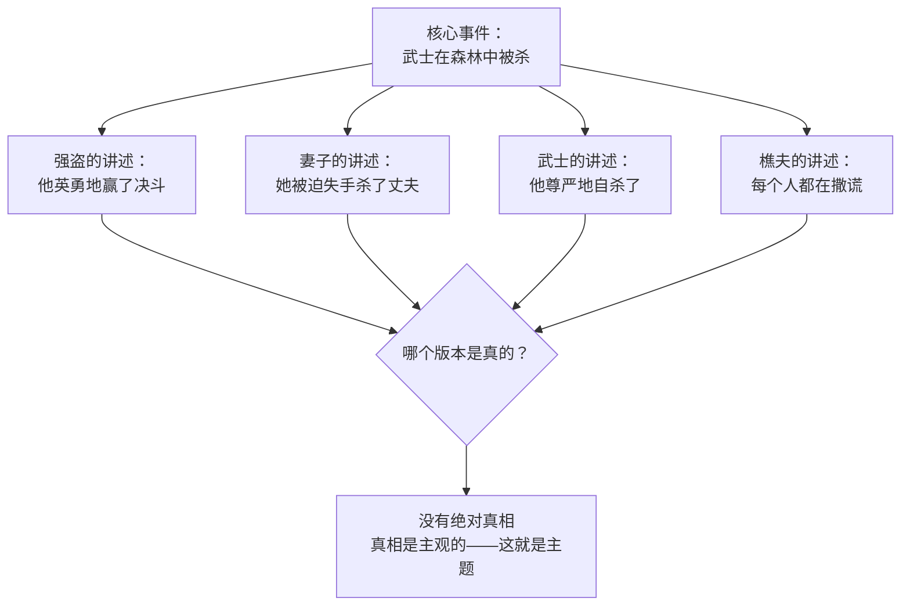

# 补充课10：不可靠叙述者

## Learning Objectives

- 理解不可靠叙述者的定义——叙述者的表述与故事真相之间的差距
- 掌握五种不可靠叙述者类型：道德型、精神型、天真型、说谎型、受限型
- 学会在不"告诉"观众的前提下暗示叙述者的不可靠性
- 设计"不可靠揭示时刻"——观众意识到真相的那个瞬间
- 通过影视和游戏案例学习不可靠叙述者的设计思路
- 能够从不可靠叙述者的视角创作一个场景

---

## 1. 什么是不可靠叙述者

### 1.1 定义

不可靠叙述者（Unreliable Narrator）是 Wayne C. Booth 在 *The Rhetoric of Fiction* 中提出的概念。最简单定义是：

> **叙述者所说的与故事世界中的客观真相之间存在距离。**
>
> — Wayne C. Booth

这个"距离"就是不可靠叙述者工作的空间。观众需要在这个距离中作出判断：哪些是真实的，哪些是叙述者扭曲的。

### 1.2 不可靠叙述者的特征

```mermaid
flowchart TD
    N["叙述者说的话<br/>Narrator's Account"] --> |"差距 Gap"| T["故事世界的客观真相<br/>Objective Truth"]
    N --> A[观众接收到的信息]
    T --> B[观众推断出的真相]
    A --> C{观众是否意识到差距？}
    C -->|"Yes"| D[悬念/好奇：<br/>"为什么他这么说？"]
    C -->|"No"| E[揭示时刻：<br/>"原来一切都是假的！"]
```

### 1.3 不可靠性不等于说谎

> [!TIP]
> 不可靠叙述者不一定在"说谎"。ta 可能是：
>
> - **被骗了**（自己也相信了错误的信息）
> - **记忆力有问题**（真诚地记错了）
> - **世界观扭曲**（ta 看到的世界和客观世界不同）
> - **精神疾病**（幻觉、妄想）
> - **太年轻/太天真**（不理解成人世界的真相）

---

## 2. 五种不可靠叙述者类型

### 2.1 道德型不可靠者（Morally Unreliable）

叙述者出于自身利益扭曲事实。ta 知道真相，但选择不诚实。

**特征**：

- 叙述者选择性呈现信息
- 省略对自己不利的细节
- 美化自己的行为

**案例：American Psycho 的 Patrick Bateman**

Bateman 的叙述中，他是一个优雅、成功、掌控一切的上流人士。但客观场景中，他是一个被同事忽视、被社会边缘化的存在。他对谋杀的自白被他人当作"笑话"——这进一步证明了他的叙述是不可靠的。

> 观众在 Bateman 的"真实"杀人场景和"他以为发生的"场景之间不断摇摆，最终无法判断哪些是真实的——这个不确定性本身就是主题的核心。

### 2.2 精神型不可靠者（Mentally Unstable）

叙述者的神经系统或精神状态影响了ta对现实的感知。

**特征**：

- 存在幻觉或妄想
- 时间感知扭曲
- 记忆缺失或虚假记忆

**案例：《搏击俱乐部》（Fight Club）的 Narrator**

Narrator 的不可靠性源于他的**解离性身份障碍**（Dissociative Identity Disorder）。Tyler Durden 不是真实存在的独立个体——他是 Narrator 的另一人格。但 Narrator 自己不知道这一点，他以"我和 Tyler 是两个不同的人"的方式叙述故事。

**结构设计**：

```
第一次观看：Tyler 是独立的人，Narrator 是在讲述他和朋友的故事
第二次观看：可以发现 Tyler 和 Narrator 从未同时出现在正常人面前
揭示时刻：Narrator 发现 Tyler 就是他自己的分身
```

> [!NOTE]
> 《搏击俱乐部》的精妙之处在于：**叙述者对自己也是不可靠的**。他不仅对观众隐瞒了真相，他对自己也隐瞒了真相。这种"双重不可靠"是叙事技术的最高难度之一。

### 2.3 天真型不可靠者（Naive/Child Narrator）

叙述者因为年龄、经验或智力的限制，无法理解发生的事情的真正含义。

**特征**：

- 叙述者如实报告所见所闻
- 但ta不知道这些事意味着什么
- 观众需要"翻译"ta的话来理解真相

**案例：《房间》（Room）的 Jack**

5 岁的 Jack 从小被囚禁在一个房间中，他认为"房间"就是整个世界，"电视里的世界"是虚构的。他的叙述是真诚的——他如实报告了自己的体验——但观众知道世界比他的理解大得多。

**张力来源**：Jack 的叙述和观众的客观知识之间的鸿沟。

> "The world is just Room. TV is pretend."
>
> — Jack, *Room*

### 2.4 说谎型不可靠者（Lying Narrator）

叙述者故意向观众撒谎。这种类型较少见，因为如果处理不当会让观众感到被"欺骗"。

**特征**：

- 叙述者有意识地选择不诚实
- 通常有隐藏的目的或需要保护的秘密
- 揭示时刻是最大的结构赌注

**案例：《非常嫌疑犯》（The Usual Suspects）的 Verbal Kint**

Verbal 在警局向探员讲述了一个完整的、精细的犯罪故事。影片的最后一分钟揭示：他编造了整个故事——"Keyser Soze"是基于审讯室墙上公告板上的名字编造的。

> [!WARNING]
> 说谎型不可靠叙述者设计的关键：**谎言必须是可被识别的**。即第二次观看时，观众应该能够发现"他来来回回看了公告板三次"、"他每次回答前都要停顿"等线索。如果纯粹是"最后一刻反转"而没有前兆，观众会感到被愚弄而不是被震撼。

### 2.5 受限型不可靠者（Limited Narrator）

叙述者的信息本身是不完整的——不是因为ta不可靠，而是因为ta不知道全部真相。

**特征**：

- 这是最"温和"的不可靠类型
- 叙述者真诚，但无知
- 随着故事推进，叙述者（和观众）一起发现真相

**案例：《唐人街》（Chinatown）的 Jake Gittes**

Jake 是一个努力诚实的侦探，但他的调查总是受限于他无法获取的信息。每次他以为自己找到了真相，新的信息就会推翻他的认知。观众跟随 Jake 的视角，与 Jake 同时发现"真相不完整"。这是一种**观众和叙述者共享的受限视角**。

> 连接 [[s08-nonlinear-narrative|补充课08：非线性叙事与时间操纵]] 中的框架叙事概念——受限型不可靠者经常与非线性结构结合，因为非线性结构可以控制"什么时候揭示什么信息"。

---

## 3. 如何暗示不可靠性

### 3.1 基本原则

不要告诉观众"这个叙述者不可靠"——用矛盾和暗示让他们自己发现。

> **Show the cracks, don't point at them.**

### 3.2 暗示技术

| 技术 | 说明 | 例子 |
|---|---|---|
| **内部矛盾** | 叙述者在不同地方说漏嘴 | 先说自己"整晚没出门"，后来说"我出去买了杯咖啡" |
| **与他人的冲突** | 其他角色纠正或质疑叙述者 | "你在说什么？那天你根本没在场。" |
| **感官偏差异常** | 叙述者对某些细节异常敏感，对其他细节完全忽略 | 详细描述一个无关的灯罩，却忘了描述一个人的脸 |
| **情感语调错位** | 叙述者对事件的情感反应与事件的严重性不匹配 | 用愉快的语气描述一个悲剧 |
| **重复与修正** | 叙述者反复修改自己的叙述 | "不对，不是这样。等等，让我重新说。" |
| **视觉证据矛盾** | 银幕上展示的画面与叙述者的描述不一致 | 旁白说"他温柔地抚摸她"，画面中他在打她 |

### 3.3 案例：《罗生门》（Rashomon）的多重不可靠

黑泽明的《罗生门》是"多重不可靠叙述者"的经典：四个角色（强盗、武士、妻子、樵夫）各自对同一事件给出了不同的叙述。



> [!NOTE]
> 《罗生门》的结构改写了叙事学的历史。它的核心洞见是：**每个叙述者都是不可靠的，因为每个叙述者都在美化自己**。这不是道德的失败，而是人性的本质。

---

## 4. 不可靠揭示时刻

### 4.1 什么是揭示时刻

这是观众意识到叙述者不可靠的那一瞬间。在此之前，观众可能已经有所怀疑，但这一刻确认了他们的怀疑。

### 4.2 揭示时刻的类型

| 类型 | 时机 | 效果 |
|---|---|---|
| **渐进型** | 观众逐渐意识到 | 持续的怀疑和不安 |
| **突变型** | 一个场景彻底翻转 | 震撼和重估全部叙事 |
| **双重型** | 第一次揭示后有第二次 | 连续的心理重击 |

### 4.3 案例：《第六感》（The Sixth Sense）的双重揭示

**第一层**（观众在观影过程中逐渐发现的）：Cole 能看到鬼魂。这个阶段的不可靠性来源于——作为观众的我们不知道该世界的规则是什么。

**第二层**（最后一幕的突变揭示）：Malcolm Crowe 医生本人就是一个鬼魂。这个揭示翻转了观众对整部电影的理解——所有 Malcolm 和妻子之间的场景都需要重新解读。

> **技术分析**：电影在第二次观看时提供了完全不同的体验。导演 Shyamalan 在前面的场景中埋下了所有线索（妻子不理 Malcolm、餐厅里妻子丢下戒指、Malcolm 从不开门），但观众在第一次观看时将这些信息归因于"情感疏离"，而不是"Malcolm 已死"。这就是"可见但不可见"的线索设计——**线索是可见的，但观众在揭示之前无法正确解读它们**。

---

## 5. 游戏中的不可靠叙述者

### 5.1 游戏的独特性

游戏中的不可靠叙述者多了一层维度——**游戏机制本身可以是不可靠的**。玩家不能仅靠"画面看到的东西"来判断真相，因为游戏机制可能本身就是叙述者扭曲的一部分。

### 5.2 案例：Spec Ops: The Line

Spec Ops: The Line 是"游戏作为不可靠叙述者"的经典案例：

- 游戏外观上是一个标准的军事射击游戏
- 但随着剧情推进，玩家逐渐发现：**命令是谎言，敌人不是敌人，你自己才是真正的恶棍**
- 游戏的加载画面、UI 提示、甚至成就系统都在逐渐变得诡异

**核心设计**：游戏机制和叙事之间存在矛盾。表面上玩家在执行"英雄任务"，客观叙事揭示玩家在进行一场屠杀。

> "How many Americans have you killed today?"
>
> — 游戏的加载画面提示，随着玩家的"罪行"增加而出现

### 5.3 案例：Hellblade: Senua's Sacrifice

Hellblade 的不可靠叙述者机制直接绑定在角色的精神疾病上：

- 主角 Senua 患有精神病（psychosis），因此她的感知世界是扭曲的
- 游戏使用**双声道录音（binaural audio）**让玩家在耳机中听到 Senua 脑海中的声音
- 玩家无法区分哪些敌人是真实的、哪些是幻觉
- 游戏的设计让玩家体验到了"精神病患者的不可靠感知"

> [!NOTE]
> Hellblade 展示了游戏相对于电影的独特优势：**电影只能展示不可靠的"看"，而游戏可以模拟不可靠的"在"**。玩家不是旁观 Senua 的幻觉，而是被放入她的幻觉中。

---

## 6. 练习：从不可靠叙述者的视角写一个场景

### 练习说明

选择一个叙述者类型，写一个约 1 页的场景。要求：

1. 场景中发生一件**客观事件**（例如：一个人走进房间，拿走了一个箱子，离开）
2. 通过不可靠叙述者的视角来呈现这个事件
3. 在场景结尾通过某种机制暗示叙述者不可靠（但不直接说）
4. 读者应该能感受到"事情好像不是这样的"

**前提选项**：

- **道德型**：一个罪犯向同伙讲述"他如何被警察冤枉"——但实际是他出卖了同伙
- **精神型**：一个患者在日记中记录病房中"医生和护士的阴谋"
- **天真型**：一个小孩描述"昨晚叔叔来和妈妈吵架"
- **说谎型**：一个间谍向上级报告"我成功完成了任务"
- **受限型**：一个人道主义工作者描述"救援行动的进展"——但ta不知道自己的行动已经被敌人利用

<details>
<summary>点击参考示例：精神型不可靠者</summary>

**场景：病房日记**

> （日记朗读声，画面为黑白影像，偶尔有闪动的彩色碎片）
>
> 7 月 14 日。他们又换了药。
>
> （画面：护士微笑着递来一杯水。叙述者的声音说"她的微笑是假的"）
>
> 我知道他们想干什么。他们说这是"维生素"，但我闻过。不是维生素的味道。隔壁房间的病人告诉我的——她也知道。但今天早上她不见了。他们说"转院了"。
>
> （画面：空荡荡的病床，床单被整齐地叠好——太整齐了，像没人睡过）
>
> 今晚他们要来找我。我听到了门外的脚步声。凌晨三点，准时。三个人。一个在门外守着，两个进来。
>
> （画面：深夜，病房安静。只有走廊的灯。脚步声越来越近。三个穿白大褂的人走进来）
>
> 但我准备好了。这次我装睡。他们要抓我，但他们不会得逞。
>
> （画面：三个医生走到床前。其中一个轻声说："她睡着了。药量够了吗？"另一个回答："今晚之后就好了。"）
>
> 他们以为我睡着了。但我醒着。我一直在等。
>
> 第二天早上。阳光照进来。
>
> （画面：病床空荡荡，床单被叠得整整齐齐。窗外的树上有鸟在叫。病房门上有新的名牌被挂上去。）
>
> 7 月 15 日。这里的鸟叫很奇怪。像机器。我觉得它们也在监视我。
>
> （画面：一只普通的鸟站在窗台上。画面冻结。）

**技术分析**：

- 叙述者描述的"阴谋"和画面的客观场景存在张力
- 医生和护士的"威胁性行为"在客观画面中是正常医疗操作
- 观众在"相信叙述者"和"相信画面"之间摇摆
- 结尾的病床整理暗示了叙述者不在了——可能是好转了，也可能是转院了，也可能如她所担心的——但观众无法确定

</details>

---

## 7. 不可靠叙述者创作检查清单

- [ ] 我的叙述者属于哪种不可靠类型？（道德/精神/天真/说谎/受限）
- [ ] 叙述者的不可靠性是否有**故事内在的理由**（不是"为了反转而反转"）？
- [ ] 我是否在前文中埋下了"第二次观看时能发现"的线索？
- [ ] 不可靠性是否与**主题**相关？（例如：《搏击俱乐部》的不可靠性是身份主题的体现）
- [ ] 观众在揭示时刻的**情感反应**是什么？震惊、心碎、恍然大悟？
- [ ] 如果去掉"不可靠揭示"，故事还成立吗？（好的不可靠叙事应该是故事的有机部分，而不是一个独立的"twist"）
- [ ] 我的叙述者是在欺骗观众还是在欺骗自己？（后者通常更有深度）

---

> 不可靠叙述者不是魔术师的障眼法——它是一面变形镜，让观众在扭曲的映像中看到比"直白的真实"更深刻的真相。当观众最终理解了这个叙述者为什么不可靠时，ta 们不是在说"被骗了"，而是在说"我明白了这个角色为什么必须这样讲述这个故事"。