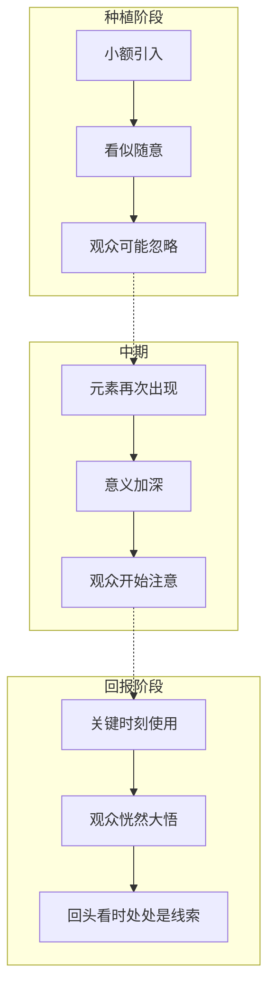
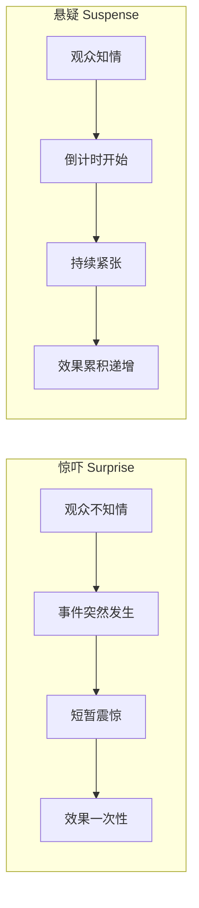

# 补充课11：悬念与伏笔

## Learning Objectives

- 理解叙事紧张的三种类型：神秘、悬疑、戏剧反讽
- 掌握伏笔（Foreshadowing）的核心技巧：直接、象征、结构
- 学会 Chekhov's Gun 原则的运用与误用
- 识别红鲱鱼（Red Herring）和假线索的作用机制
- 掌握 Plant and Payoff（种植与回报）结构
- 理解 Hitchcock 的炸弹理论：悬疑 vs 惊吓
- 通过游戏和电影案例，掌握环境伏笔与延迟揭示

---

## 三种叙事紧张（Three Types of Narrative Tension）

叙事紧张是观众"想知道接下来发生什么"的驱动力。法国电影理论家将叙事紧张分为三种基本类型，每种类型依赖于**信息的不对称**来制造效果。

### 1. 神秘（Mystery）— 过去发生了什么

神秘的驱动力是**信息缺失**。观众和角色都不知道发生了什么，共同寻找答案。

- 核心问题："What happened?"（发生了什么？）
- 时间方向：面向**过去**——追溯一个已经发生的事件
- 情感体验：好奇心、困惑、逐步揭示的满足感
- 典型体裁：推理/侦探故事、悬疑片

> [!NOTE]
> 神秘的特点是**所有角色都不知道真相**（或只有少数人知道）。观众和主角一起处于"无知"状态，通过收集线索一步步接近真相。

**电影案例：**
- 《公民凯恩》：观众和记者一起追问"Rosebud"是什么
- 《记忆碎片》：主角失忆，观众和他一起拼凑碎片
- 《消失的爱人》：前半段观众和丈夫一起寻找消失的妻子

### 2. 悬疑（Suspense）— 将要发生什么

悬疑的驱动力是**未来的不确定性**。观众知道某些事情可能发生，但不知道结果如何——而且在乎这个结果。

- 核心问题："What will happen?"（将会发生什么？）
- 时间方向：面向**未来**——期待/担忧即将发生的事件
- 情感体验：紧张、期待、焦虑、如坐针毡
- 典型体裁：惊悚片、动作片、灾难片

**电影案例：**
- 《出租车司机》：观众知道 Travis 正在走向爆发，但不知道他会在何时以何种方式失控
- 《暗黑骑士》"双船"场景：两艘船上的人会按下引爆器吗？
- 《地心引力》：宇航员能活着回到地球吗？

### 3. 戏剧反讽（Dramatic Irony）— 观众知道，角色不知道

戏剧反讽的驱动力是**信息优势**。观众知道的比角色多，因此能预见到角色即将面临的危险或误会。

- 核心问题："The audience knows something the character doesn't."（观众知道角色不知道的事情。）
- 时间方向：**信息差**——观众拥有角色不具备的知识
- 情感体验：焦急、"别进去！""别相信他！"的冲动
- 典型体裁：悲剧、黑色喜剧、恐怖片


> [!TIP]
> 最优秀的编剧会在同一个故事中混合使用这三种紧张。例如：《沉默的羔羊》中，既有"Water Buffalo Bill 是谁"（神秘），也有"Clarice 能救出 Catherine 吗"（悬疑），还有观众知道 Buffalo Bill 在暗处但 Clarice 不知道的戏剧反讽。

---

## 伏笔（Foreshadowing）

伏笔是在故事早期**植入**一个元素，让它在后期**回收**的技巧。它让故事的转折和高潮显得既出乎意料，又在情理之中。

### 直接伏笔（Direct Foreshadowing）

角色或叙事者直接暗示即将发生的事情。

```
例子：
"我有一种不好的预感。"
"注意这扇门——它从来都锁不上。"
"你不可能战胜他的。"
```

> [!WARNING]
> 直接伏笔的陷阱是**过于露骨**。如果角色说"我明天就要死了"，观众会立即猜到结局，悬念荡然无存。好的直接伏笔应该是模糊的、可多重解读的。

### 象征伏笔（Symbolic Foreshadowing）

通过意象、天气、物品等象征性的元素来暗示未来的发展。

| 象征元素 | 常见含义 | 例子 |
|---------|---------|------|
| 暴风雨 | 冲突将至 | 《李尔王》中 Lear 在暴风雨中发疯 |
| 破碎的镜子 | 关系破裂 | 《歌剧魅影》中镜子碎裂预示真相 |
| 重复出现的数字 | 宿命感 | 《迷失》中的数字 4、8、15、16、23、42 |
| 枯萎的植物 | 生命的衰落 | 《教父》中花园的枯萎暗示 Vito 的衰老 |

**游戏案例 — Dark Souls 的环境伏笔：**

Dark Souls 系列是环境伏笔的大师。在《Dark Souls》中，玩家在游戏早期就能远远看到一座巨大的城堡——那就是玩家最终目的地 Anor Londo。在《Dark Souls III》中，玩家在灰烬墓地能看到远方世界的剪影，那些剪影就是后续关卡的地图。

这种"**远景揭示（Long-Distance Reveal）**"让玩家在潜意识中建立对世界的认知，当最终到达时会产生强烈的"就是这个！"的满足感。

### 结构伏笔（Structural Foreshadowing）

故事的结构本身暗示了结局。最经典的例子是**开场画面与结局画面呼应**。

> [!NOTE]
> 结构伏笔的常见模式：故事的开场画面（Opening Image）与终场画面（Final Image）形成对比或镜像，告诉观众角色在这些事件中经历了怎样的变化。

**例子：**
- 《教父》：开场婚礼 vs 结尾洗礼——家族的身份转变
- 《飞屋环游记》：开头 Ellie 和 Carl 的一生蒙太奇——奠定了全片的"承诺与放手"主题
- 《肖申克的救赎》：Andy 在雨中张开双臂的幻想 vs 结尾他在雨中真正获得自由


---

## Chekhov's Gun（契诃夫之枪）

> [!NOTE]
> Chekhov's Gun 是戏剧创作的基本原则（源自俄国剧作家安东·契诃夫）：**"如果你在第一幕在墙壁上挂了一把手枪，那么它在第三幕必须发射。否则，它就不应该被挂在那里。"**

这个原则的核心含义是：**故事中引入的每一个元素都必须有叙事功能。**

### 正确运用

- 一个细节被强调（特写、角色特意提及、画面构图突出）→ 这个细节必须后期有意义
- 一支枪被展示 → 必须有人使用它
- 一个角色有特殊技能 → 这个技能必须在关键时刻发挥作用

**电影案例：**
- 《侏罗纪公园》：开场展示迅猛龙的利爪和聪明 → 结尾迅猛龙利用这些特性追杀主角
- 《海上钢琴师》：Max 把 trumpet 典当给乐器店，吹响了最后一段旋律 → 结尾老板播放了那段唯一的录音

### 误用与反例

- **假 Chekhov's Gun**：你以为枪会开，实际上不会。这是 Red Herring 的一种（见下文）。
- **Chekhov's Gun 失效**：枪被展示但从未使用——观众感到失落和困惑。

> [!WARNING]
> Chekhov's Gun 在某些体裁中可以被有意颠覆。例如，在黑色喜剧中，一把看似重要的枪最终只是一处玩笑。但这种颠覆需要编剧有足够的技巧，否则只会让观众觉得故事不完整。

---

## 红鲱鱼（Red Herring）与假线索

Red Herring 是故意误导观众的手法——引入一个看似重要的线索或角色，实际上它与故事的核心谜题无关。

### Red Herring 的功能

- 增加猜谜的难度（在推理故事中）
- 制造假安全感（在惊悚片中）
- 加深最后反转的冲击力（让观众以为自己早就"猜到了"）

| 技巧 | 说明 | 例子 |
|------|------|------|
| **可疑配角** | 一个行为怪异的角色转移观众注意力 | 《东方快车谋杀案》中的每个乘客 |
| **误导性物证** | 一个看似关键的物品实际是假的 | 出现在案发现场的不属于凶手的物品 |
| **错误的时间线** | 时间线被操纵让无辜者看上去可疑 | 《非常嫌疑犯》中故事的多重讲述 |

**电影案例 —《The Usual Suspects》（非常嫌疑犯）：**

整部电影是一个巨大的 Red Herring。Kaiser Soze 的故事是 Verbal 编造的——所有线索都指向了一个不存在的罪犯。观众和警探一起被完整地误导了。

### 最佳实践

1. **公平游戏（Fair Play）**：Red Herring 的理由应能在回头看时被理解，而不是完全的欺骗
2. **数量限制**：1-2 个 Red Herring 足够，过多的假线索会让观众失去信任
3. **回收**：即使是假线索，也应该服务于故事——它揭示了某个角色的特征或推动情节

---

## Plant and Payoff（种植与回报）

Plant and Payoff 是编剧最基础、最强大的技巧之一。它的运作方式：

1. **Plant（种植）**：在故事早期引入一个元素（物品、信息、角色特征）
2. **Payoff（回报）**：在故事后期这个元素产生关键作用

### 小额种植与大额回报



**经典案例 —《The Sixth Sense》（第六感）：**

| Plant | Payoff |
|-------|--------|
| Malcolm 被枪击中 | 原来他早就死了 |
| Cole 说"我能看到死人" | Malcolm 是死者之一 |
| Malcolm 的妻子不和他说话 | 她在一座空房间里悲伤 |
| Malcolm 没注意到自己在餐厅被无视 | 暗示他是鬼魂 |

> [!TIP]
> 最好的 Plant and Payoff 在第二次观看时可以成立一个**完全不同的故事**。观众第二次看时会想："原来每一句台词都在暗示这一点！"

### 游戏中的 Plant and Payoff

**Shadow of the Colossus（旺达与巨像）:**

游戏早期，玩家经过一条长长的黑暗隧道到达神殿。在隧道的壁画上，展示了古代祭祀的场景——一个持剑的人与巨大的怪物战斗。玩家当时不会多想，但这正是结局的伏笔：主角 Wander 为了复活 Mono 而猎杀 Colossi，最终自己也变成了一个巨大的怪物——他正在重演壁画上的寓言。

游戏结束时，Mono 醒来，走进神殿的花园，看到的不是一个英雄，而是一个巨大的、黑暗的 Wander 被封印在神殿之中。壁画上的预言成真了。

这个设计完美地展示了**环境伏笔 + Chekhov's Gun + Plant and Payoff** 的组合运用。

---

## Hitchcock 的炸弹理论（Bomb Theory）

> [!NOTE]
> Alfred Hitchcock 用著名的"炸弹理论"区分了**惊吓（Surprise）** 和 **悬疑（Suspense）**：
>
> **假设两个人坐在一张桌子前谈话，桌子下有一颗炸弹。**
>
> - **惊吓（Surprise）**：炸弹在第 5 分钟突然爆炸。观众震惊了 15 秒，然后故事结束。
> - **悬疑（Suspense）**：观众在第 1 分钟被告知桌子下有炸弹，且它将在 12 点爆炸。然后两个人坐下来开始谈话——现在观众坐立不安，看着墙上指向 11:45 的钟，焦急地等待他们离开。

### 炸弹理论的编剧启示

1. **信息就是力量**：让观众知道角色不知道的关键信息 = 制造悬疑
2. **时间限制增加张力**：给事件设置截止时间（tic-tock clock）
3. **反差放大紧张**：当危险近在眼前而角色在聊家常时，紧张感最强



> [!TIP]
> Hitchcock 说："惊吓是炸弹在你脚下爆炸。悬疑是你看得见那枚炸弹。"

---

## 悬念与伏笔在游戏叙事中的特殊运用

游戏作为互动媒介，悬念和伏笔有其独特的运作方式。

| 媒介差异 | 电影/文学 | 游戏 |
|---------|-----------|------|
| **节奏控制** | 编剧控制节奏 | 玩家控制节奏 |
| **注意力** | 观众被动接收 | 玩家主动探索 |
| **伏笔回收** | 线性回收（必须按顺序） | 非线性回收（玩家可能错过） |
| **信息传递** | 对白/画面直接传递 | 环境细节、物品描述、可收集品 |
| **重玩价值** | 较低 | 二周目玩家能发现新伏笔 |

**游戏案例 — Dark Souls 的环境伏笔系统：**

Dark Souls 的伏笔完全依赖于玩家的观察力。一个经典例子：在《Dark Souls》中，玩家在底层（Depths）遇到一只被困在雾门后的屠夫狗。当时不会多想。但在后续 DLC 中，玩家回到乌托邦（Oolacile），发现同样的狗在野外自由奔跑——原来底层里的那只狗是被人为困在那里的。这种跨越数十小时的伏笔回收，在游戏中创造了独特的时间厚度。

---

## 本章小结

叙事紧张来自于观众与角色之间的**信息差**：神秘（角色不知道）、悬疑（两者都不知道）、戏剧反讽（观众知道角色不知道）。伏笔（Foreshadowing）是埋设这些信息差的核心技巧，可细分为直接、象征、结构三种。Chekhov's Gun 原则要求故事中的每一个元素都具有叙事功能，而 Red Herring 则是有意制造虚假线索。Plant and Payoff 结构是编剧最基础的工具——在早期种植，在后期收获。Hitchcock 的炸弹理论提醒我们：告诉观众炸弹的存在比炸弹本身更令人紧张。在游戏叙事中，悬念和伏笔需要适应玩家的主动探索和节奏控制。

---

## 课程链接

- 上一课：[[0016-bonus-next-steps|第16课：附加资源与下一步]]
- 下一课：[[s12-game-narrative-fundamentals|补充课12：游戏叙事基础]]
- 参考主课：[[0008-three-act-structure|第08课：三幕式故事结构]] — 转折点往往需要伏笔来铺垫

## 自我测试

1. 三种叙事紧张（神秘、悬疑、戏剧反讽）分别对应的"信息状态"是什么？
2. Chekhov's Gun 的核心原则是什么？它和 Red Herring 有什么区别？
3. Hitchcock 的炸弹理论是如何区分 Surprise 和 Suspense 的？
4. Plant and Payoff 结构的两个阶段分别做什么？
5. 为什么在游戏中，环境伏笔（而非对白伏笔）更为有效？

<details><summary>参考答案</summary>

1. 神秘：观众和角色都缺少信息（面向过去）；悬疑：观众和角色都对未来不确定（面向未来）；戏剧反讽：观众知道信息但角色不知道（信息差）。
2. Chekhov's Gun：故事中引入的每个元素都必须有叙事功能。Red Herring 是有意误导观众的假线索，它看似重要但实际无关，是有意违背 Chekhov's Gun 假象的手法。
3. 惊吓（Surprise）：观众不知道炸弹存在，爆炸时震惊但短暂。悬疑（Suspense）：观众知道炸弹存在且有时间倒计时，紧张感持续累积递增。
4. Plant（种植）：在故事早期引入一个看似不起眼的元素。Payoff（回报）：在故事后期这个元素产生关键作用。
5. 因为玩家在游戏中的节奏是主动的、可变的，对白容易在玩家分心时被忽略，而环境中的视觉信息一直在场。同时，玩家可以通过主动探索发现环境伏笔，产生"我发现了秘密"的成就感。

</details>

## 课后练习

1. **伏笔分析**：选择一部你喜欢的电影（如《第六感》《黑客帝国》《寄生虫》），找出至少 3 个伏笔，分析它们的类型（直接/象征/结构）和相应的 Payoff。
2. **红鲱鱼设计**：写一个 3 句话的短故事，在其中加入一个 Red Herring（误导线索）。请你的朋友猜结局，观察他们是否被误导。
3. **Hitchcock 场景改写**：取一个日常场景（如在咖啡馆和朋友聊天），用"炸弹理论"的方式重新描述——先告诉读者某个关键信息（定时炸弹/即将到来的危险/某个秘密），然后才展开场景描写。
4. **游戏伏笔探索**：打开你玩过的任何一款 RPG 或冒险游戏，寻找环境中的伏笔（远景中的建筑物、墙上的壁画、NPC 的对话暗示），记录至少 2 个例子。
5. **种植与回报**：为你当前构思中的故事设计一个 Plant and Payoff。写下早期场景中你打算"种植"的元素，以及后期打算"回报"的时刻。

---

> **参考：** [[reference/glossary|编剧术语表]] | [[reference/three-act-structure|三幕结构速查]]