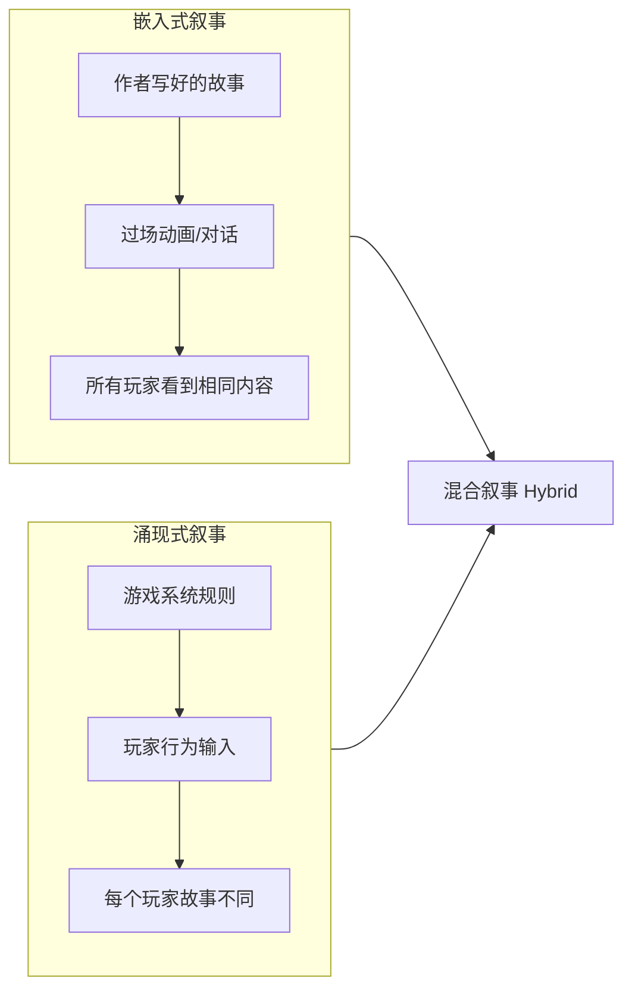
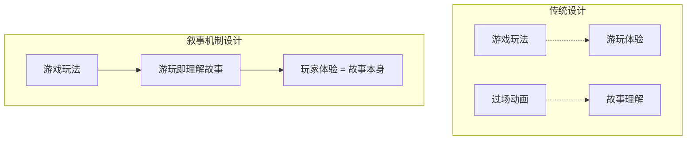

# 补充课12：游戏叙事基础 — 互动叙事的核心挑战

## Learning Objectives

- 理解 Ludonarrative Dissonance（Ludo 叙事失调）的概念和成因
- 掌握 Player Agency（玩家能动性）与 Authored Story（作者故事）之间的张力
- 区分 Embedded Narrative（嵌入式叙事）与 Emergent Narrative（涌现式叙事）
- 理解 Environmental Storytelling（环境叙事）的基本原理
- 掌握 Narrative Mechanics（叙事机制）的设计思路
- 对比 Film/Linear 与 Game/Interactive 叙事在 10 个维度上的差异
- 通过经典游戏案例理解以上概念的实际运用

---

## 从线性叙事到互动叙事：一个范式转变

电影、文学和戏剧是**线性叙事**——作者写好了故事，观众被动接收。游戏是**互动叙事**——玩家通过行动参与甚至改变故事。

> [!NOTE]
> 互动叙事的核心挑战：如何让玩家既感受到"这是我的故事"，又不失去"这是一个好故事"？

这一挑战存在于每一款叙事驱动的游戏中。而处理这个挑战的种种尝试，构成了游戏叙事设计的核心。

---

## Ludonarrative Dissonance（Ludo 叙事失调）

### 定义

Ludonarrative Dissonance 是由游戏设计师 Clint Hocking 在 2007 年提出的概念：

> **Ludonarrative Dissonance（Ludo 叙事失调）**：游戏的玩法（Ludology — 游戏规则与操作）和故事（Narrative — 情节与角色）传达了相互矛盾的信息时产生的裂痕。

### 经典案例 —《Uncharted》系列

Nathan Drake 在过场动画中是一个幽默、可爱的冒险家。但在游戏中，他是一个杀了上千人的杀手。这两种身份之间的割裂就是 Ludonarrative Dissonance：

| 层面 | 故事告诉你的 | 玩法要求你做的 |
|------|------------|--------------|
| 角色身份 | Nathan 是一个"可爱的寻宝者" | 你在游戏中杀了数百人 |
| 道德立场 | 为了正义而战 | 为了任何有价值的宝物都可以大开杀戒 |
| 情感基调 | 轻松的冒险喜剧 | 每一场枪战都在杀人 |

> [!WARNING]
> Ludonarrative Dissonance 不一定是"坏的"。有些游戏故意利用这种失调来制造特殊效果。但如果不加注意，它会破坏玩家的沉浸感。

### 刻意运用 —《Spec Ops: The Line》

《Spec Ops: The Line》故意利用 Ludonarrative Dissonance 来批判军事射击游戏。游戏中的玩法（杀掉一波又一波敌人）和故事（主角逐渐意识到自己在做错事）之间的摩擦被设计为叙事核心——玩家被诱导去杀戮，然后被游戏"质问"为什么要这样做。


---

## Player Agency vs Authored Story（玩家能动性 vs 作者故事）

这是游戏叙事的**根本张力**：

- **Player Agency（玩家能动性）**：玩家拥有选择权，能影响故事走向
- **Authored Story（作者故事）**：编剧预先设计好的剧情结构

| 偏向 | 优点 | 缺点 |
|------|------|------|
| 强调 Agency | 玩家有控制感，重玩价值高 | 故事容易松散，难以保证情感质量 |
| 强调 Authored Story | 故事精良，情感曲线可控 | 玩家感觉被"牵着走"，失去互动感 |

> [!TIP]
> 好的游戏叙事在两者之间建立**张力的平衡**。不是选边站，而是在两者之间搭建桥梁。

### 平衡策略

1. **透明选择 + 隐藏结果** — 玩家知道自己在做选择（Agency），但不知道后果（保持紧张）
2. **选择影响故事色彩，而非主干** — 玩家可以决定"如何到达终点"，但不能决定"终点在哪里"
3. **假装有选择（Illusion of Choice）** — 玩家觉得自己的选择重要，但故事永远回到预设轨道

---

## Embedded Narrative vs Emergent Narrative

游戏叙事的另一个核心分类：**嵌入式叙事（Embedded Narrative）** 和 **涌现式叙事（Emergent Narrative）**。

### Embedded Narrative（嵌入式叙事）

这是传统的"预写故事"——过场动画（Cutscene）、剧本对白、固定的故事事件。它是**作者预先设计**的。

```
嵌入式叙事的典型形式：
- 开场动画
- 过场动画（Cutscenes）
- 角色间对话（Dialogue Trees）
- 剧情事件（Scripted Events）
- 文本日志/物品描述
```

**优点：** 叙事质量可控，情感曲线精确。
**缺点：** 玩家参与度低，可能与玩法脱节。

### Emergent Narrative（涌现式叙事）

这是玩家在**游玩过程中自发产生**的故事。它不是编剧写好的，而是从游戏系统和玩家行为的互动中"涌现"的。

```
涌现式叙事的典型形式：
- 玩家在 Minecraft 中建造了一座城堡后遭遇怪物袭击
- 《RimWorld》中一个殖民者因为失去配偶而发疯
- 《Dwarf Fortress》中猫喝了酒精然后变成了醉猫
- 《EVE Online》中玩家工会之间的政治博弈
```

**优点：** 高度个性化，玩家有极强的故事拥有感。
**缺点：** 不可预测，无法保证每个玩家都有"好故事"。

| 维度 | Embedded Narrative | Emergent Narrative |
|------|--------------------|--------------------|
| 来源 | 作者创作 | 系统 + 玩家行为 |
| 可控性 | 完全可控 | 不可控 |
| 情感质量 | 稳定且可预测 | 波动大但对个体极强 |
| 重复游玩 | 内容固定 | 每次不同 |
| 典型体裁 | RPG、冒险游戏 | 沙盒、模拟、策略游戏 |



> [!NOTE]
> 大部分叙事驱动的现代游戏是**混合叙事（Hybrid Narrative）**。它们使用嵌入式叙事搭建主线骨架，使用涌现式叙事填充玩家的个性化内容。

---

## Environmental Storytelling（环境叙事）

环境叙事是指**让游戏场景本身讲述故事**——不通过文字或对白，而是通过空间的设计传递信息。

> [!TIP]
> 环境叙事遵循"Show, Don't Tell"原则的最高形式：不是让角色说发生了什么，而是让玩家在探索中自己发现发生了什么。

### 环境叙事的三大类型

**1. 因果关系型（Cause-and-Effect）**

场景中的痕迹向玩家展示了发生了什么：

```
例子：
- 看到地上的血迹拖向墙角 → "有人受伤了，爬向了那里"
- 桌椅掀翻、杯子摔碎 → "这里发生过打斗"
- 一堆空罐头和一张写满焦急字迹的纸条 → "有人被困在这里很久了"
```

**2. 角色刻画型（Characterization）**

通过角色的生活空间展示其性格：

```
例子：
- 一个整洁有序的房间和一个杂乱无章的房间 → 不同角色的性格
- 墙上贴满侦探线索的照片 → 这个角色在追查什么
- 书架上全是"如何做好父亲"的书 → 角色试图弥补过往
```

**3. 世界历史型（World History）**

环境中的细节展现整个世界的过去：

```
例子：
- 废弃战场上锈蚀的坦克 → 这里曾发生过激烈战争
- 一座被沙尘暴掩埋的城市 → 这个世界正在荒漠化
- 墙上的涂鸦用多种语言写给同一个已故的人 → 多元文化下的集体创伤
```

### 经典案例 — What Remains of Edith Finch

这款游戏是环境叙事的教科书级作品。玩家的任务是在一个家族旧宅中探索每个家族成员的死因。每一个房间都是一段完整的环境叙事：

| 房间/空间 | 环境叙事内容 | 讲述了什么 |
|-----------|-------------|-----------|
| Molly 的房间 | 老鼠洞、壁画、窗外树 | 一个女孩在饥饿和孤独中的幻觉 |
| Barbara 的房间 | 杂志封面、血迹、玩具 | 一个童星的陨落和家庭的掩盖 |
| Lewis 的房间 | 鱼罐头生产线、王冠、镜子 | 一个年轻人逐渐脱离现实的最后一天 |
| 地下室 | 各种发明和工具 | 家族的创造力和宿命感的来源 |

> [!WARNING]
> 环境叙事的陷阱：环境细节必须**可以被玩家发现**，但也不能强制玩家发现。最好的环境叙事是可选的（Optional）——主动探索的玩家获得奖励，直奔主线的玩家不会错过核心信息。

---

## Narrative Mechanics（叙事机制）

叙事机制是指**游戏系统本身就是叙事的一部分**——玩法不仅是玩法，还在讲述故事。

### 什么是 Narrative Mechanics

| 传统设计 | 叙事机制设计 |
|---------|-------------|
| 玩法是玩法，故事是故事 | 玩法和故事是一体的 |
| 过场动画推进故事 | 玩家行动本身就是故事 |
| 故事解释为什么玩家在战斗 | 战斗过程本身就在讲述 |

### 经典案例 — Bioshock: "Would You Kindly?"

Bioshock 中的叙事机制堪称游戏叙事史上的里程碑。

**机制：**
- 整个游戏中，主角收到无线电指令："Would you kindly..."（拜托你……）
- 玩家按照指令行动——因为这是游戏机制告诉你要做的事

**反转：**
- 最终揭示："Would you kindly" 是一个触发词——主角的大脑被编程，听到这句话就会无条件服从
- 玩家意识到：你自己（作为玩家）也一直在无条件服从游戏指令

> [!NOTE]
> Bioshock 的 Brilliance：它把"玩家为什么要听从游戏指令"这个元问题变成了叙事核心。游戏机制（接受任务 → 执行任务）本身就是故事的核心反转。

**其他叙事机制的例子：**

| 游戏 | 机制 | 叙事功能 |
|------|------|---------|
| Shadow of the Colossus | 每次杀死巨像后主角身体变得更灰暗腐败 | 告诉玩家"你在付出代价"而不需要说一句话 |
| Dark Souls | 每次死亡后回到篝火，敌人刷新 | 死亡被编织进世界观——不死人的诅咒 |
| Hades | 每次死亡回到大厅，推进对话树 | 死亡不是失败，而是故事推进的方式 |
| Outer Wilds | 22 分钟的时间循环 | 游戏机制本身就是故事主题 |
| Undertale | 玩家可以选择"不杀任何人" | 玩家的道德选择直接影响所有角色的命运 |



---

## 电影/线性叙事 vs 游戏/互动叙事：10 个维度的对比

| # | 维度 | 电影 / 线性叙事 | 游戏 / 互动叙事 |
|---|------|----------------|----------------|
| 1 | **叙事者** | 编剧/导演掌控一切 | 玩家参与共创 |
| 2 | **节奏控制** | 编剧决定节奏（剪辑决定一切） | 玩家决定节奏（可能花 10 分钟探索一个房间） |
| 3 | **信息传递** | 受控的揭示（编剧决定何时告诉观众什么） | 玩家驱动发现（可能错过重要信息） |
| 4 | **视角** | 固定视角（通常第三人称或第一人称） | 可变的互动视角（玩家控制摄影机） |
| 5 | **角色认同** | 观众与角色共情 | 玩家与角色共情 + 投射自我 |
| 6 | **失败与重来** | 故事中的失败是最终结局 | 失败是游戏循环的一部分（死亡后重来） |
| 7 | **叙事时长** | 固定时长（通常 90-120 分钟） | 可变时长（5-100 小时不等） |
| 8 | **情感曲线** | 编剧精确控制情感节奏 | 玩家行为影响情感节奏 |
| 9 | **重复体验** | 相同的叙事体验 | 选择和随机性创造不同体验 |
| 10 | **叙事密度** | 高密度（每一秒都在推进叙事） | 低密度（大量时间在探索/战斗/解谜） |

> [!NOTE]
> 这 10 个维度的差异表明：游戏不是"可以玩的电影"。游戏的叙事设计需要完全不同的方法论。把电影编剧的方法直接移植到游戏中，往往产生 Ludonarrative Dissonance。

---

## 游戏叙事设计的基本原则

基于以上概念，以下是几条基本的设计原则：

### 1. 死亡是叙事的一部分

在线性媒介中，死亡意味着结束。在游戏中，死亡是一个**循环**——玩家重来，继续故事。最优秀的游戏叙事将死亡编织进故事世界观中。

- Dark Souls/Returnal：死亡是世界的一部分
- Hades：死亡是角色对话的推进器
- Undertale：死亡之后世界的态度会改变

### 2. 玩家需要为故事付出努力

> [!TIP]
> 最好的游戏故事不是"喂给"玩家的，而是玩家**主动发现**的。Dark Souls 的故事需要玩家阅读物品描述、观察环境、推测历史——这种努力的回报是强烈的叙事满足感。

### 3. 玩法和故事不能互相拆台

如果玩法告诉玩家"随便杀"，故事告诉玩家"我们是好人"，两者之间的裂痕就是 Ludonarrative Dissonance。理想的游戏叙事是**玩法即故事，故事即玩法**。

### 4. 尊重玩家的时间

电影观众花 2 小时，游戏玩家花 20-200 小时。玩家投入更多，期望也更高。同一个故事在游戏中需要更多的填充——而填充不能是"注水"。

### 5. 混合叙事 > 纯线性或纯涌现

绝大多数成功叙事游戏的公式：**嵌入式（主线）+ 环境（空间叙事）+ 涌现（玩家行为）= 完整的叙事体验**。

---

## 本章小结

游戏叙事不是"加了互动的电影"。它是全新的叙事形式，面临独特的挑战：Ludonarrative Dissonance（玩法与故事的冲突）、Player Agency vs Authored Story（玩家选择权与作者叙事的张力）、Embedded vs Emergent Narrative（预写与涌现的平衡）。Environmental Storytelling 让空间自己讲故事，Narrative Mechanics 让玩法本身成为叙事。与线性叙事相比，游戏叙事在节奏控制、信息传递、角色认同和叙事时长等 10 个维度上有着根本差异。成功的游戏叙事不是让玩家"看电影"，而是让玩家在互动中**发现**和**创造**故事。

---

## 课程链接

- 上一课：[[s11-suspense-foreshadowing|补充课11：悬念与伏笔]]
- 下一课：[[s13-env-storytelling-branching|补充课13：环境叙事与分支选择]]
- 参考主课：[[0014-9-steps-short-film|第14课：撰写短片的 9 个步骤]] — 短片对叙事效率的要求同样适用于游戏中的嵌入式叙事

## 自我测试

1. 什么是 Ludonarrative Dissonance？请给出一个正面例子和一个反面例子。
2. Player Agency 和 Authored Story 之间的核心张力是什么？
3. Embedded Narrative 和 Emergent Narrative 有什么区别？它们可以共存吗？
4. 环境叙事的三大类型是什么？请各举一个例子。
5. 什么是 Narrative Mechanics？请用 Bioshock 的 "Would You Kindly" 解释。

<details><summary>参考答案</summary>

1. Ludonarrative Dissonance 是玩法（Ludology）和故事（Narrative）之间传递了矛盾信息。反面例子：《Uncharted》中 Nathan Drake 在故事中是善良冒险家，在玩法中是千人斩杀手。正面例子（刻意运用）：《Spec Ops: The Line》利用这种失调来批判军事射击游戏，让玩家反思自己的行为。
2. Player Agency 要求玩家有选择权、能影响故事；Authored Story 要求故事结构完整、情感曲线可控。两者之间的张力在于：越多自由 = 越难保证故事质量；越精良的故事 = 玩家自由越少。
3. Embedded Narrative 是作者预写的故事（过场动画、对白、脚本事件）。Emergent Narrative 是从游戏系统 + 玩家行为中自然产生的故事（如《RimWorld》中殖民者的故事）。它们完全可以共存——大部分叙事游戏使用混合叙事（主线嵌入 + 涌现填充）。
4. 三大类型：因果关系型（地上的血迹指向墙角）、角色刻画型（房间布置展示性格）、世界历史型（废墟讲述过去）。
5. Narrative Mechanics 是指游戏系统本身就是叙事。在 Bioshock 中，"接受无线电指令并执行"是游戏的核心玩法机制，而这个机制本身是故事的核心反转——玩家的"自由选择"实际上是被编程的服从。

</details>

## 课后练习

1. **Ludonarrative Dissonance 诊断**：选一个你玩过的游戏，分析它是否存在 Ludonarrative Dissonance。如果有，它是"无意的裂痕"还是"设计上刻意的效果"？写下你的分析。
2. **环境叙事设计**：设计一个废弃的研究站——用环境叙事的方式告诉玩家：1）这里发生了什么事故；2）科学家们的情绪变化；3）最后一个离开的人是谁。不允许使用任何文字或对白，只通过场景布置传递信息。
3. **叙事机制分析**：选一个游戏中的"死亡"机制，分析它是否是叙事机制的一部分。比如：死亡是纯粹的失败惩罚，还是被融入世界观（如 Dark Souls 的不死人）？
4. **选择权设计**：写一个简短的分支叙事（3 个决策点）。每个决策点提供两个选择，每个选择必须：1）清晰表明玩家的立场；2）有可见的即时后果；3）长期来看有隐藏的连锁反应。
5. **对比分析**：将同一个故事场景（例如"主角发现一个房间刚经历了一场激烈战斗"）分别写成电影剧本（一行文字描述 + 剪辑节奏）和游戏环境叙事（玩家可以自由探索的空间），感受两种媒介在信息传递方式上的差异。

---

> **参考：** [[reference/glossary|编剧术语表]] | [[0014-9-steps-short-film|第14课：撰写短片的 9 个步骤]]