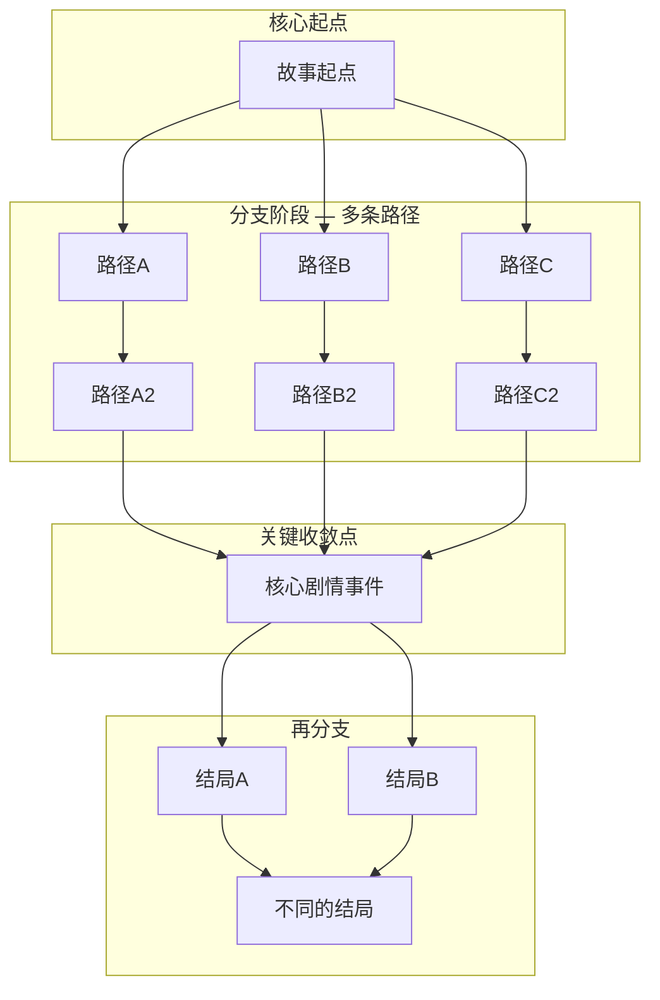
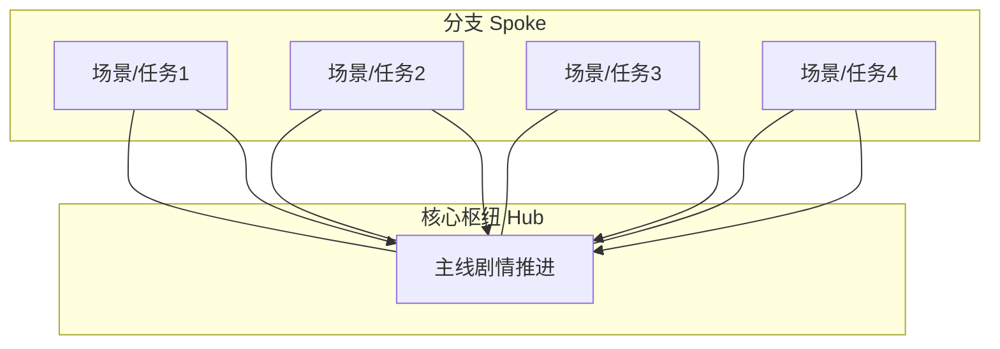
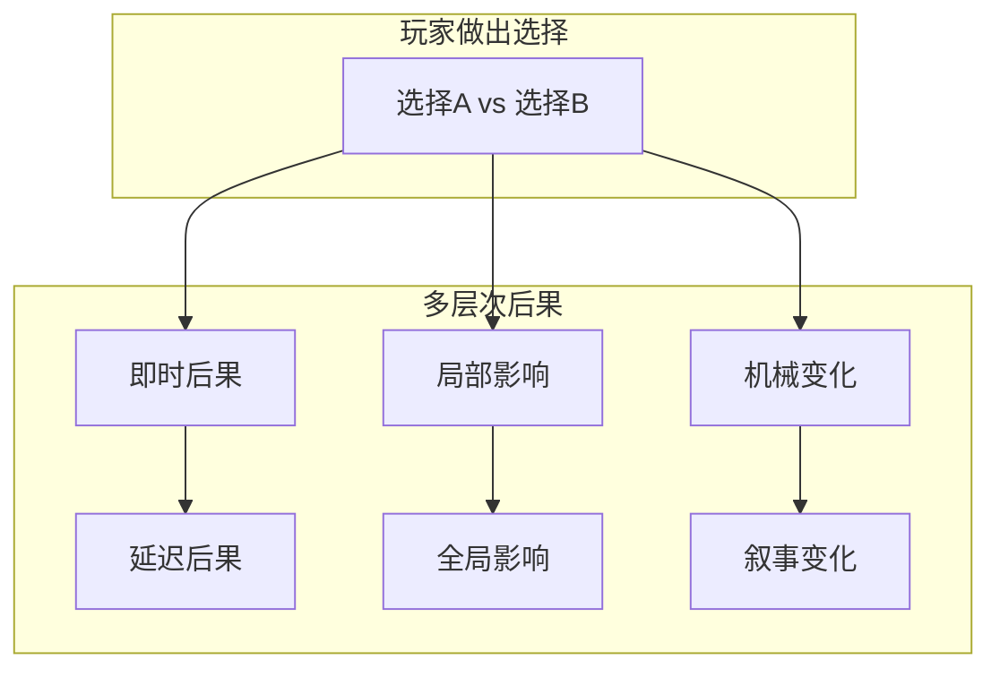

# 补充课13：环境叙事与分支选择

## Learning Objectives

- 掌握游戏中的"Show, Don't Tell"——Level Design 作为叙事工具
- 理解注意力与信息量的平衡（Attention vs Information Ratio）
- 掌握多种 Lore Delivery（传说传递）方法及其适用场景
- 掌握三种分支叙事结构：Diamond、Hub-and-Spoke、Quest-based
- 理解 Meaningful Choice（有意义选择）的设计原则
- 学会设计即时/延迟、局部/全局、机制/叙事三种后果系统
- 通过 The Walking Dead、Detroit、The Witcher 3 等案例理解分支叙事

---

## 环境叙事：Show, Don't Tell 在游戏中的最高形态

在 [[s12-game-narrative-fundamentals|补充课12]] 中我们介绍了环境叙事的基本概念。本课将深入探讨如何**设计和实现**环境叙事。

### 水平一：场景陈述（Scene Statement）

> [!NOTE]
> 场景陈述是指：**如果用一个词或一个句子描述一个场景"说了什么"，它的答案就是场景陈述。** 这和电影编剧中的"场景目标"是同一个概念。

**例子：**
- "这个矿场发生过灾难" → 倒塌的支柱、散落的工具、墙上的抓痕
- "这里的指挥官疯了" → 墙上用血写下的疯狂文字、对着空气说话的全息记录
- "这个世界曾经辉煌" → 巨大的穹顶、褪色的壁画、覆盖苔藓的黄金

### 水平二：角色通过环境讲述

不通过对白，而是通过角色在空间中的行为来传递性格。

```
例子：
两个不同的末日幸存者的避难所：

避难所 A：
- 武器排列整齐，每把都保养得很好
- 墙上的日历有规律的划痕
- 一本写满战斗笔记的日记
→ 性格：纪律、经验、孤独

避难所 B：
- 到处都是空酒瓶
- 墙上有飞镖靶，靶心是一个人的照片
- 一张揉皱的全家福
→ 性格：绝望、愤怒、失去
```

### 水平三：环境作为故事结构本身

最高级别的环境叙事是：**整个游戏的世界就是一个故事。**

**案例 — Dark Souls 的世界设计：**

Dark Souls 中 Lordran 的关卡布局本身就是叙事：

- Firelink Shrine 位于世界的中心（连接所有区域）
- 向上的路通往 Anor Londo（神的世界）—— 逐渐明亮、庄重
- 向下的路通往 Blighttown（被遗忘者的世界）—— 逐渐黑暗、污秽
- 地理上的"垂直性"暗示了世界的社会阶层

> [!TIP]
> Dark Souls 的设计启示：与其在开场动画中告诉你"这是一个关于神明、人类和被遗弃者的世界"，不如让你**走一遍这个世界**——从上到下，从光明到黑暗，每一次移动都是一次叙事体验。

---

## Lore Delivery（传说传递）方法

游戏需要向玩家传递世界观信息（Lore），但不同于电影，玩家在游戏中往往处于"活跃状态"——他们在操作角色、战斗、探索。因此，信息传递的方式需要精心设计。

### 常见方法对比

| 方法 | 优点 | 缺点 | 最佳使用时机 |
|------|------|------|------------|
| **过场动画（Cutscene）** | 叙事密度高，情感冲击强 | 打断游戏节奏，玩家被动 | 关键剧情时刻 |
| **音频日志（Audio Log）** | 不打断移动，沉浸感强 | 玩家可能漏听或错过 | 探索过程中 |
| **文本/物品描述（Item Description）** | 可选深度阅读 | 大量玩家不会主动阅读 | 补充世界观背景 |
| **环境细节（Environmental Detail）** | 始终在场，不打断节奏 | 玩家可能忽略 | 持续性的背景叙事 |
| **NPC 对话（Character Dialogue）** | 自然融入游戏进程 | 无法控制节奏 | 任务交互中 |
| **可收集品（Collectibles）** | 奖励探索行为 | 容易被视为"填充" | 作为探索奖励 |


### Attention vs Information Ratio（注意力与信息量比）

> [!NOTE]
> 一个核心设计原则：**不要在玩家需要操作的时候传递需要高度注意力的信息。**

- **低操作强度时段**（行走、乘坐载具、加载画面）→ 适用于高密度信息（音频日志、NPC 对话）
- **高操作强度时段**（战斗、解谜、快速移动）→ 适用于低密度信息（环境细节、不需要阅读的文字）

| 玩家状态 | 操作强度 | 适用信息类型 | 例子 |
|---------|---------|-------------|------|
| 慢步探索 | 低 | 音频日志、环境细节 | 在废墟中边走路边听录音 |
| 战斗中 | 高 | 环境叙事（无需阅读） | 战场上的痕迹讲述战斗的惨烈 |
| 在安全区 | 最低 | 文本/书籍/物品描述 | 在篝火处阅读物品故事 |
| 对话中 | 低 | NPC 对白、选择支 | 和任务 NPC 对话 |
| 快速移动 | 低 | 音频/加载画面故事 | 《战神》中快速旅行时的对话 |

---

## 分支叙事结构（Branching Narrative Structures）

### 1. 钻石结构（Diamond Structure）— 收敛式分支

**特征：** 故事从中心出发，向外分支，最终回到收敛的关键节点。



| 优点 | 缺点 |
|------|------|
| 故事结构完整可控 | 分支之间的差异性有限 |
| 编剧能保证情感弧线 | 玩家感觉选择"被拉回原轨" |
| 开发成本适中 | 分支可能感觉"伪装" |

**代表案例：** 《The Walking Dead》（Telltale 系列）— 玩家有大量选择，但故事的关键节点总是相同的。最终结局大方向一致，但玩家到达的方式和情感体验不同。

### 2. Hub-and-Spoke 结构（放射式结构）

**特征：** 中心 Hub（核心故事节点）连接多个 Spoke（分支任务/场景），玩家可以自由选择探索顺序。



| 优点 | 缺点 |
|------|------|
| 玩家自由度高 | 情感弧线难以精确控制 |
| 探索感强 | 不同顺序可能导致叙事混乱 |
| 开发结构清晰 | 需要确保每个 Spoke 都"意料之外，情理之中" |

**代表案例：** 《Detroit: Become Human》— 围绕关键节点展开大量分支，玩家的选择影响哪些角色存活，最终通向大量不同的结局。

### 3. Quest-based 结构（任务式结构）

**特征：** 主线任务 + 大量支线任务的组合。主线提供核心故事，支线丰富世界观和角色。

这种结构是开放世界游戏中最常见的叙事模式。详细分析请见 [[s14-quest-worldbuilding|补充课14：任务结构与世界构建]]。

| 优点 | 缺点 |
|------|------|
| 主线和支线可以承担不同叙事功能 | 主线节奏常被支线打断 |
| 玩家可以自由选择参与程度 | 主线与支线的质量差距可能明显 |

---

## Meaningful Choice（有意义选择）

分支叙事的核心在于**玩家觉得自己的选择有意义**。以下是 Meaningful Choice 的三个必要条件：

### 1. 选择必须有可见的后果

> [!NOTE]
> 如果玩家做了一个选择，但完全看不到任何后续影响，他们会认为自己的选择毫无意义，进而对游戏的叙事失去兴趣。

**好例子（The Witcher 3）：**
- 决定帮助精灵还是人类 → 之后在任务中会遇到被帮助一方的回报
- 决定杀不杀某个怪物 → 后续某位 NPC 会提及这个决定并改变对你的态度

**坏例子：**
- 选择"我原谅你"和"我不原谅你" → 之后 NPC 用完全相同的对白回复你

### 2. 选择必须足够清晰（但不必清晰到"正义 vs 邪恶"）

玩家需要理解自己在选择什么。但这不意味着选择必须是"白 vs 黑"——实际上，最有趣的选择往往是**灰色地带的选择**。

```
灰色的选择设计：

清晰的选择： "救村民" vs "救自己"（玩家明白利害）
灰色的结果： 无论救谁都会带来意想不到的后果
道德模糊： 两个选择都有正当理由，也都有代价
```

### 3. 选择必须足够复杂，值得思考

真正有意义的选择会让玩家停下来思考：

- **道德困境**：没有完美的选择
- **信息不对称**：玩家不能完全预测后果
- **情感冲突**：两个选项各有利害关系

### Meaningful Choice 设计清单

| 检查项 | 说明 | 通过？|
|--------|------|-------|
| **可见后果** | 玩家在合理时间内看到选择的影响 | [ ] |
| **清晰可选** | 玩家理解两个选项之间的差异 | [ ] |
| **灰色地带** | 两个选择都不是"完美选项" | [ ] |
| **不可逆** | 选择不能轻易撤销，有重量感 | [ ] |
| **情感投入** | 玩家对选择涉及的角色/事物在意 | [ ] |
| **回响效应** | 选择的影响在后续故事中反复出现 | [ ] |

---

## 后果系统（Consequence Systems）

选择是瞬间的，后果是延续的。一个好的分支叙事需要设计不同层次、不同时间尺度的后果。

### 1. 即时 vs 延迟后果

| 类型 | 时间 | 例子 |
|------|------|------|
| **即时后果（Immediate）** | 几秒到几分钟 | 选择帮 A 还是 B，B 当场发怒离开 |
| **短延迟后果（Short-term）** | 几分钟到几小时 | 帮了 B 之后，B 在下一关提供帮助 |
| **长延迟后果（Long-term）** | 几小时到几十小时 | 第一章的选择在最终章决定了一个角色的生死 |

### 2. 局部 vs 全局后果

| 类型 | 范围 | 例子 |
|------|------|------|
| **局部后果（Local）** | 影响当前场景/任务 | 选择对话选项改变当前 NPC 的态度 |
| **全局后果（Global）** | 影响整个游戏世界 | 选择决定了哪个势力最终统治城市 |

### 3. 机械 vs 叙事后果

| 类型 | 形式 | 例子 |
|------|------|------|
| **机械后果（Mechanical）** | 影响游戏玩法 | 选择帮助某个阵营 → 获得该阵营的专属武器/技能 |
| **叙事后果（Narrative）** | 影响故事走向 | 选择帮助某个阵营 → 另一阵营的成员在后续剧情中死亡 |



---

## 经典案例深度分析

### 1. The Walking Dead（Telltale）— 假装有意义的选择

Telltale 的《The Walking Dead》被誉为分支叙事的里程碑，但分析它的设计会发现：**大多数选择不改变故事的主干，但改变了玩家的感受。**

- 玩家选择的对话会影响其他角色对主角的态度（局部叙事后果）
- 但关键情节节点总是固定的——Lee 总是会被咬，Clementine 总是会学开枪
- **核心技巧**：让玩家感觉自己的选择"塑造了旅程，而非目的地"

> [!NOTE]
> Telltale 模式的重要启示：**分支叙事不一定要改变结局才有意义。如果玩家在过程中感受到了情感的重量，即使走向同一个终点，体验也是独特的。**

### 2. Detroit: Become Human — 真正的分支网络

Quantic Dream 的《Detroit: Become Human》则采用了完全不同的哲学：每一个选择都可能导向完全不同的结局。

- 三条角色线的选择相互影响
- 三个角色的存活状态由玩家的每一个选择决定
- 结局数量极多（数十种不同的故事终点）
- **代价**：巨大的开发成本和测试复杂度

> [!WARNING]
> Detroit 的模式虽然令人印象深刻，但对大多数游戏团队而言不可行——每一条分支都需要完整的动画、配音、测试，开发成本呈指数级增长。

### 3. The Witcher 3 — 灰色道德与延迟后果

CD Projekt Red 的选择设计哲学是：**没有完美的选择，后果永远不会立即显现。**

**案例 — "Bloody Baron"任务线：**

在这个著名的任务中，玩家需要处理一个家庭暴力的故事：

- 玩家面对的选择没有"好"的选项
- 每个选择都有道德代价
- 某些后果在 20 小时后才显现
- 玩家无法"完美通关"这个任务

> [!TIP]
> The Witcher 3 的选择设计启示：**在现实世界中，很多选择没有正确答案。最好的游戏选择也给你同样的感觉——你的决定会改变一些事情，但不一定变得"更好"。**

---

## 本章小结

环境叙事是游戏独有的叙事优势——让空间本身成为故事。Lore Delivery 方法的选择取决于 Attention vs Information Ratio：玩家在低操作强度时获取高密度信息，在高操作强度时用环境传递低密度信息。分支叙事有三种主要结构（钻石、放射、任务式），各有优劣。Meaningful Choice 要求设计有可见后果、足够清晰、足够复杂的选择。后果系统分为即时/延迟、局部/全局、机械/叙事三个维度。最好的分支叙事不改变所有终点，但让每个玩家的旅程都感觉独特而沉重。

---

## 课程链接

- 上一课：[[s12-game-narrative-fundamentals|补充课12：游戏叙事基础]]
- 下一课：[[s14-quest-worldbuilding|补充课14：任务结构与世界构建]]
- 参考主课：[[0008-three-act-structure|第08课：三幕式故事结构]] — 分支叙事的选择节点在结构上类似于转折点
- 参考补充：[[s11-suspense-foreshadowing|补充课11：悬念与伏笔]] — 分支叙事中的伏笔和后果设计

## 自我测试

1. 环境叙事的三个水平层次是什么？
2. Attention vs Information Ratio 的核心原则是什么？请给出一个"信息密度不当"的坏例子。
3. 三种分支叙事结构（钻石、放射、任务式）各自的核心特征是什么？
4. Meaningful Choice 的三个必要条件是什么？
5. 后果系统的三个维度是什么？各举一个例子。

<details><summary>参考答案</summary>

1. 水平一（场景陈述）：场景用视觉元素传递一个核心信息。水平二（角色通过环境讲述）：空间中的布置反映角色的性格和状态。水平三（环境作为故事结构）：整个游戏世界本身在讲述一个故事。
2. 核心原则：不要在玩家需要操作的时候传递需要高度注意力的信息。坏例子：在激烈战斗中弹出大段文字描述，或者在慢速探索时只给一个简单的环境提示。
3. 钻石结构（Diamond）：从中心向多个分支发散后又收敛回关键节点。放射结构（Hub-and-Spoke）：围绕核心枢纽展开多条可自由探索的分支。任务式结构（Quest-based）：主线 + 支线的组合。
4. 1）选择必须有可见的后果；2）选择必须足够清晰让玩家理解差异；3）选择必须足够复杂让玩家值得思考。
5. 即时 vs 延迟（几分钟后 vs 几十小时后看到后果），局部 vs 全局（影响当前任务 vs 影响整个世界），机械 vs 叙事（影响玩法 vs 影响故事）。

</details>

## 课后练习

1. **环境叙事设计**：选择一个场景（如"一个末日后的超市"），用环境叙事的方式传递三个信息：1）这里发生了什么；2）留下痕迹的人是谁；3）这个世界的社会状态。不允许使用任何文字或对白。
2. **分支结构蓝图**：为你构思中的一个故事设计一个 Diamond 分支结构。标注出：起点 → 至少 3 条分支路径 → 收敛点 → 至少 2 种结局。
3. **选择设计**：写一个"灰色的选择"——两个选项都有道德理由，也都有代价。然后在每个选项下面写下：1）即时后果（马上发生的）；2）延迟后果（10 小时后显现的）；3）全局影响（改变最终故事的哪个部分）。
4. **Lore Delivery 策略**：拿一个现有的游戏世界（或你自己的世界观），为一个世界背景信息（如"这个世界的神已经死了"）设计三种不同的传递方法——一种用环境，一种用物品描述，一种用 NPC 对话。
5. **后果系统设计**：设计一个三层的后果链——玩家在 Act 1 做了一个选择，这个选择在 Act 2 产生了局部影响，在 Act 3 产生了全局影响。画出影响链条。

---

> **参考：** [[reference/glossary|编剧术语表]]