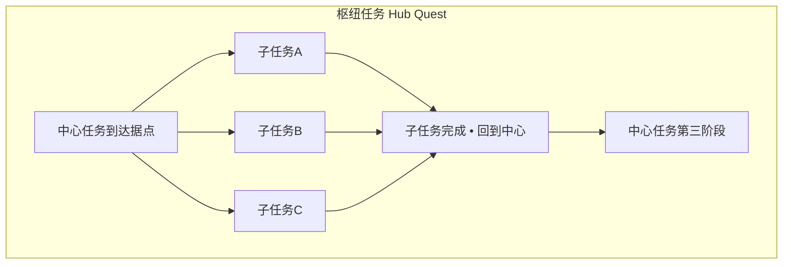
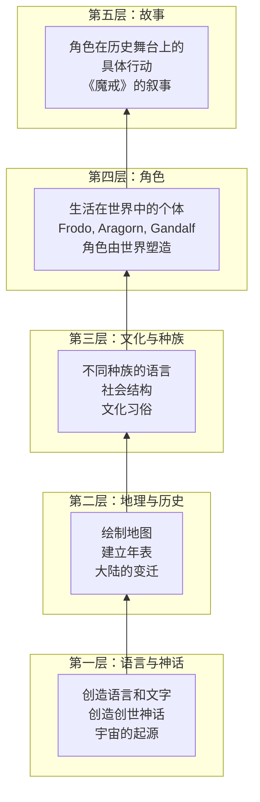

# 补充课14：任务结构与世界构建

## Learning Objectives

- 理解 Main Quest（主线任务）和 Side Quests（支线任务）的不同叙事功能
- 掌握 6 种 Quest Design Patterns（任务设计模式）及其适用场景
- 学习开放世界游戏中叙事节奏与玩家自主权之间的平衡方法
- 理解 Worldbuilding（世界构建）的基本原理：内部一致性、冰山理论、Show Don't Info-Dump
- 掌握 Tolkien 式的 Bottom-Up Worldbuilding 模型
- 通过 The Witcher 3、Red Dead Redemption 2、Elden Ring 等案例学习最佳实践
- 独立设计一个主线任务和一个支线任务

---

## Main Quest vs Side Quests（主线与支线的叙事分工）

在一款叙事驱动的游戏中，主线任务和支线任务承担着**不同的叙事功能**。不应该把所有任务都设计成"同样重要"。

| 维度 | Main Quest（主线任务） | Side Quests（支线任务） |
|------|----------------------|------------------------|
| **叙事核心** | 推动主故事向前发展 | 扩展世界观、丰富次要角色 |
| **情感曲线** | 构建核心情感弧线（上升-高潮-结局） | 提供情感调剂的独立弧线 |
| **节奏控制** | 承载主要的节奏变化 | 创造节奏的弹性空间 |
| **角色发展** | 主角的核心蜕变 | 配角的故事线、世界的变化 |
| **紧迫感** | 通常有时间压力或命运危机 | 轻松/可选/可以随时回来做 |
| **开发优先级** | 必须最优 | 质量重要但可接受有波动 |

> [!NOTE]
> 一个常见的设计错误：将支线任务做成"一模一样"的重复任务。好的支线任务是**小而完整的故事**——它们有自己的三幕结构、角色弧线和情感回报。

### 支线任务的隐藏功能

支线任务不仅仅是"额外内容"。在优秀的游戏设计中，支线任务承担着以下功能：

1. **世界冷却（World Cooling）**：在主线紧张后提供喘息空间
2. **替代视角（Alternate Perspective）**：通过支线展示主线事件的不同侧面
3. **情感投资（Emotional Investment）**：让玩家爱上这个世界的居民——这样主线的赌注才有情感分量
4. **主题深化（Thematic Deepening）**：支线可以用微观故事映射主线主题
5. **世界历史（World History）**：支线是展示世界背景的天然载体

---

## Quest Design Patterns（任务设计模式）

### 6 种常用任务模式

#### 1. FedEx（快递模式）

**结构：** 从 NPC A 处接收物品 → 送到 NPC B 处 → 获得奖励。

```
叙事功能：
- 最常见的任务模式，用于连接不同区域
- 可以用于展示世界的地理变化（送货路上经过不同风土人情）
```

| 优点 | 缺点 |
|------|------|
| 结构简单，实现成本低 | 过于重复时玩家感到无聊 |
| 是展示世界的天然载体 | 如果没有叙事包装，就是纯粹的跑腿 |

**改善策略：** 给 FedEx 任务添加故事。例子——《The Witcher 3》中"送一封信"的任务，信的内容揭示了一段跨越十几年的悲剧爱情故事，玩家送到后可能面临是否告知收信人真相的道德选择。

#### 2. Go Here, Kill X（猎杀模式）

**结构：** NPC 告知目标位置 → 前往该区域 → 击败指定敌人 → 返回报告。

```
叙事功能：
- 展示世界观中的冲突和威胁
- 建立角色作为"解决问题的人"的形象
- 可以揭示环境的生态/文化信息
```

**改善策略：** 让目标不再是"纯粹的怪物"。例子——《The Witcher 3》中一个任务要求玩家猎杀一只"怪物"，但玩家发现它是被人类虐待后逃走的生物——你杀谁？保护谁？

#### 3. Escort（护送模式）

**结构：** 保护一个移动的 NPC → 从 A 点护送到 B 点 → 途中遭遇威胁。

```
叙事功能：
- 在移动过程中展示世界（边走边聊）
- 通过护送对象讲述这个世界的故事
- 建立玩家与 NPC 的情感联系
```

> [!WARNING]
> Escort 任务在游戏界臭名昭著（NPC 跑得太慢 / AI 太蠢 / 死了就重来）。如果使用这种模式，务必确保 NPC 的 AI 行为不会激怒玩家。参考《The Last of Us》中 Ellie 的护送——她不会做蠢事。

#### 4. Investigation（调查模式）

**结构：** 到达现场 → 收集线索 → 推理分析 → 得出结论 → 采取行动。

```
叙事功能：
- 让玩家主动参与故事（而非被动接收）
- 展示环境叙事的最高水平
- 赋予玩家"侦探"式的成就感
```

**经典案例：** 《The Witcher 3》中的调查任务——玩家使用 Witcher 感官追踪气味、血迹、脚印，拼凑出事件真相。玩家不是在"看故事"而是在"破案"。

> [!NOTE]
> 调查模式完美地结合了 [[s13-env-storytelling-branching|补充课13]] 中讨论的环境叙事和 Attention vs Information Ratio 原则——玩家在低操作强度下（慢走、观察）接收高密度信息。

#### 5. Moral Choice（道德选择模式）

**结构：** 呈现一个无完美答案的困境 → 玩家做出选择 → 不同的长期后果。

```
叙事功能：
- 推动角色的道德弧线
- 让玩家思考故事的主题
- 在灰色地带中建立情感重量
```

**经典案例：** 《The Witcher 3》"Bloody Baron"——玩家面临远非"选 A 还是选 B"简单的道德选择。每个决定都有不可预测的后果，有些在 20 小时后才显现。

#### 6. Hub Quest（枢纽任务模式）

**结构：** 一个中心任务 → 多个子任务（通常需要完成一定数量的子任务才能推进） → 子任务完成后回到主任务。

```
叙事功能：
- 创建大片地图上的叙事聚集点
- 让玩家对某个区域产生"这是我的主战场"的感觉
- 子任务共同揭示中心任务的多重面向
```



**经典案例：** 《Red Dead Redemption 2》的营地系统——营地是叙事枢纽，玩家在营地里接受主线任务、与同伴互动、推动个人故事。每个同伴的支线任务最终汇聚为推动主线进展。

---

## 任务类型与叙事功能对照表

| 任务类型 | 叙事密度 | 玩家主动度 | 主要叙事功能 | 代表游戏 |
|---------|---------|-----------|-------------|---------|
| FedEx（快递） | 低 | 低 | 连接区域 / 展示世界 | 广泛存在 |
| Go Here, Kill X（猎杀） | 中低 | 中 | 建立冲突 / 角色身份 | The Witcher 3 |
| Escort（护送） | 高 | 低 | 角色关系 / 情感投资 | The Last of Us |
| Investigation（调查） | 高 | 高 | 故事探索 / 推理发现 | The Witcher 3, Sherlock |
| Moral Choice（道德选择） | 最高 | 高 | 主题表达 / 角色弧线 | The Witcher 3, Detroit |
| Hub Quest（枢纽任务） | 中高 | 中 | 区域构建 / 人物群像 | RDR2, Cyberpunk 2077 |

---

## 开放世界的叙事节奏（Narrative Pacing in Open-World）

开放世界的最大叙事挑战：**玩家可以自由离开"应该紧张"的地方。**

在电影中，如果主角正在被追杀，观众会持续紧张 15 分钟。在开放世界游戏中，玩家在被追杀的过程中可能看到一朵花然后去采，或者在逃跑的路上看到一座塔然后去爬。

### 节奏控制策略

#### 1. 紧迫感的分层设计

| 层 | 紧迫程度 | 设计方法 |
|----|---------|---------|
| **核心叙事层** | 高 | 主线的核心危机（世界末日、亲人的死亡倒计时） |
| **区域层** | 中 | 当前区域的局部危机（该地区的军队正在逼近） |
| **任务层** | 低 | 单个任务内的紧迫（"必须在日落前到达"） |
| **探索层** | 无 | 自由探索时间（没有时间压力） |

#### 2. 节奏的"呼吸感"

> [!NOTE]
> 好的开放世界叙事像呼吸——紧张（吸气）和松弛（呼气）交替出现，而玩家可以自己决定每次呼吸的深度和时长。

```
设计节奏示意图：

主线大事件（吸气 — 强制紧张）
  ↓
自由探索窗口（呼气 — 玩家可以：做支线 / 探索 / 看风景 / 收集）
  ↓
角色情感推动（轻吸气 — 对话、营地场景）
  ↓
更多自由时间
  ↓
主线大事件（强吸气 — 下一个高潮）
```

#### 3. 主线张力与支线松弛的冲突

开放世界的核心矛盾：**主线故事告诉玩家"世界末日了快跑"，但支线任务要求玩家"帮我找猫"。**

**解决方案：**

- **调整主线的紧迫感措辞**：不要在第一幕就说世界要毁灭了。让危机慢慢浮现
- **剧情锁（Story Gate）**：某些核心任务需要满足条件（完成一定数量的支线 / 达到特定等级 / 角色准备就绪）
- **叙事上的"等待时机"**：主线任务中安排自然的中场休息时间（等候某人的回复、等待夜晚降临）

---

## Worldbuilding（世界构建）的底层原理

### 内部一致性（Internal Consistency）

> [!NOTE]
> 世界构建的第一原则：**世界的规则必须自洽。** 魔法可以有，但魔法必须有它的规则、代价和限制。如果违反自己设立的规则，玩家/读者会失去信任。

**建立内部一致性的检查清单：**

- [ ] 物理规则：这个世界和现实世界有什么不同？有哪些是相同的？
- [ ] 魔法/科技规则：超自然力量（如果存在）如何运作？有什么代价？
- [ ] 社会规则：权力结构是怎样的？法律和惩罚体系？社会阶级？
- [ ] 历史：这个世界的重要事件有哪些？它们如何塑造了现在？
- [ ] 地理：不同的区域如何影响文化？交通/交流如何实现？

### 冰山理论（Iceberg Principle）

> **冰山理论：** 在游戏中（或任何叙事媒介中），你只需要展示世界观的 10%。剩下的 90% 隐藏在水面之下，但你必须把它构建出来——因为它决定了那 10% 的真实感。

```
可视化：
        ___________
       /  可见的    \      ← 10%：玩家在游戏中直接体验到的
      /    10%      \        （任务、对白、场景）
     /_______________\
    /                  \
   /     隐藏的 90%     \   ← 90%：编剧知道但玩家不需要直接看到的
  /                     \       （完整的历史、人口统计、经济体系、
 /_______________________\       未使用的传说、未出现的角色背景）
```

> [!TIP]
> 冰山理论的实践意义：编剧对世界的了解应该是玩家看到的 10 倍。这 90% 的"隐藏世界"不会直接出现在游戏中，但它会渗透进每一个细节，让世界显得真实而有深度。

### Show, Don't Info-Dump（展示，不要倾倒信息）

这是 Show, Don't Tell 原则在世界构建中的延伸。不要通过以下方式向玩家倾倒世界观：

```
不好的 Info-Dump 例子：

NPC 说：
"你知道吗，我们这个王国在 300 年前经历了伟大的战争，当时的国王 Regulus 三世带领人民战胜了黑暗领主 Malakor，建立了现在这个和平的时代。从那以后，我们每 50 年举办一次光明节来纪念那个时刻。"

```

> [!WARNING]
> 一段对话塞进了 5 个信息点：300 年前的战争、Regulus 三世、Malakor、战争的结果、光明节。玩家几乎不可能全部记住。更糟的是，它听起来像课本而不像人话。

```
好的 Show 方式：

对话：
玩家："这里为什么有个巨大的雕像？"
NPC："大家都叫他救世主。（耸耸肩）至少史书是这么说的。"

环境：市场里悬挂着 50 年一次的光明节彩灯，孩子们在讨论今年谁会扮演"光明使者"。

物品描述：一本破旧的历史书——"战争结束了 300 年，但边境的伤疤还没愈合。"
```

---

## Tolkien 的 Bottom-Up Worldbuilding 模型

J.R.R. Tolkien 是近代世界构建的奠基人。他的方法是从小到大、从底层到顶层构建世界。

### Tolkien 的世界构建层



### 反 Tolkien 模型：Top-Down

很多游戏世界构建采用反方向：**先有玩法需求，再构建世界来适应玩法。**

```
例子：
1. 我们需要一个"可以让玩家随意开枪的城市" → 设计城市
2. 城市需要有冲突 → 帮派战争
3. 帮派战争需要背景 → 设计帮派历史
4. 历史和城市需要故事 → 设计主角和任务
```

> [!NOTE]
> 两种模型都是有效的。Tolkien 模型创造的世界深厚自洽，但构建成本高（需要大量世界设定可能永远不会出现在游戏中）。Top-Down 模型效率高，但世界可能会显得"功能化"和浅薄。大部分游戏世界构建在这两者之间找到平衡。

---

## 经典案例深度分析

### The Witcher 3 — 支线的尊严

《The Witcher 3》的设计哲学：**每一个支线任务都应该像一个迷你主线。**

- 每个支线有独立的叙事弧线（开头 → 发展 → 结局）
- 支线角色有完整的背景故事和对话
- 支线的选择会影响后续世界状态
- 支线的写作质量不亚于主线

> [!TIP]
> 《The Witcher 3》的启示：支线任务不是"填充物"。当玩家意识到每一个支线任务都可能带来一个真正的故事体验时，他们对世界的投入程度呈指数级增长。

### Red Dead Redemption 2 — 慢节奏的世界构建

RDR2 采用了一种"反游戏设计"的世界构建策略——**它故意放慢节奏，让玩家沉浸在世界中。**

- 角色的移动速度故意放慢（不是跑就是跑，而是自然的步行/骑马速度）
- 所有动作都有动画耗时（剥皮、搜索抽屉、上子弹）
- 日常互动（吃饭、刮胡子、和同伴聊天）被设计为"可选的叙事体验"
- 场景之间的过渡有漫长的骑马过程（同伴会在骑马时和你聊天，讲述过去的故事）

> [!NOTE]
> RDR2 的风险：这种慢节奏让一些玩家感到无聊。但它的回报是：那些"慢下来的时刻"创造了游戏史上最深的沉浸感。玩家不只是"完成了游戏"，而是"在那段时间里生活在那个世界中"。

### Elden Ring — 碎片化叙事世界

FromSoftware 的 Elden Ring 采用了一种极端的"碎片化叙事"方式：

- 没有任务日志，没有明确的 NPC 引导
- 故事情节通过物品描述、环境细节、NPC 的谜语式对话拼凑
- 玩家需要主动"考古"——阅读物品描述，对比地理，推测历史
- 主线任务是多个并行的"半主线"——玩家自由选择推进哪个

```
Elden Ring 的叙事哲学：

给玩家一本散落在地图上的书，由他们自己拼凑出故事。
而不是递给玩家一本装订好的书，让他们从头读到尾。
```

---

## 本章小结

主线任务推动核心故事，支线任务扩展世界和深化主题。六种任务模式（FedEx、猎杀、护送、调查、道德选择、枢纽）各有其叙事功能，关键在于给每种模式增添故事深度。开放世界叙事节奏的核心是"呼吸感"——让玩家在紧张的剧情和自由的探索之间找到平衡。世界构建的原理包括内部一致性（规则必须自洽）、冰山理论（展示 10%，知道 100%）、Show Don't Info-Dump（不要倾倒信息）。Tolkien 的 Bottom-Up 模型（语言→地理→文化→角色→故事）创造了最深层的世界感。最好的游戏世界不是背景板——它们是故事本身。

---

## 课程链接

- 上一课：[[s13-env-storytelling-branching|补充课13：环境叙事与分支选择]]
- 参考补充：[[s12-game-narrative-fundamentals|补充课12：游戏叙事基础]] — Embedded vs Emergent Narrative
- 参考补充：[[s11-suspense-foreshadowing|补充课11：悬念与伏笔]] — 任务中的伏笔和 payoff 设计
- 参考主课：[[0008-three-act-structure|第08课：三幕式故事结构]] — 每个任务也可以有三幕结构

## 自我测试

1. 主线任务和支线任务在叙事功能上有哪些核心区别？
2. 6 种任务模式分别是什么？举出各自的叙事功能。
3. 开放世界游戏节奏控制中的"呼吸感"是什么意思？
4. 世界构建的"冰山理论"是什么？对编剧的实践意味着什么？
5. Tolkien 的 Bottom-Up 世界构建模型有哪几个层次？

<details><summary>参考答案</summary>

1. 主线推动核心故事和情感弧线，支线扩展世界观、丰富次要角色、提供情感调剂的独立弧线。主线有节奏控制权，支线创造弹性空间。
2. 1）FedEx（快递）：连接区域，展示世界。2）Go Here, Kill X（猎杀）：展示冲突，建立角色身份。3）Escort（护送）：在移动中建立关系，情感投资。4）Investigation（调查）：玩家主动探索故事。5）Moral Choice（道德选择）：主题表达，角色弧线。6）Hub Quest（枢纽）：区域构建，人物群像。
3. 紧张的剧情（吸气）和自由的探索（呼气）交替出现。玩家可以自己决定每次呼吸的深度和时长。
4. 冰山理论：你只需要展示世界观的 10%，但你必须构建 100%。对编剧的实践意味着：你对世界的了解应该是玩家看到的 10 倍，那 90% 的隐藏知识决定了那 10% 的真实感。
5. 第一层：语言与神话（宇宙的起源）；第二层：地理与历史（地图、年表）；第三层：文化与种族（社会结构）；第四层：角色（个体）；第五层：故事（具体叙事）。

</details>

## 课后练习

1. **任务设计（主线）**：设计一个主线任务。包含以下要素：1）任务前提和背景；2）触发条件；3）任务的 3 个关键阶段（对应三幕结构）；4）一个意料之外的转折；5）这个任务对整个主线故事的推动作用。
2. **任务设计（支线）**：设计一个支线任务。要求：1）与主线主题产生呼应；2）包含一个道德灰色选择；3）有一个"隐藏"的后果（玩家可能要到 10 小时后才发现的）。
3. **世界构建片段**：用 Tolkien 的 Bottom-Up 方法，为一个新世界构建至少 3 个层次：1）一个地理特征（如一座山、一条河、一片沙漠）及它如何影响当地文化；2）一个社会规则或禁忌及它的历史来源；3）一个生活在这个世界中的普通人——他的日常生活是什么样的？
4. **节奏设计**：为你的游戏设计 3 个"呼吸"周期。标注每个周期的吸气（紧张—主线事件）和呼气（松弛—自由探索）的内容和时长比例。
5. **Info-Dump 改写**：找一个游戏/电影中"信息倾倒"的场景，将其改写为环境叙事 + 碎片化展示的方式。

---

> **参考：** [[reference/glossary|编剧术语表]]