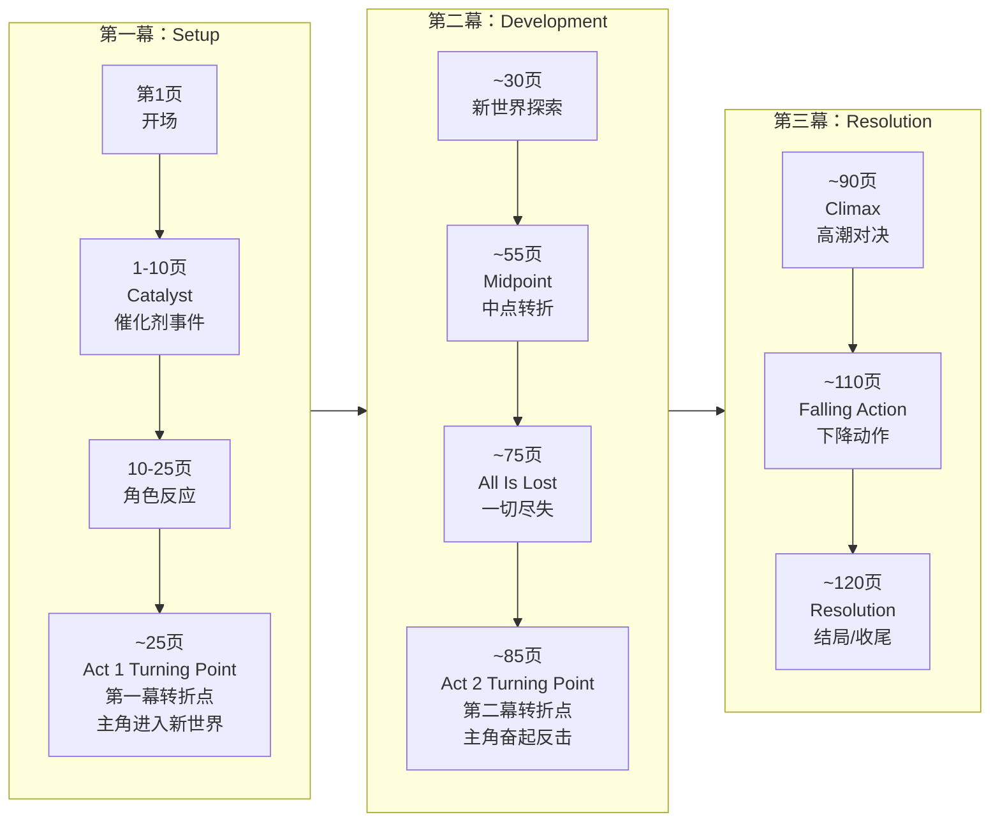
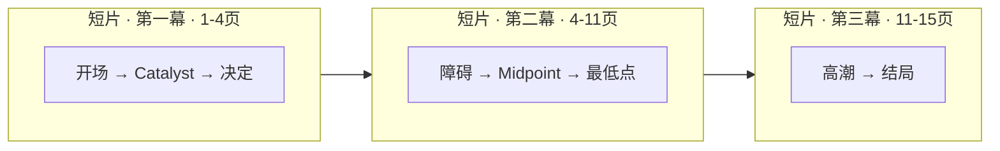

# 三幕结构速查

三幕式结构是最经典也是最有效的故事结构。本参考以 **120 页 Feature Film** 为基准，同时提供针对 **15 页 Short Film** 的缩放指南。

---

## 三幕结构总览



---

## 各幕详解

### 第一幕：Setup（铺垫）

**页数位置：** 第 1 页 — 第 25/30 页
**占比：** 约 25%

#### 做什么：

| 元素 | 位置 | 作用 |
|---|---|---|
| **开场 (Opening Image)** | 第 1 页 | 用一两页建立故事的世界、基调、主角的现状 |
| **Catalyst (催化剂事件)** | 第 5-15 页 | 打破主角日常生活的突发事件，故事由此正式开始 |
| **主角反应** | 第 10-25 页 | 主角试图抵抗或适应 Catalyst 带来的变化 |
| **第一幕转折点** | 第 25-30 页 | 主角做出关键决定，主动进入第二幕的世界 |

> [!TIP]
> 审查你的第一幕：在第 10 页之前，观众是否知道主角是谁、他想要什么？在第 25 页之前，主角是否做出了不可逆的选择？

---

### 第二幕：Development（发展）

**页数位置：** 第 30 页 — 第 85/90 页
**占比：** 约 50%

#### 做什么：

| 元素 | 位置 | 作用 |
|---|---|---|
| **上升动作 (Rising Action)** | 第 30-55 页 | 主角追逐目标，遇到越来越大的障碍；副线发展 |
| **Midpoint (中点转折)** | 第 55-60 页 | 故事的重大转折 — stakes 提升、主角从被动变主动、或者真相被揭露 |
| **一切尽失 (All Is Lost)** | 第 70-75 页 | 主角遇到最大的挫折，似乎失败了 |
| **第二幕转折点** | 第 80-85 页 | 主角在最低谷找到新的动力或策略，准备进入最终对决 |

> [!WARNING]
> 第二幕是最长的部分，也是最容易"写散"的部分。确保每个场景都在推进故事或深化角色。如果某个场景没有这两个功能之一，考虑删掉它。

---

### 第三幕：Resolution（解决）

**页数位置：** 第 90 页 — 第 120 页
**占比：** 约 25%

#### 做什么：

| 元素 | 位置 | 作用 |
|---|---|---|
| **Climax (高潮)** | 第 90-100 页 | 主角和冲突的最终对决，tension 的最高点 |
| **Falling Action (下降动作)** | 第 100-110 页 | 高潮后的余波，展现主角如何应对结局 |
| **Resolution (结局)** | 第 110-120 页 | 故事收尾，展示主角经历了怎样的变化 |

---

## 页面标尺 (Page Ruler)

下面是一个 120 页对标尺，可以打印出来作为写作时的参考：

```
|----|----|----|----|----|----|----|----|----|----|----|----|
1    10   20   30   40   50   60   70   80   90  100  110  120
^    ^         ^              ^         ^              ^
开场 Catalyst    第一幕       Midpoint   一切尽失      Climax
               转折点                   第二幕转折点
```

---

## 短片缩放指南 (15 页 Short Film)

| 长片 (120页) | 短片 (15页) | 作用 |
|---|---|---|
| 第 1-25 页 第一幕 | 第 1-4 页 | 开场 + Catalyst + 决定 |
| 第 25-85 页 第二幕 | 第 4-11 页 | 发展过程 + Midpoint + 转折 |
| 第 85-120 页 第三幕 | 第 11-15 页 | Climax + Resolution |

**短片三幕节奏建议：**



> [!NOTE]
> 短片中每个元素的速度大约是长片的 6-8 倍。没有时间铺垫 — 你需要让 Catalyst 非常早地出现，可能在第 1-2 页就发生。

---

## 每个转折点的核心问题

| 转折点 | 观众应该问的问题 |
|---|---|
| **Catalyst** | "主角会怎么做？" |
| **Act 1 Turning Point** | "他/她能成功吗？" |
| **Midpoint** | "等等，现在事情不一样了 — 主角变了？" |
| **All Is Lost** | "这要怎么收场？完全没有希望了？" |
| **Act 2 Turning Point** | "好，主角有新的计划了，能行吗？" |
| **Climax** | （屏住呼吸 — 没有问题了，只有感受） |
| **Resolution** | "主角真的变了。这是一个好结局。" |

---

## 各幕自查清单

### 第一幕 Checklist

- [ ] Opening Image 展现了主角的"before"状态
- [ ] Catalyst 在第 5-15 页之间发生
- [ ] 观众知道主角想要什么（外在目标）
- [ ] 观众知道主角需要什么（内在需求）
- [ ] Stakes 是明确的 — 赢了能得到什么，输了会失去什么
- [ ] 第一幕结尾主角做出了不可逆的决定

### 第二幕 Checklist

- [ ] 每个场景都在推进冲突或深化角色
- [ ] 障碍越来越大，而不是重复同样的困难
- [ ] Midpoint 改变了故事的走向
- [ ] 副线（B Story）得到了发展
- [ ] All Is Lost 时刻让观众真正感到绝望
- [ ] 主角在第二幕结尾有了新的决心或计划

### 第三幕 Checklist

- [ ] Climax 是主角自己的行动决定的（不是意外或别人代劳）
- [ ] 主角在 Climax 中展现了成长
- [ ] 故事的所有主要问题都得到了回答
- [ ] Resolution 展现了主角的"after"状态
- [ ] 结局给观众留下了情感余韵

---

> 参见 [[0008-three-act-structure|第08课：三幕式故事结构]]