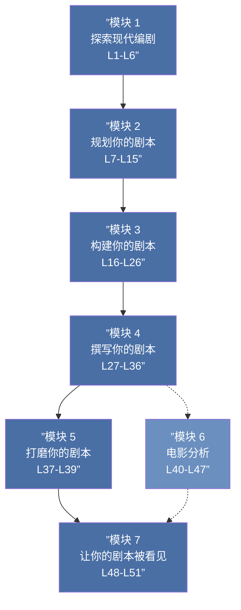

# 课程地图

## 模块 1：探索现代编剧（第01-06课）

| 课号 | 标题 | 核心概念 |
|:----:|------|----------|
| [[lessons/0001-welcome-to-screenwriting-workshop|01]] | 欢迎与课程概览 | 课程全貌、学习路径 |
| [[lessons/0002-why-write-screenplays|02]] | 为什么写剧本 | 编剧动机、叙事的力量 |
| [[lessons/0003-top-grossing-genres|03]] | 最卖座的类型 | 卖座类型特点、类型惯例 |
| [[lessons/0004-award-winning-films|04]] | 获奖影片特征 | 优秀剧本的共同点 |
| [[lessons/0005-movies-versus-television|05]] | 电影 vs 电视 | 媒介差异、叙事策略 |
| [[lessons/0006-history-of-tv-and-movies|06]] | 影视历史 | 技术变革如何塑造叙事 |

## 模块 2：规划你的剧本（第07-15课）

| 课号 | 标题 | 核心概念 |
|:----:|------|----------|
| [[lessons/0007-getting-ideas|07]] | 如何获得灵感 | 构思技术、灵感捕捉 |
| [[lessons/0008-plot-and-story|08]] | 情节与故事 | Plot vs Story 的区别 |
| [[lessons/0009-theme|09]] | 主题 | 故事的深层含义 |
| [[lessons/0010-creating-compelling-characters|10]] | 创造引人注目的角色 | 角色塑造基础 |
| [[lessons/0011-protagonists|11]] | 主角 | 主角类型与弧光 |
| [[lessons/0012-antagonists|12]] | 反派 | 冲突的引擎 |
| [[lessons/0013-supporting-characters|13]] | 配角 | 配角的功能 |
| [[lessons/0014-archetypes|14]] | 原型角色 | 经典角色模式 |
| [[lessons/0015-heros-journey|15]] | 英雄之旅 | 12 阶段叙事模型 |

## 模块 3：构建你的剧本（第16-26课）

| 课号 | 标题 | 核心概念 |
|:----:|------|----------|
| [[lessons/0016-loglines-and-pitches|16]] | Logline 与 Pitch | 一句话讲清故事 |
| [[lessons/0017-synopses|17]] | 故事梗概 | 一页纸大纲 |
| [[lessons/0018-introduction-to-structure|18]] | 结构基础 | 为什么需要结构 |
| [[lessons/0019-four-act-structure|19]] | 四幕结构 | 四幕详解 |
| [[lessons/0020-three-act-structure|20]] | 三幕结构 | 经典三幕模型 |
| [[lessons/0021-act-1|21]] | 第一幕 | 建立与激发 |
| [[lessons/0022-act-2|22]] | 第二幕 | 冲突与升级 |
| [[lessons/0023-act-3|23]] | 第三幕 | 高潮与收尾 |
| [[lessons/0024-beginnings-and-endings|24]] | 开头与结尾 | 首尾呼应设计 |
| [[lessons/0025-scenes|25]] | 场景写作 | 场景的功能 |
| [[lessons/0026-treatments-and-outlines|26]] | 大纲与提纲 | 写作前的规划 |

## 模块 4：撰写你的剧本（第27-36课）

| 课号 | 标题 | 核心概念 |
|:----:|------|----------|
| [[lessons/0027-screenwriting-software|27]] | 编剧软件 | 工具选择 |
| [[lessons/0028-how-to-format-a-screenplay|28]] | 剧本格式基础 | 标准格式规范 |
| [[lessons/0029-formatting-specifics|29]] | 格式细节 | 特殊格式处理 |
| [[lessons/0030-using-celtx|30]] | 使用 Celtx | 软件操作 |
| [[lessons/0031-what-belongs-and-what-doesnt|31]] | 该写什么 | 可见 vs 不可见 |
| [[lessons/0032-writing-great-dialogue|32]] | 写好对白 | 潜台词与角色声音 |
| [[lessons/0033-writing-great-action-description|33]] | 写好动作描述 | 视觉叙事 |
| [[lessons/0034-writing-great-character-introductions|34]] | 角色登场 | 第一印象设计 |
| [[lessons/0035-pacing|35]] | 节奏控制 | 张弛有度 |
| [[lessons/0036-tips-for-completing-your-screenplay|36]] | 完成剧本 | 坚持到底的策略 |

## 模块 5：打磨你的剧本（第37-39课）

| 课号 | 标题 | 核心概念 |
|:----:|------|----------|
| [[lessons/0037-importance-of-workshops|37]] | Workshop 的重要性 | 反馈的艺术 |
| [[lessons/0038-rewrites|38]] | 重写的策略 | 修改层次 |
| [[lessons/0039-revisiting-logline-and-pitch|39]] | 重新审视 Logline | 迭代优化 |

## 模块 6：电影分析（第40-47课）

| 课号 | 标题 | 电影 | 分析重点 |
|:----:|------|------|----------|
| [[lessons/0040-introduction-to-film-analyses|40]] | 电影分析入门 | — | 方法论 |
| [[lessons/0041-shawshank-redemption|41]] | 剧情片分析 | 肖申克的救赎 | 结构、主题 |
| [[lessons/0042-silence-of-the-lambs|42]] | 惊悚片分析 | 沉默的羔羊 | 角色、紧张感 |
| [[lessons/0043-lion-king|43]] | 家庭片分析 | 狮子王 | 英雄之旅 |
| [[lessons/0044-youve-got-mail|44]] | 浪漫喜剧分析 | 电子情书 | 双主角 |
| [[lessons/0046-spiderman|46]] | 超级英雄片分析 | 蜘蛛侠 | 起源故事 |
| [[lessons/0047-fifth-element|47]] | 科幻片分析 | 第五元素 | 世界构建 |

## 模块 7：让你的剧本被看见（第48-51课）

| 课号 | 标题 | 核心概念 |
|:----:|------|----------|
| [[lessons/0048-getting-your-screenplay-noticed|48]] | 如何推广剧本 | 投稿渠道与策略 |
| [[lessons/0049-online-resources-for-screenwriters|49]] | 在线资源 | 社区与平台 |
| [[lessons/0051-grand-finale|51]] | 总结 | 回顾与下一步 |