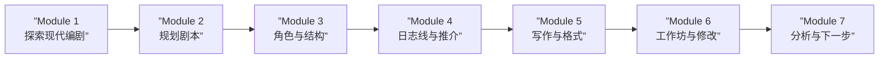

# 第01课：欢迎来到编剧工作坊

## 学习目标

- 了解本课程的整体结构与学习路径
- 明确编剧（Screenwriting）对讲故事能力的核心价值
- 熟悉课程功能（资料、提问、笔记侧边栏）
- 为后续学习做好心理与资源准备

## 核心内容

### 课程概览

本课程由小说家兼编剧丹妮-阿尔科恩（Dani Alcorn）主讲，她创作过反乌托邦科幻小说、浪漫喜剧和医学剧等多种类型的剧本。课程聚焦于**编剧（Screenwriting）**，旨在帮助学习者掌握影视叙事的核心技法，无论你未来想写电影还是电视剧。

> [!TIP] 这不是一门只针对职业编剧的课程。无论你是课程设计师、内容创作者、小说作者还是职场人士，编剧思维都能极大地提升你的**叙事能力（Storytelling Ability）**。

### 七个模块的学习路径

本课程共分为 **7 个模块**，环环相扣：

| 模块 | 核心主题 | 关键内容 |
|------|----------|----------|
| 1 | 探索现代编剧 | 为何写剧本、票房类型、获奖影片、影视差异、影视历史 |
| 2 | 规划剧本 | 故事 vs 情节、主题、灵感、角色创作、英雄之旅 |
| 3 | 角色与结构 | 现代叙事结构、主角（Protagonist）与对立角色（Antagonist） |
| 4 | 日志线与推介 | 日志线（Logline）、摘要写作、三幕结构与四幕结构 |
| 5 | 写作与格式 | 编剧软件、格式规范、对话、动作描述、节奏 |
| 6 | 工作坊与修改 | 剧本工作坊、重写、润色 |
| 7 | 分析与下一步 | 类型电影分析、投稿指南、代理人与经纪人 |

### 课前观影准备

> [!WARNING] 剧透提醒
> 讲师将假设你已观看过以下四部电影，后续课程会频繁引用它们来讲解结构：
> - 《星球大战第四集：新希望》
> - 《哈利-波特与魔法石》
> - 《泰坦尼克号》
> - 《狮子王》

如果你尚未观看，建议在进入 Module 3 之前补完。

### 课程功能指引

- **资料（Materials）侧边栏**：包含 PDF 讲义和测试练习
- **问题（Questions）侧边栏**：随时向讲师提问
- **笔记（Notes）侧边栏**：记笔记时会自动记录时间戳，点击即可跳转回对应视频位置

## 实践与反思

### 练习任务

1. 确认自己是否已看过上述四部电影，如未看完制定补看计划
2. 浏览整个课程大纲，标记你最感兴趣的模块
3. 思考一个问题：你希望通过这门课提升什么样的讲故事能力？

### 自测题

点击查看答案

**Q：本课程主要关注电影还是电视？**
A：课程更关注电影编剧，但也会涉及电视作为对比。

**Q：讲师是谁？她有哪些创作经验？**
A：丹妮-阿尔科恩，小说家兼编剧，创作过反乌托邦科幻小说、浪漫喜剧和医学剧等作品。

**Q：课程将重点讲解哪种叙事结构？**
A：三幕结构（Three-Act Structure），同时也会介绍四幕结构作为补充视角。

---

**关键词**：编剧工作坊、学习路径、三幕结构、日志线

**下一课**：[[0002-why-write-screenplays|第02课：为什么写剧本]]