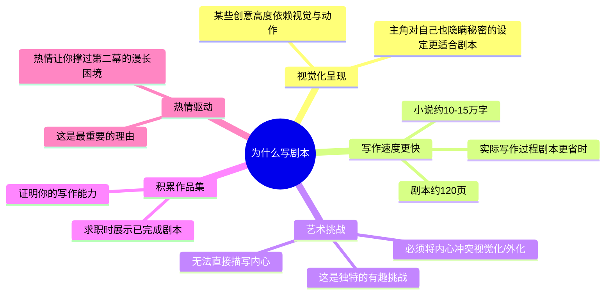

# 第02课：为什么写剧本

## 学习目标

- 理解编剧（Screenwriting）与小说写作的核心差异
- 掌握哪些创意更适合剧本而非小说
- 认识到剧本写作的独特价值与实践意义
- 找到驱动自己写作的内在热情

## 核心内容

### 为什么选择写剧本而不是小说？

讲师丹妮曾是一名小说家，她发现有些创意虽然精彩，但写成小说时总显得"无聊"。这引出了一个关键洞察：

> [!TIP] 有些创意天生更适合电影，有些更适合小说。关键在于识别创意的**视觉化程度**和**叙事方式**。

### 五个写剧本的理由

### 小说 vs 剧本：叙事工具的差异

| 维度 | 小说 | 剧本 |
|------|------|------|
| 字数 | 10-15万字 | 约120页（每页字数更少） |
| 内心描写 | 可以深入角色内心 | 必须外化/视觉化 |
| 叙事速度 | 较慢 | 较快完成完整作品 |
| 信息隐藏 | 较自然 | 对"主角自己都不知道的秘密"更有效 |
| 视觉元素 | 通过文字描述 | 通过画面直接呈现 |

### 热情：写到第120页的真正动力

> [!IMPORTANT] 写剧本最重要的理由是你的**热情**。这个想法现在有什么特别之处？是什么让你如此心动？这才是支撑你从第一页写到第120页的力量。

**思考方向**：
- 这是你想在电影院看到的作品吗？
- 这是你希望有但现在还没有的作品吗？
- 它传达的信息对你来说是否重要？

当你开始发展自己的想法时，提前思考这些问题会大有帮助。

## 实践与反思

### 练习任务

拿出一张纸，写下以下问题的答案：
1. 你心中有没有一个"非讲不可"的故事？
2. 这个故事更适合写成小说还是剧本？为什么？
3. 如果写成剧本，最让你兴奋的画面是什么？

### 自测题

点击查看答案

**Q：剧本和小说最大的叙事差异是什么？**
A：剧本不能直接描写角色的内心活动，必须通过可视化的动作、表情和对话来**外化**内心冲突。

**Q：中等长度小说的字数大约是多少？**
A：约10万到15万字，而剧本通常只有120页，每页字数远少于小说。

**Q：什么类型的创意更适合剧本而非小说？**
A：高度视觉化、以动作驱动、或者主角对自己也隐瞒了某些秘密的创意，天然更适合剧本形式。

---

**关键词**：编剧动机、小说 vs 剧本、视觉叙事、热情驱动、叙事技巧

**下一课**：[[0003-top-grossing-genres|第03课：最卖座的电影类型]]