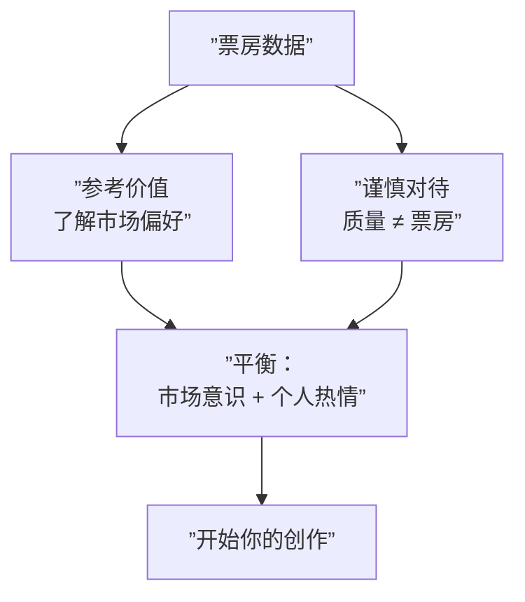

# 第03课：最卖座的电影类型

## 学习目标

- 了解1995-2012年间票房最高的电影类型
- 认识各类型的核心元素与观众吸引力
- 理解票房数据对编剧的参考意义与局限性

## 核心内容

### 最卖座的电影类型（1995-2012）

数据来源：**The Numbers**（1997年上线，现拥有超过13,000条数据记录）

> [!EXAMPLE] 票房类型市场份额排名
> | 排名 | 类型（Genre） | 市场份额 |
> |------|---------------|----------|
> | 1 | 喜剧（Comedy） | 遥遥领先 |
> | 2 | 冒险（Adventure） | 较高 |
> | 3 | 剧情（Drama） | - |
> | 4 | 动作（Action） | - |
> | 5 | 惊悚/悬疑（Thriller/Mystery） | - |
> | 6 | 浪漫喜剧（Romantic Comedy） | - |

**未出现在主要榜单的类型**：恐怖片（Horror）、音乐剧（Musical）、西部片（Western）和黑色幽默（Dark Comedy）的市场份额较小。

### 史上最高票房电影（Box Office Mojo数据）

数据来源：**Box Office Mojo**（IMDb运营的电影追踪工具）

| 排名 | 电影 | 备注 |
|------|------|------|
| 1 | 《阿凡达》（Avatar） | 詹姆斯-卡梅隆，遥遥领先 |
| 2 | 《泰坦尼克号》（Titanic） | 詹姆斯-卡梅隆 |
| 3 | 《复仇者联盟》（The Avengers） | 超级英雄类型 |
| 4 | 《哈利-波特与死亡圣器（下）》 | 系列终章 |
| 5 | 《变形金刚：月黑之时》 | 动作/科幻 |
| 6 | 《指环王》系列 | 奇幻冒险 |
| 7 | 《007：大破天幕杀机》 | 间谍动作 |
| 8 | 《黑暗骑士崛起》 | 超级英雄 |
| 9 | 《加勒比海盗：亡灵的魔咒》 | 冒险 |
| 10 | 《玩具总动员3》 | 动画/儿童 |

> [!WARNING] 票房冠军的成功很难复制
> 仅仅因为《阿凡达》取得了巨大的票房成功，并不意味着下一部成功的电影会是科幻片。事后分析总是容易的，但**预测下一个趋势极其困难**。

### 票房数据给编剧的启示

> [!IMPORTANT] 票房数据是**市场参考**，而非**创作指南**。榜单上的电影质量参差不齐，有些电影适合你，有些可能并不合你的胃口。始终把市场信息放在心上，但不要让它成为你的唯一考量。

### 类型元素概览

| 类型 | 核心元素 | 观众期待 |
|------|----------|----------|
| 喜剧（Comedy） | 幽默对话、滑稽情境、反转 | 笑、轻松、解压 |
| 冒险（Adventure） | 探索、危险、旅程 | 刺激、未知世界 |
| 剧情（Drama） | 冲突、情感深度、人物成长 | 感动、共鸣 |
| 动作（Action） | 打斗、追逐、特效 | 肾上腺素飙升 |
| 惊悚/悬疑（Thriller） | 张力、谜团、反转 | 紧张、烧脑 |
| 浪漫喜剧（Rom-Com） | 爱情、误会、圆满结局 | 甜蜜、治愈 |

## 实践与反思

### 练习任务

1. 从Top 10票房榜单中选择一部你最喜欢的电影，分析它属于哪种类型
2. 思考：如果让你写一个电影创意，你会选择哪个类型？为什么？
3. 观察一下你最近去电影院看的电影，它们分别属于什么类型？

### 自测题

点击查看答案

**Q：1995-2012年间票房最高的类型是什么？**
A：喜剧（Comedy），以相当大的差距领先其他类型。

**Q：历史上票房最高的两部电影是谁导演的？**
A：詹姆斯-卡梅隆（《阿凡达》和《泰坦尼克号》）。

**Q：票房数据是否应该成为编剧创作时的首要考量？**
A：不应该。票房数据是市场参考，但质量不一定与票房挂钩，创作应当平衡市场意识与个人热情。

---

**关键词**：电影类型、票房分析、市场份额、类型元素、市场参考

**上一课**：[[0002-why-write-screenplays|第02课：为什么写剧本]]
**下一课**：[[0004-award-winning-films|第04课：获奖影片的共同特征]]