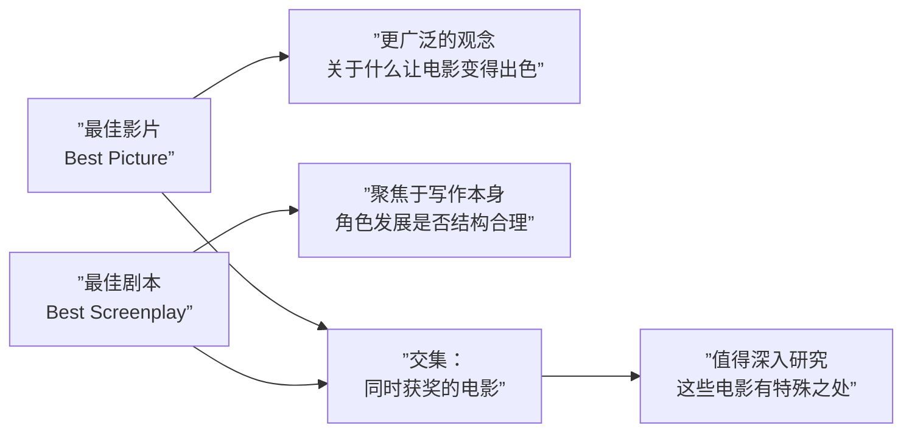

# 第04课：获奖影片的共同特征

## 学习目标

- 了解奥斯卡最佳影片与最佳剧本的历史获奖情况
- 识别哪些影片同时斩获最佳影片与最佳剧本奖
- 学会区分"获奖品质"与"个人喜好"
- 开始培养**分析性观看（Analytical Viewing）** 的习惯

## 核心内容

### 奥斯卡获奖的多维标准

> [!WARNING] 奥斯卡奖不是衡量电影成功的唯一标准
> 一部电影的成功可以从多个维度评估：**可看性（Watchability）**、**艺术价值（Artistic Merit）** 和**票房成功（Box Office Success）**。奥斯卡只代表其中一种视角。

### 历史上的"意外"获奖与失利

| 年份 | 最佳影片得主 | 落败的经典 | 启示 |
|------|-------------|------------|------|
| 1939 | 《乱世佳人》 | 《绿野仙踪》《史密斯先生去华盛顿》 | 竞争激烈，但《绿野仙踪》经受住了时间考验 |
| 1940 | 《丽贝卡》 | 《费城故事》 | 获奖不等于在公众意识中更持久 |
| 1941 | 《我的山谷有多绿》 | 《公民凯恩》 | 被认为是史上最伟大的电影之一却输了奥斯卡 |
| 2009 | 《拆弹部队》 | 《阿凡达》 | 技术开创性作品输给了紧贴时代脉搏的现实题材 |
| 2012 | 《逃离德黑兰》 | 《刺杀本-拉登》 | 获奖有时难以预测 |

> [!TIP] 《公民凯恩》（Citizen Kane）被广泛认为是现代电影的起源，几乎每门电影入门课程都会讨论它。但它当年并没有获得最佳影片奖。这提醒我们：**奖项不等于电影的历史地位**。

### 同时获得最佳影片与最佳剧本的电影

以下五部电影同时赢得了奥斯卡**最佳影片（Best Picture）** 和**最佳剧本（Best Original Screenplay）** 奖（以绿色标注）：

| 电影 | 年份 | 特点 |
|------|------|------|
| 《沉默的羔羊》 | 1991 | 心理惊悚完美融合角色与剧情 |
| 《辛德勒的名单》 | 1993 | 历史题材，深刻的道德探讨 |
| 《莎翁情史》 | 1998 | 以戏说历史展现创作本身 |
| 《拆弹部队》 | 2009 | 紧贴时代的现实主义战争叙事 |
| 《逃离德黑兰》 | 2012 | 真实事件改编，悬疑与政治结合 |

这些电影的共同特质：
- **角色发展结构合理**（Well-Structured Character Development）
- 与当时的观众**产生了深刻共鸣**
- 在故事层面既有技巧又有深度

### 最佳影片 vs 最佳剧本的考察维度

## 实践与反思

### 练习任务：开始分析性观看

本周选择一部同时获得过最佳影片和最佳剧本提名的电影进行重温（或观看新片），思考以下问题：

1. 你认为它应该获得这两个奖项吗？为什么？
2. 是什么让这部电影如此吸引人？
3. 这部作品好在哪里？如果你不喜欢，你能理解它为什么会获奖吗？

> [!IMPORTANT] 分析性观看与单纯享受电影是截然不同的两种方式，但**两者都是完全合理的**。分析性观看能帮助你发现模式，理清自己喜欢和不喜欢的到底是什么。

### 自测题

点击查看答案

**Q：《公民凯恩》是否获得了奥斯卡最佳影片奖？**
A：没有。《公民凯恩》在1941年输给了《我的山谷有多绿》，但它被许多人认为是史上最伟大的电影之一。

**Q：2009年，开创3D新时代的《阿凡达》输给了哪部电影？**
A：《拆弹部队》。《拆弹部队》因紧贴时代脉搏、与观众产生深刻共鸣而获胜。

**Q：同时获得最佳影片和最佳剧本的五部电影有什么共同特点？**
A：它们都有结构合理的角色发展，与当时观众产生了深刻共鸣，且兼具写作技巧与故事深度。

---

**关键词**：奥斯卡、最佳影片、最佳剧本、分析性观看、电影质量、角色发展

**上一课**：[[0003-top-grossing-genres|第03课：最卖座的电影类型]]
**下一课**：[[0005-movies-versus-television|第05课：电影与电视的差异]]