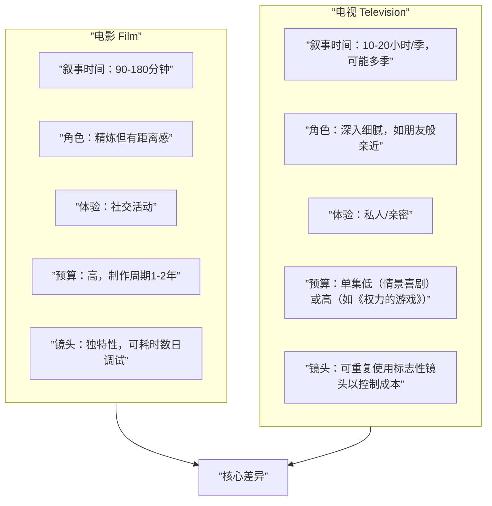

# 第05课：电影与电视的差异

## 学习目标

- 理解电影（Film）与电视（Television）在叙事结构上的根本差异
- 掌握两者在角色发展、观众体验和制作层面的不同考量
- 学会根据故事创意判断更适合哪种媒介

## 核心内容

### 五大核心差异



### 1 叙事结构差异

| 维度 | 电影 | 电视 |
|------|------|------|
| 总时长 | 90-180分钟 | 一季10-20小时，多季持续 |
| 情节密度 | 集中，一个完整弧线 | 分散，可有多条故事线（Storylines） |
| 节奏控制 | 导演/编剧完全掌控 | 需考虑广告插播（Commercial Breaks） |
| 重复性 | 仅为艺术效果而重复 | 需重复关键信息以帮助错过剧集的观众 |

### 2 角色发展差异

> [!TIP] 回想一下你最喜欢的电影角色 vs 电视角色
> 你可能能**滔滔不绝**地描述一个电视角色的喜好、背景、家庭、习惯。但对电影角色，你记住的更多是精彩台词和动作场面。这是因为电视有更多时间让角色变得"真实"。

| 方面 | 电影 | 电视 |
|------|------|------|
| 角色深度 | 精炼，重点突出 | 深入细腻，多层次 |
| 角色关系 | 观众"喜欢"角色 | 观众感觉角色"像朋友" |
| 发展空间 | 必须在有限时间内完成弧线 | 可以跨越数季缓慢展开 |
| 例子 | 汉-索罗（酷、机智） |  Meredith Grey（你知道她爱吃什么、怕什么、父母是谁） |

### 3 观众体验差异

```
媒介       体验特质       观众投入
------  -------------  ------------
电影       社交活动       较少时间投入（2小时）
           电影院/群体观影  情感风险低
电视       私人体验       大量时间投入（40+小时）
           客厅/笔记本独看  情感风险高（害怕被砍/烂尾）
```

> [!WARNING] 电视的情感风险更高
> 很多人拒绝开始看一部高评价剧集，直到它完结且确认有满意的结局。投入40-60小时追剧却遭遇烂尾，是非常沮丧的体验。这意味着写电视剧时需要**更大的叙事责任感**。

### 4 制作与预算差异

- **电影制作周期**：通常1-2年，从启动到最终剪辑。可以花两天调试一个镜头。
- **电视剧制作周期**：每集约1-2周完成，必须平衡叙事与经济效益。

**电视的经济策略**：使用标志性镜头（Signature Shots）
- 《白宫风云》标志性的走廊行走对话镜头
- 《迷失》中角色穿越树林的奔跑镜头
- 这些镜头复杂但可重复使用，帮助团队快速完成设置

### 5 写作考量总结

| 考量点 | 电影 | 电视 |
|--------|------|------|
| 叙事时间 | 有限，精心设计 | 充裕但需持续吸引 |
| 角色发展 | 精选细节 | 深入挖掘 |
| 重复 | 无需 | 需要（帮助错过的观众） |
| 格式时间 | 灵活（80-180分钟） | 严格（需配合广告插播） |
| 制作经济 | 可追求艺术完美 | 必须考虑效率 |
| 观众关系 | 社交/公共 | 私密/个人 |

## 实践与反思

### 练习任务：角色特征对比

准备好一张纸，纵向对折成两列：

| 我最喜欢的电影角色 | 我最喜欢的电视剧角色 |
|---------------------|----------------------|
| （列出你知道的所有特征） | （列出你知道的所有特征） |

完成后观察：哪一栏明显更充实？思考一下为什么，以及是什么让你喜欢上这些角色。

> [!IMPORTANT] 虽然本课程主要聚焦于电影编剧，但理解电视的角色塑造方法，也能为你的电影角色创作提供有价值的洞见。

### 自测题

<details>
<summary>点击查看答案</summary>

**Q：电影和电视在时间投入上有什么显著差异？**
A：电影通常只需2小时，而一部电视剧可能需要40-60小时甚至更多。这意味着电视观众的情感投入和风险感都更高。

**Q：为什么电视节目经常使用重复内容？**
A：因为观众可能错过某些剧集，需要帮助他们跟上剧情。电影只有在艺术或戏剧效果需要时才会重复。

**Q：电视节目标志性镜头的作用是什么？**
A：在保证视觉复杂度的同时，通过重复使用来提升制作效率，平衡叙事效果与制作预算。

</details>

---

**关键词**：电影 vs 电视、叙事结构、角色发展、观众体验、制作经济、标志性镜头

**上一课**：[[0004-award-winning-films|第04课：获奖影片的共同特征]]
**下一课**：[[0006-history-of-tv-and-movies|第06课：电影与电视的历史]]