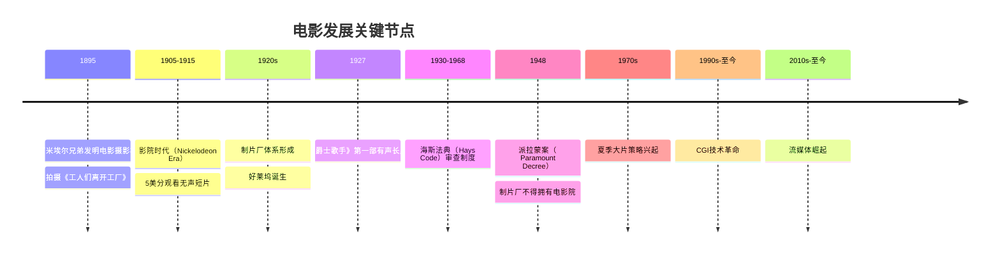
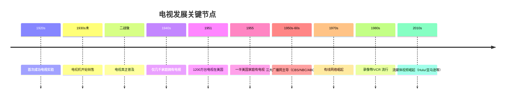

# 第06课：电影与电视的历史

## 学习目标

- 了解电影从诞生到流媒体时代的发展简史
- 了解电视从无线电波到流媒体的演变过程
- 认识技术变革如何深刻影响叙事形式
- 从历史中识别影视叙事的关键转折点

## 核心内容

### 电影发展简史

### 电影史的七个里程碑

#### 1. 诞生期（1895）
卢米埃尔兄弟（Lumiere Brothers）发明了第一台电影摄影机，拍摄了极其简短的片段——这就是当时技术的极限。

#### 2. 影院时代（1905-1915）
只需支付5美分就能观看非常短的无声片段。电影尚处于"新鲜玩意儿"阶段。

#### 3. 制片厂体系与好莱坞诞生（1920s）
五大制片厂（Big Five）：20世纪福克斯、RKO、派拉蒙、华纳兄弟、米高梅
三小制片厂（Little Three）：环球、哥伦比亚、联合艺术家

#### 4. 有声电影革命（1927）
《爵士歌手》（The Jazz Singer）是第一部配有声音的长片，彻底改变了电影制作方式。

#### 5. 海斯法典（1930-1968）

> [!WARNING] 海斯法典的影响
> 1930年制定，1934年正式实施，规定了美国电影的道德内容标准。如果你好奇为什么早期电影里已婚夫妇总是分床而睡，这就是原因。1968年被**MPAA分级制度**（G、PG、PG-13、R等）取代。

#### 6. 派拉蒙案（1948）

美国诉派拉蒙案颠覆了电影发行模式：**制片厂不能再拥有自己的电影院**。
- 之前：制片厂每年制作数百部电影，确保在自家影院发行
- 之后：制片厂需迎合第三方影院，对项目更加谨慎，电影数量减少

#### 7. 从夏季大片到流媒体（1970s-至今）
- 1970s中期：夏季大片（Summer Blockbuster）策略出现
- CGI技术成为新的游戏规则改变者（如《阿凡达》创造的完全外星球世界）
- 大规模发行模式仍主导好莱坞，但未来可能更倾向互联网流媒体

### 电视发展简史

### 电视叙事形式的演变

| 阶段 | 模式 | 特点 | 代表作品 |
|------|------|------|----------|
| 早期 | 选集类（Anthology） | 每周不同剧本、不同演员、无连贯故事 | 借鉴广播和戏剧 |
| 发展期 | 剧集类（Episodic） | 固定角色与设定，每周全新故事 | 《缉毒特攻队》《佩里-梅森》 |
| 过渡期 | 部分连载（Serialized）| 每周新故事+跨集情节线 | 《吸血鬼猎人巴菲》《实习医生格蕾》 |
| 现代 | 系列剧（Serial） | 几乎无每集总结，整季连贯 | 《迷失》 |

> [!TIP] 《星际迷航》系列是观察电视叙事演变的绝佳案例
> - 原始系列：纯剧集模式
> - 《下一代》：纯剧集模式
> - 《深空九号》：前三季剧集模式，后期转向连载，第七季最后十集是一个完整长篇情节
> - 《航海家号》：一开始就更加连载化
> - 《迷失》：真正改变了电视叙事规则的科幻剧

### 技术如何改变叙事

| 技术变革 | 对叙事的影响 |
|----------|-------------|
| 有声电影（1927） | 对话成为叙事核心工具 |
| 彩色电影 | 视觉语言更加丰富 |
| 电视普及（1950s） | 家庭私密叙事体验诞生 |
| 录像带/VCR/DVD | 观众可以重看、倒带，故事可以更复杂 |
| CGI（1990s-） | 任何想象都能被可视化 |
| 流媒体（2010s-） | 整季一次性放出，催生了" binge-watching"和更复杂的连载叙事 |

## 实践与反思

### 练习任务

1. 选择一部你喜欢的电影，追溯一下它的制作——如果放在20年前，技术上能否实现？
2. 观察你最近在看的一部电视剧，判断它属于"剧集类"还是"连载类"？它的叙事方式能否在20年前实现？
3. 思考：流媒体如何改变了你个人的观看习惯？

### 自测题

点击查看答案

**Q：1895年卢米埃尔兄弟拍摄的第一部电影是什么内容？**
A：他们拍摄了工人们离开卢米埃尔工厂的简短片段。

**Q：海斯法典从哪一年开始正式实施，到哪一年被取代？**
A：1934年正式实施，1968年被MPAA分级制度取代。

**Q：1948年派拉蒙案对电影行业产生了什么影响？**
A：制片厂不能再拥有自己的电影院，这导致电影制作数量减少，制片厂在选择项目时更加谨慎。

**Q：电视剧集中《深空九号》体现了什么趋势？**
A：它体现了从纯剧集模式向连载模式的过渡，后期越来越连载化，第七季最后十集实际上是一个完整的长篇情节。

---

**关键词**：电影史、电视史、卢米埃尔兄弟、海斯法典、派拉蒙案、MPAA分级、CGI、流媒体、连载叙事

**上一课**：[[0005-movies-versus-television|第05课：电影与电视的差异]]
**下一课**：进入 Module 2 —— [[../lessons/0007-getting-ideas|第07课：如何获得剧本灵感]]