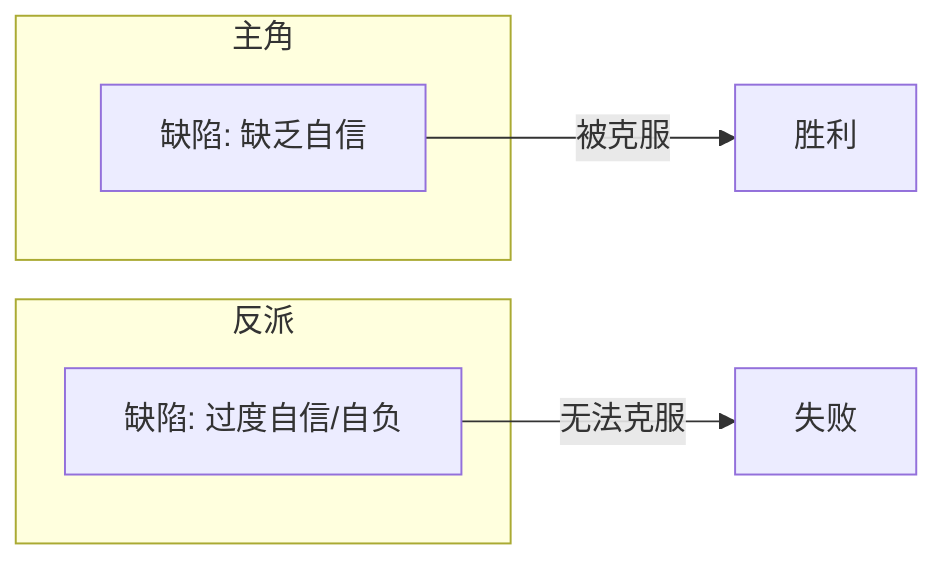

# 第12课：反派的塑造

## 学习目标

- 理解反派（Antagonist）的核心作用
- 掌握反派作为"主角镜像"的概念
- 学会创造有说服力的反派动机
- 理解反派缺陷如何决定故事结局

## 核心内容

### 反派的本质：主角的镜像

> [!TIP]
> **反派（Antagonist）不是"坏人"，而是"与主角对立的人"。** 最优秀的反派是主角的镜像——他们拥有相似的缺陷，却走向了不同的方向。

```
主角 ← （镜像对立）→ 反派
   ↓                      ↓
有缺陷                   有缺陷
   ↓                      ↓
克服缺陷 → 成功          无法克服缺陷 → 失败
```

### 反派必须主动

> [!WARNING]
> **反派必须是主动出击的。** 如果反派不主动对抗，故事就会失去悬念和张力。
>
> 一个消极等待的反派会让主角看起来也很无聊，因为缺乏真正的威胁。

**主动反派的效应：**
- 观众时刻感到"反派随时可能获胜"的紧迫感
- 主角的每一步行动都是在应对反派的挑战
- 故事始终保持紧张和悬念

### 反派的悲剧缺陷

反派也有缺陷——而且这是决定性的：

```
主角的缺陷 → 被克服 → 主角胜利
反派的缺陷 → 无法克服 → 反派失败（悲剧性缺陷）
```

> [!EXAMPLE]
> **《狮子王》**：辛巴缺乏自信，刀疤过于自信。
> 高潮时刻：辛巴克服了缺乏自信 → 他的胜利
> 刀疤因过于自信而轻视对手 → 他的失败

### 对应缺陷的张力

最吸引观众的设定是：**反派拥有与主角相同或相反的缺陷。**



### 反派的隐藏身份

在很多优秀的故事中，反派的身份在开始时是**隐藏的**：

- 悬疑故事尤其依赖隐藏反派的身份
- 反派可能"不在场"但通过行动施加影响
- 反派的存在感可以通过后果来体现（如发现新尸体——连环杀手依然活跃）

> [!EXAMPLE]
> **《谋杀绿脚趾》**中的反派一直只以"手"的形式出现——制作赎金信、处理炸弹威胁，直到结尾才揭示身份。即使在隐藏期，他们的存在感依然强烈。

### 反派的命运选择

反派在故事结尾不一定非要死。失败方式应与**电影基调**匹配：

| 电影类型 | 反派的失败方式 |
|---------|--------------|
| 生死动作片 | 通常死亡 |
| 轻松喜剧 | 社会孤立、尴尬失败 |
| 浪漫喜剧 | 可能得到救赎 |

> [!EXAMPLE]
> **浪漫喜剧中的救赎：**
> 《两周通知》中的乔治·韦德是一个反派角色，他的缺陷是"无法独立思考"。在影片结束时，他经历了角色成长，得到了改造，和主角幸福地生活在一起。

### 如何让观众真正讨厌反派

如果你需要观众讨厌反派，可以使用这些工具：

- **霸凌者** —— 没有人喜欢霸凌者
- **极端自我中心** —— 一切只为自己
- **撒谎者** —— 欺骗成性
- **外表丑陋** —— 经典的视觉线索（如绿皮肤巫婆）

> [!WARNING]
> 也有一些最有趣的反派是"讨人喜欢的反派"，但这根线非常微妙。如果你选择让反派有些可爱，必须拿捏分寸。

### 经典反派案例分析

| 电影 | 反派 | 缺陷 | 主角缺陷 | 结局 |
|------|------|------|---------|------|
| 《狮子王》 | 刀疤 | 自负/狂妄 | 缺乏自信 | 因过于自信而败 |
| 《哈利·波特》 | 伏地魔 | 自负 | 谦虚/愿意牺牲 | 认为不会死→被杀 |
| 《魔发奇缘》 | 葛索妈妈 | 自私 | 渴望自由 | 自私导致失败 |
| 《阿凡达》 | 上校 | 无法适应变化 | 愿意改变 | 因僵化而失败 |

## 实践与反思

### 自测题

<details>
<summary>点击展开答案</summary>

1. **反派与主角最理想的关系是什么？**
   - 反派应该是主角的镜像——拥有相似或相对的缺陷，让主角的胜利更有意义。
2. **为什么反派必须主动？**
   - 主动的反派制造持续的紧张感和悬念，让故事始终有推动力。
3. **反派的"悲剧性缺陷"是什么意思？**
   - 反派拥有一个无法克服的缺陷，这个缺陷最终导致ta的失败——主角获胜不是靠运气，而是因为反派自己的内在问题。
4. **浪漫喜剧中反派的命运通常是什么？**
   - 反派可能得到救赎，经历角色成长，和主角一起改变。
</details>

### 练习任务

1. **镜像分析**：为你构思中的主角设计一个镜像反派——他们拥有什么相同或相反的缺陷？
2. **动机挖掘**：为你的反派写一段"自传"——为什么ta成为了现在这样？ta的动机是什么？（反派从不认为自己是坏人）
3. **失败方式设计**：根据你故事的基调，设计反派的失败方式——是死亡、救赎，还是其他？

### 下节课预告

主角和反派之外，故事还需要其他角色来丰富世界。下一课我们将学习[[0013-supporting-characters|配角（Supporting Characters）]]。

---

> **关键术语回顾：** 反派（Antagonist）、镜像（Mirror）、悲剧性缺陷（Tragic Flaw）、宿敌（Nemesis）、救赎（Redemption）