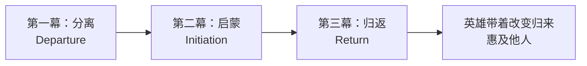

# 第15课：英雄之旅

## 学习目标

- 理解约瑟夫·坎贝尔（Joseph Campbell）的单一神话（The Monomyth）理论
- 掌握英雄之旅（Hero's Journey）的12个阶段
- 学会将英雄之旅应用于现代故事创作
- 区分字面使用与隐喻使用

## 核心内容

### 什么是英雄之旅？

> [!TIP]
> 约瑟夫·坎贝尔在1949年出版的《千面英雄》（The Hero with a Thousand Faces）中提出了**单一神话（Monomyth）**的概念——全世界所有文化的神话故事，本质上都在讲述同一个故事：**英雄的旅程**。
>
> 坎贝尔的名言："梦是个人的神话，神话是去个人化的梦。"

### 英雄之旅的三个基本阶段



### 英雄之旅的完整12阶段

```mermaid
graph TD
    subgraph ”第一幕：分离/出发”
        1[1、平凡世界<br>Ordinary World] --> 2[2、冒险召唤<br>Call to Adventure]
        2 --> 3[3、拒绝召唤<br>Refusal of the Call]
        3 --> 4[4、遇见导师<br>Meeting the Mentor]
        4 --> 5[5、跨越第一道门槛<br>Crossing the Threshold]
        5 --> 6[6、考验、盟友与敌人<br>Tests, Allies, Enemies]
    end
    subgraph ”第二幕：启蒙”
        6 --> 7[7、接近最深的洞穴<br>Approach to the Inmost Cave]
        7 --> 8[8、严峻考验<br>Ordeal]
        8 --> 9[9、获得奖赏<br>Reward]
    end
    subgraph ”第三幕：归返”
        9 --> 10[10、返回的路<br>The Road Back]
        10 --> 11[11、复活与重生<br>Resurrection]
        11 --> 12[12、带着灵药归来<br>Return with the Elixir]
    end
```

### 第一阶段：分离/出发（Departure）

#### 1. 平凡世界（Ordinary World）

英雄原本生活的日常世界，ta感到某种缺失或不满足。

> 英雄通常是一个感到生活中缺少了某样东西的人。

#### 2. 冒险召唤（Call to Adventure）

命运召唤英雄踏上冒险。召唤可以是：
- 英雄主动选择
- 被强加给英雄
- 一个错误改变了生活轨迹
- 自我觉醒——意识到缺少什么

> [!EXAMPLE]
> **《我最好朋友的婚礼》**：茱莉安接到好友的电话——不是求婚，而是邀请她参加自己的婚礼。这是一个字面上的"冒险召唤"。

#### 3. 拒绝召唤（Refusal of the Call）

英雄最初会拒绝机会。但最终必须说"是"，否则故事不会发生。

> [!EXAMPLE]
> **《霍比特人》**：比尔博·巴金斯拒绝了甘道夫的冒险邀约——"谢谢，我要留在夏尔。"但在最后一刻改变主意，加入了旅程。

#### 4. 遇见导师（Meeting the Mentor）

总会有人提供保护和引导。
- 向导、摆渡人、老师、仙女教母
- 可能提供护身符或武器

> [!EXAMPLE]
> - 《霍比特人》的甘道夫
> - 《星球大战》的欧比旺·克诺比
> - 《死亡诗社》的基廷老师

#### 5. 跨越第一道门槛（Crossing the Threshold）

英雄告别熟悉的世界，踏入未知领域。这是一个**不归路**。

> [!EXAMPLE]
> - 《指环王》：弗罗多离开夏尔
> - 《婚礼约会》：凯特飞往英国
> - 《贝隆夫人》：埃娃离开小镇前往布宜诺斯艾利斯

#### 6. 鲸腹（Belly of the Whale）

英雄被未知吞噬，仿佛已死去。这可以是**象征性的死亡**或字面上的死亡。

> [!EXAMPLE]
> - 《猫鼠游戏》中的弗兰克放弃旧身份不断接受新身份
> - 埃娃在布宜诺斯艾利斯重塑自我——抛弃过去的女孩身份成为明星和政治家

### 第二阶段：启蒙（Initiation）

#### 7. 考验之路（Road of Trials）

英雄面临一系列考验和挣扎，必须证明自己配得上英雄称号。

> 第二幕的核心是："这个人是否配得上被称为英雄？"

**常见的考验模式：**

| 模式 | 说明 | 例子 |
|------|------|------|
| 龙的战斗 | 必须击败内外敌人 | 几乎所有故事 |
| 与女神相遇 | 强大的女性给予智慧或帮助 | 《指环王》的加拉德瑞尔 |
| 兄弟对抗 | 与身边的人对抗 | 《雷神》的洛基、托尔 |
| 与父亲和解 | 与父亲/父权象征达成和解 | 《梦幻之地》、《驯龙高手》 |
| 神圣婚姻 | 与另一个角色的特殊连接 | 《迷失》的佩妮与德斯蒙德 |
| 仪式死亡 | 抛弃过去的生活 | 《佐罗的面具》 |
| 神化 | 被提升到神的高度 | 《大力士》、《通往埃尔多拉多之路》 |

#### 8. 接近最深的洞穴（Approach to the Inmost Cave）

英雄接近最危险的境地——可能是外部地点，也可能是内心最恐惧的地方。

#### 9. 严峻考验（Ordeal）

英雄面对最大的挑战——看似无法战胜的困难。这是故事的核心时刻。

#### 10. 获得奖赏（Reward）

英雄战胜考验后获得"灵药"——可能是物品、知识、力量或领悟。

> [!EXAMPLE]
> 《哈利·波特》中寻找魂器的旅程——带回魂器才能击败伏地魔。

### 第三阶段：归返（Return）

#### 11. 拒绝回归（Refusal of the Return）

英雄不愿意回到平凡世界——对现在的状态感到满意，不想回去。

> 成功的英雄会克服这一障碍，带着智慧和收获回归家乡。

#### 12. 魔法逃脱（The Magic Flight）

英雄的归途可能有两种方式：

- **被命令返回**：如《第五元素》中科尔宾被告知可以回地球
- **被迫战斗回归**：如《猫鼠游戏》中弗兰克想回家但被卡尔阻止，必须战斗

#### 13. 外部救援（Rescue from Without）

有人从外部帮助英雄完成归途。

> [!WARNING]
> 要小心在高潮时使用外部救援——你希望**英雄本人**直接战胜反派。

#### 14. 跨越归返的门槛（Crossing the Return Threshold）

英雄回到出发的地方，重新接受平凡世界。

> [!EXAMPLE]
> - 佛罗多和比尔博回到夏尔
> - 《迷失东京》的鲍勃回到美国
> - 《第五元素》的科尔宾和莉露回到地球

#### 15. 两个世界的主宰（Master of Two Worlds）

英雄已经能在平凡世界和非凡世界之间自如穿梭——ta已经成长到能同时驾驭两者。

#### 16. 自由地生活（Freedom to Live）

英雄不再恐惧死亡，活在当下，因为ta已经完成了使命。

#### 17. 带着灵药归来（Return with the Elixir）

英雄带着解决最初问题的"灵药"回到平凡世界——可能是知识、宝物、或者改变了自我。

> [!EXAMPLE]
> 普罗米修斯盗取天火送给人类——经典的"灵药"模式。

### 如何将英雄之旅应用于现代故事

> [!IMPORTANT]
> 除非你是写奇幻题材，否则不要**字面照搬**英雄之旅的每个元素。将神话元素视为**隐喻**。

**隐喻转换示例：**

| 神话元素 | 现代隐喻 |
|---------|---------|
| 跨越门槛进入非凡世界 | 升职进入公司高层、搬到新城市 |
| 遇见超自然导师 | 遇到一个智慧的导师或教练 |
| 与龙战斗 | 击败竞争对手/内心的恐惧 |
| 神化 | 获得巨大成功或认可 |

### 英雄之旅的练习方法

> [!TIP]
> 选一部你最近看过的电影，列出其中出现的英雄之旅元素。注意：除非是奇幻片，这些元素通常以**隐喻**的形式存在。

## 实践与反思

### 自测题

<details>
<summary>点击展开答案</summary>

1. **英雄之旅的三个基本阶段是什么？**
   - 分离（Departure）、启蒙（Initiation）、归返（Return）。
2. **"拒绝召唤"在故事中起什么作用？**
   - 增加英雄的"凡人"特质，让观众产生共鸣。英雄不是天生勇敢的，而是最终选择了勇敢。
3. **为什么英雄之旅被称为"单一神话"？**
   - 坎贝尔认为全世界所有文化的神话故事本质上讲述的是同一个旅程模式。
4. **如何在现代非奇幻故事中运用英雄之旅？**
   - 将神话元素视为隐喻——"非凡世界"可以是新环境，"超自然导师"可以是人生教练。
</details>

### 练习任务

1. **电影分析**：选一部你喜欢的电影（非奇幻题材），列出其中出现的英雄之旅元素（以隐喻形式理解）。
2. **旅程地图**：为你的故事主角绘制一份英雄之旅地图，标注每个阶段的具体事件。
3. **缺陷与考验**：检查你主角的缺陷——在英雄之旅的哪个阶段ta会面临最大的考验？
4. **灵药设计**：你的英雄最终带回了什么"灵药"？（这很可能就是你的[[0009-theme|主题]]）

### 本课总结

英雄之旅不仅是一个编剧工具，它是人类叙事的**深层原型**。理解它不是为了机械套用，而是为了理解为什么某些故事模式跨越文化和时代仍然打动人心。

从[[0007-getting-ideas|获取灵感]]到[[0008-plot-and-story|情节与故事]]，从[[0009-theme|主题]]到[[0010-creating-compelling-characters|角色塑造]]，再到[[0011-protagonists|主角]]、[[0012-antagonists|反派]]、[[0013-supporting-characters|配角]]和[[0014-archetypes|原型]]——Module 2的每一步都在为你的故事创作打下基础。下一课开始，我们将进入**Module 3：故事结构**，深入探讨三幕剧结构。

---

> **关键术语回顾：** 英雄之旅（Hero's Journey）、单一神话（Monomyth）、《千面英雄》（The Hero with a Thousand Faces）、约瑟夫·坎贝尔（Joseph Campbell）、分离（Departure）、启蒙（Initiation）、归返（Return）