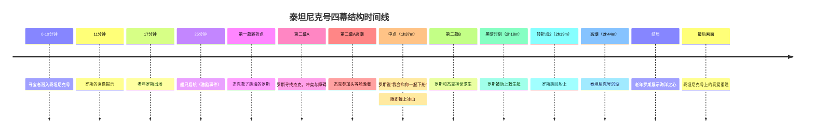

# 第19课：四幕结构（Four Act Structure）

## 学习目标

- 理解四幕结构的构成
- 掌握每幕的功能和关键转折点
- 学会识别四幕结构中的"中点"及其他关键节点
- 通过《泰坦尼克号》案例分析加深理解

## 核心内容

### 四幕结构概览

四幕结构本质上是对传统三幕结构的再划分——将中间最长的幕一分为二（2A和2B）。在120分钟/120页的标准电影中，每幕约30页。

```mermaid
flowchart LR
    subgraph ”第一幕 Act 1”
        A1[角色介绍<br/>背景设定] --> A2[激励事件] --> A3[转折点1]
    end
    subgraph ”第二幕A Act 2A”
        B1[英雄踏上旅程] --> B2[冲突与障碍] --> B3[中点转折]
    end
    subgraph ”第二幕B Act 2B”
        C1[新的尝试] --> C2[黑暗时刻] --> C3[转折点2]
    end
    subgraph ”第三幕 Act 3”
        D1[紧张升级] --> D2[高潮对决] --> D3[结局]
    end
    A3 --> B1
    B3 --> C1
    C3 --> D1
```

### 各幕详解

#### 第一幕：建立（Setup，约30分钟）

- **介绍角色**：了解主角是谁，建立共鸣
- **介绍背景**：故事发生的世界和情境
- **激励事件**：打破日常的不寻常事件
- **确立目标**：让观众知道主角渴望什么
- **转折点1**：改变故事走向的关键时刻

#### 第二幕A：反应与探索（约30分钟）

- 英雄踏上冒险之旅
- 遭遇冲突与各种障碍
- **第一紧迫点**：小型高潮，剧本中的关键时刻
- **中点（Midpoint）**：情感基调与结局相反

> [!TIP]
> **中点的核心规律**：中点的情感基调与结局完全相反。如果结局是幸福的，中点是故事最黑暗的时刻；如果结局是悲剧，中点反而可能有好事发生。

#### 第二幕B：主动出击（约30分钟）

- 主角以不同方式继续追求目标
- 目标可能变得更加宏大（从个人目标到关系到他人）
- **黑暗时刻**：主角被逼到绝境
- **转折点2**：顿悟引发决策或行动

#### 第三幕：高潮与解决（约30分钟）

- 紧张气氛不断升级
- **高潮（Climax）**：与反派的最终对决，最紧张的时刻
- **结局（Resolution）**：所有线索汇总收束
- **最后画面**：留给观众的最后印象

### 案例分析：《泰坦尼克号》



**关键结构亮点：**

1. **中点设计**：罗斯和杰克终于在一起——但在此时撞上冰山，完美体现了"中点与结局情感相反"的规律
2. **黑暗时刻**：罗斯被劝说上了救生艇，与杰克分离
3. **高潮与反派的特殊性**：泰坦尼克号本身是"反派"，沉船提供了最终的紧张时刻
4. **首尾呼应**：开场时的"海洋之心"谜题在结尾得到解答

## 实践与反思

### 练习：分析一部电影的四幕结构

选一部你喜欢的电影，尝试标出以下位置：
1. 第一幕转折点在哪里？
2. 中点在哪里？（情感基调是否与结局相反？）
3. 黑暗时刻在哪里？
4. 高潮是什么？

> [!WARNING]
> 不同时长的电影，各幕的时间点会相应变化。3小时的电影（如《泰坦尼克号》）的每个节点会比2小时电影更靠后，但比例大致相同。

---

**关键术语回顾**：Midpoint（中点）、Dark Moment（黑暗时刻）、Climax（高潮）、Turning Point（转折点）

相关课程：[[0018-introduction-to-structure|第18课：剧本结构基础]] | [[0020-three-act-structure|第20课：三幕结构]]