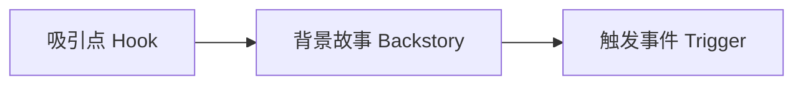
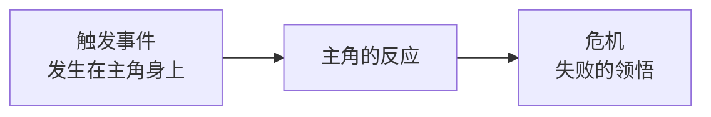

# 第21课：第一幕详解

## 学习目标

- 掌握第一幕的三个检查点：吸引点、背景故事、触发事件
- 理解如何提出"故事问题"抓住观众
- 学会选择故事的起始点
- 通过《星球大战：新希望》理解第一幕的运作

## 核心内容

### 第一幕的三个检查点

### 1. 吸引点（Hook）

吸引点是**第一幕的第一个目标**——在剧本开头提出至少一个**故事问题**。

**为什么需要故事问题？**
- 如果没有问题等待解答，观众就没有理由继续看下去
- 问题创造好奇心，驱动观众参与

**如何写出好的吸引点？**

| 技巧 | 说明 | 示例 |
|------|------|------|
| **从行动或对话开始** | 抓住眼球的动作或对话 | 《星球大战》的太空战斗开场 |
| **选择尽可能晚的起始点** | 从角色生活中最值得讲述的时刻切入 | 不要从出生开始讲 |
| **尽早引入主角** | 避免观众与错误角色建立共鸣 | 但也有例外 |

> [!TIP]
> 大部分故事只讲述角色生活中一个短暂的瞬间——可能只有几天、几小时甚至几分钟（如《早餐俱乐部》只有一天，《罗拉快跑》只有20分钟）。

**《星球大战》的吸引点分析：**

影片以经典的**滚动开场文字**开始，紧接着是**太空战斗**。台词 **"这次公主没有逃脱的机会"** 提出了多个故事问题：
- 公主为什么没有逃脱的机会？
- 她之前也遇到过这种情况吗？
- 公主到底是谁？

### 2. 背景故事（Backstory）

在第一幕中，背景故事负责以下任务：

- **介绍角色**：主角是谁，有什么缺陷
- **设定世界规则**：故事世界是如何运作的
- **引入配角**：导师、朋友、敌人
- **建立目标和渴望**：让观众了解主角想要什么

**有效的背景故事交代方式：**

| 方式 | 说明 | 注意事项 |
|------|------|----------|
| **对话** | 角色之间的自然交流 | 避免"解释性独白" |
| **闪回** | 回顾过去的重要事件 | 不需要过度使用 |
| **行动展示** | 通过角色行为展现 | 最自然的方式 |

> [!WARNING]
> 不要用一段冗长的独白来解释背景。应该用更自然、有机的方式分散在场景中呈现，甚至可以留一些信息稍后补充。

**《星球大战》的背景故事要点：**
- 卢克是孤儿（这将成为重要伏笔）
- 本·克诺比是他的朋友和导师
- 莱娅掌握着死星的计划
- 了解光速旅行、武器等世界规则

### 3. 触发事件（Trigger）

**触发事件**是推动主角踏上旅程的关键时刻。它的特点是：

- 通常只占**一页以内**的篇幅
- **直接挑战主角的缺陷**
- **不是**主角的决定或行动——是发生在主角身上的事
- 主角对这个事件的反应将引出**危机**（第二幕）

**《星球大战》的触发事件：**

本告诉卢克："你必须面对达斯·维德。"

这个瞬间直接挑战了卢克的缺陷——**缺乏自信**。他被告知要对抗宇宙中最强大的军阀之一，他的反应是拒绝。

## 实践与反思

### 练习：写出你的第一幕

使用你已有的故事构思，写下三个检查点各对应的一两句话：

1. **吸引点**：开场的第一句话或第一个画面是什么？提出了什么故事问题？
2. **背景故事**：观众需要知道哪些关于角色和世界的信息？
3. **触发事件**：什么事情发生在主角身上，迫使他们踏上旅程？

写吸引点的小技巧

- 不要在开场就倾倒大量信息（尽管《星球大战》的滚动文字是个例外）
- 从行动或对话入手比从描述入手更有效
- 确保吸引点提出的问题在故事结尾会得到回答

---

**关键术语回顾**：Hook（吸引点）、Backstory（背景故事）、Trigger/Inciting Incident（触发事件/激励事件）、Story Question（故事问题）

相关课程：[[0020-three-act-structure|第20课：三幕结构]] | [[0022-act-2|第22课：第二幕详解]]