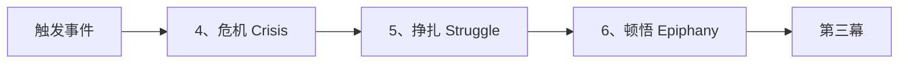

# 第22课：第二幕详解

## 学习目标

- 理解第二幕的三个检查点：危机、挣扎、顿悟
- 掌握"失败的领悟"的概念
- 学会通过挣扎保持紧张感
- 理解顿悟作为角色的内心转折

## 核心内容

### 第二幕的三个检查点



### 4. 危机（Crisis）

**危机是一个内心时刻**——完全没有情节推进，而是主角内心的重要时刻。

**什么是"失败的领悟"？**

"失败的领悟"是指：主角的缺陷受到挑战，但他们**不知道自己的缺陷是什么**，因此**无法克服**。

- 如果主角能意识到自己的缺陷，他们就能解决问题——但故事就结束了
- 所以他们在这个时刻**无法战胜缺陷**，从而进入了挣扎

> [!TIP]
> 你可以把危机理解为：主角有一个"通关秘籍"（意识到缺陷并克服它），但他们就是没看到。如果他们看到了，故事在三分钟就结束了。

**《星球大战》中卢克的危机：**

触发事件后（本告诉卢克必须面对达斯·维德），卢克**拒绝了**并离开了本。这个拒绝就是危机——他对自己能否做到充满怀疑，缺乏自信是他的缺陷。

### 5. 挣扎（Struggle）

挣扎是**整个故事中最长的部分**——几乎覆盖第二幕的所有情节细节。

**挣扎的特点：**

```mermaid
flowchart TB
    subgraph ”挣扎中的紧张感”
        E1[尝试] --> F1[失败]
        F1 --> E2[新尝试]
        E2 --> F2[新失败]
        F2 --> E3[再尝试]
        E3 --> F3[黑暗时刻]
    end
```

- **所有出错的事情**都发生在这里
- 所有计划失败，所有坏事发生在角色身上
- 紧张感持续升级，不能松懈
- 角色找到**超越自我的伟大目标**（避免显得自私）
- 反派登场（如果还没出现）

**挣扎的结束——黑暗时刻：**

挣扎结束时，主角被逼到极限，情绪跌入最低谷。这正是**顿悟的前奏**。

**《星球大战》中的挣扎要素：**
- 卢克和本找汉·索罗带他们去死星
- 卢克发现莱娅被囚禁，前去救她
- 本为了让大家逃脱而牺牲自己

### 6. 顿悟（Epiphany）

**顿悟**是第二幕的终点——又一个**内心时刻**，主角：

1. **意识到自己的缺陷**（"啊，我的缺陷是……"）
2. **下定决心要改变**

> [!WARNING]
> 顿悟和危机一样是内心时刻。作为编剧，你需要想出一个**视觉化**的方式来展现这个内心转折：
> - 一个"灵光一现"的瞬间
> - 角色说的某句话
> - 如果是特定风格，可以用旁白
> - **对话通常是最可靠的选择**

**《星球大战》中的顿悟：**

卢克的顿悟是：**"我一定要相信自己。只要我相信自己，就能运用原力，摧毁死星。"**

### 第二幕的情感弧线

```mermaid
---
config:
  theme: neutral
---
line
    title 第二幕情感变化
    x-axis [”触发事件”, ”危机”, ”挣扎中”, ”黑暗时刻”, ”顿悟”]
    y-axis ”情感状态”
    line [3, 2, 1.5, 0.5, 4]
```

### 第二幕的常见问题

| 问题 | 表现 | 解决方案 |
|------|------|----------|
| **紧张感松懈** | 节奏变慢，观众失去兴趣 | 持续加大冲突，不断升级 |
| **主角显得自私** | 目标过于个人化 | 让主角找到超越自我的目标 |
| **缺乏情感旅程** | 只有情节推进，没有内心变化 | 关注危机到顿悟的情感弧线 |
| **情节与故事脱节** | 事件在发生但没有角色成长 | 确保每个事件都挑战主角的缺陷 |

## 实践与反思

### 练习：规划你的第二幕

1. **危机**：写一两句话描述主角"失败的领悟"
2. **挣扎**：列出3-5件出错的事情（保持简洁）
3. **顿悟**：主角意识到什么？用什么视觉方式展现？

<details>
<summary>关键检查</summary>

- 触发事件是否直接攻击了主角的缺陷？
- 危机中的"失败"是否贯穿整个挣扎过程？
- 顿悟是否直接解决了危机中的问题？

</details>

---

**关键术语回顾**：Crisis（危机）、Struggle（挣扎）、Epiphany（顿悟）、Dark Moment（黑暗时刻）、Character Flaw（角色缺陷）

相关课程：[[0021-act-1|第21课：第一幕详解]] | [[0023-act-3|第23课：第三幕详解]]