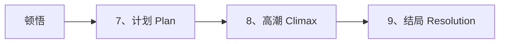

# 第23课：第三幕详解

## 学习目标

- 理解第三幕的三个检查点：计划、高潮、结局
- 掌握高潮设计的核心原则
- 学会让结局有意义且令观众满意
- 理解反派失败与主角缺陷的呼应关系

## 核心内容

### 第三幕的三个检查点



### 7. 计划（Plan）

**计划必须是主角在顿悟之前无法做到的事情。** 顿悟让他意识到自己的缺陷并克服了它，这使他能制定出新的方案。

**计划的注意事项：**

| 情况 | 说明 |
|------|------|
| **第一个计划可能失败** | 可以有多个计划方案 |
| **悲剧中的计划** | 如果主角没有真正改变，所有计划都无效，最终被反派击败 |
| **喜剧/英雄故事** | 最后一个计划通常会成功 |

**《星球大战》中的计划：**

卢克的计划很简单——基于"我相信自己"的顿悟，他要接近死星，甩掉追击者（包括达斯·维德），用原力摧毁死星。

> [!TIP]
> 不同故事类型的计划长度差异很大。在抢劫类电影中，计划可能需要大量时间来铺陈；而在《星球大战》中，计划只占几分钟。

### 8. 高潮（Climax）

**高潮是故事中最紧张的时刻**——主角与反派的最终对决。

```mermaid
flowchart TB
    subgraph ”高潮的核心原则”
        P1[主角必须主动出击] --> P2[反派因自身缺陷而失败]
    end
    P2 --> P3[观众保持对主角的同情]
```

**重要原则：**

**原则一：主角必须主动出击**
- 主角不能等待救援或被动等待
- 他们必须采取积极行动

**原则二：反派因自身缺陷而失败**
- 如果反派在最后一刻意识到并克服了自己的缺陷，他们就能击败主角
- 正因为反派**没有改变**，所以他们失败了
- 这让主角保持同情——我们没有让主角变成欺凌者

**原则三：反派的失败与故事的重要性相符**
- 初中生故事中，反派的失败可以很轻松
- 动作冒险故事中，反派很可能会死去
- 反派也可以被改造（如达斯·维德在后来的电影中）

**《星球大战》中的高潮：**

- 卢克拉动了扳机——**主动出击**
- 达斯·维德因**过于自信**而失败——他根本不相信有人能做到
- 死星被摧毁

### 9. 结局（Resolution）

**结局的任务：**

1. **旅程结束**，所有悬念得到解答
2. 主角有**短暂的机会反思**他们走过的历程
3. 最后的画面让观众**整理感受**

> [!WARNING]
> 如果电影在高潮后直接结束，观众会感到不满足。他们需要时间从紧张状态中"降落"，消化刚刚看到的故事。

**《星球大战》中的结局：**

- 义军举行仪式
- 卢克和伙伴们获得莱娅公主颁发的奖牌
- 我们知道卢克会继续与义军并肩作战
- 为续集留下了开放的可能性

### 第三幕的情感曲线

```mermaid
---
config:
  theme: neutral
---
line
    title 第三幕紧张感变化
    x-axis [”顿悟”, ”计划”, ”高潮”, ”结局”]
    y-axis ”紧张感”
    line [1, 3, 5, 1]
```

### 设计高潮与结局的关键检查

| 检查项 | 问题 |
|--------|------|
| **主角的主动性** | 主角是主动出击还是被动等待？ |
| **反派的缺陷** | 反派因为什么缺陷而失败？这个缺陷与主角的缺陷有呼应吗？ |
| **主角的同情度** | 击败反派后，主角是否依然让观众同情？ |
| **结局的完整性** | 所有故事问题都得到解答了吗？观众是否感到满足？ |
| **最后画面** | 你希望观众记住什么？最后的画面传达了故事主题吗？ |

## 实践与反思

### 练习：设计你的第三幕

1. **计划**：主角在顿悟后能做什么之前做不到的事？
2. **高潮**：主角如何主动出击击败反派？
   - 反派因什么缺陷而失败？
3. **结局**：最后给观众留下什么画面？

<details>
<summary>参考检查清单</summary>

- [ ] 计划直接关联顿悟中的领悟
- [ ] 高潮是故事中紧张感最强的时刻
- [ ] 反派失败的方式与他们的缺陷相关
- [ ] 结局给了观众整理感受的空间
- [ ] 最后的画面能帮助观众理解故事的意义

</details>

---

**关键术语回顾**：Plan（计划）、Climax（高潮）、Resolution（结局）、Final Image（最后画面）

相关课程：[[0022-act-2|第22课：第二幕详解]] | [[0024-beginnings-and-endings|第24课：开头与结尾]]