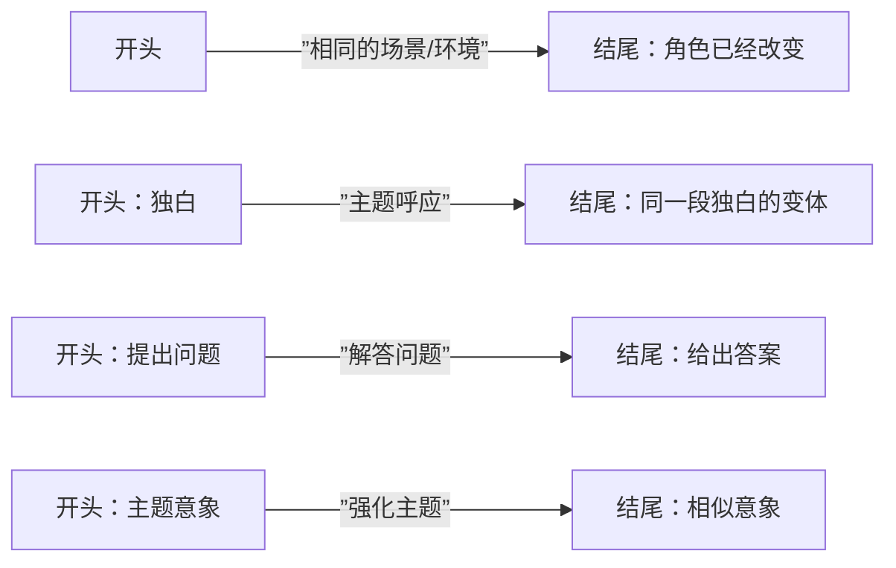

# 第24课：开头与结尾

## 学习目标

- 掌握三种最常见的开头方式
- 了解不同类型结尾的特点和适用场景
- 学会设计开头与结尾的呼应关系
- 通过经典电影案例分析首尾呼应的力量

## 核心内容

### 三种常见的开头方式

```mermaid
flowchart TB
    subgraph ”开头方式”
        A1[1、从行动中开始<br/>In Medias Res] --> D[目标：快速抓住观众]
        A2[2、提前揭示结局] --> D
        A3[3、创造难忘画面] --> D
    end
```

#### 1. 从行动中开始（In Medias Res）

在**故事进行到一半时**开始，直接进入动作或追逐戏。

- 观众需要迅速"赶上"情节，弄清楚发生了什么
- 例：角色从飞机上跳伞、正在执行任务
- 效果：立即制造紧迫感

#### 2. 提前揭示结局

在开头直接告诉观众故事将如何结束。

- 引发故事问题："这真的是发生的事情吗？"或"我们是如何从A到B的？"
- 例：《美国丽人》——"不到一年我就会死去"
- 例：《魔发奇缘》——"这是我死亡的故事"

#### 3. 创造令人难忘的画面

用令人印象深刻的场景、对话或图像吸引观众的注意力。

- 例：詹姆斯·邦德系列电影的开场介绍
- 邦德总是做一些非常大胆的事情
- 虽然这些场景有时与主要故事无关，但它们非常令人难忘

> [!TIP]
> **选择起始点的原则**：尽可能晚地进入故事。你讲述的不是角色的整个人生，而是他们生活中最值得讲述的一个片段。

### 结尾的类型

| 类型 | 描述 | 适用场景 |
|------|------|----------|
| **完整收束** | 所有问题得到解决 | 独立故事、三部曲终章 |
| **循环结局** | 回到故事开始的地方 | 强调角色变化 |
| **反转结局** | 结局与观众预期完全相反 | 《第六感》《非常嫌疑犯》 |
| **苦乐参半** | 达成目标但失去了什么 | 《莎翁情史》 |
| **开放式** | 留下未解答的问题 | 三部曲中间部 |
| **悬念式** | 让观众好奇接下来发生什么 | 系列电影 |
| **揭示式** | 最后揭示关键信息 | 家庭关系、身份谜团 |
| **独白结尾** | 通过独白总结旅程 | 循环结构故事 |

### 开头与结尾的呼应

最好的结局通常与开头直接相关：



#### 经典案例：《早餐俱乐部》

**开场独白：**
> "1984年3月24日，星期六……你只看到我们最简单的一面，用最方便的定义——书呆子、运动员、精神病患者、公主和罪犯。这就是我们早上七点时的看法。"

**结尾独白：**
> "但我们发现每个人都是智者和运动员、精神病患者、公主和罪犯。这算不算回答你的问题？真诚的，早餐俱乐部。"

这段首尾呼应完美地展示了角色在这段旅程中的变化。

#### 其他经典案例

| 电影 | 开头 | 结尾 | 呼应方式 |
|------|------|------|----------|
| **《朱诺》** | 她走过城镇，喝着饮品 | 她在不同的季节骑车穿行 | 环境变化反映角色变化 |
| **《安娜贝尔》** | 女孩从车窗到达 | 相似的场景，不同的女性 | 情境呼应，角色替换 |
| **《泰坦尼克号》** | 寻宝者寻找海洋之心 | 老年罗斯展示海洋之心 | 解答开头的谜题 |

> [!WARNING]
> 使用反转结局（Twist Ending）时要注意：不要让你的剧本只剩下一个反转。如果第三次观看就变得无聊，说明缺乏值得反复品味的角色时刻。《第六感》之所以成功，是因为布鲁斯·威利斯和小男孩的互动本身就值得一看再看。

## 实践与反思

### 练习：设计你的开头和结尾

1. 你的故事用哪种方式开头？
2. 你的故事用哪种类型结尾？
3. 开头和结尾之间有什么呼应关系？
4. 如何通过视觉方式展现主角在开头和结尾之间的变化？

<details>
<summary>思考提示</summary>

- 如果你用独白开头，考虑用独白结尾
- 如果你用画面开头，考虑用相似的画面结尾
- 在相同的地点、不同的时间展示主角，可以巧妙地展现他们的变化

</details>

---

**关键术语回顾**：In Medias Res（从行动中开始）、Circular Ending（循环结局）、Twist Ending（反转结局）、Bittersweet Ending（苦乐参半的结局）、Open Ending（开放式结局）

相关课程：[[0023-act-3|第23课：第三幕详解]] | [[0025-scenes|第25课：场景写作]]