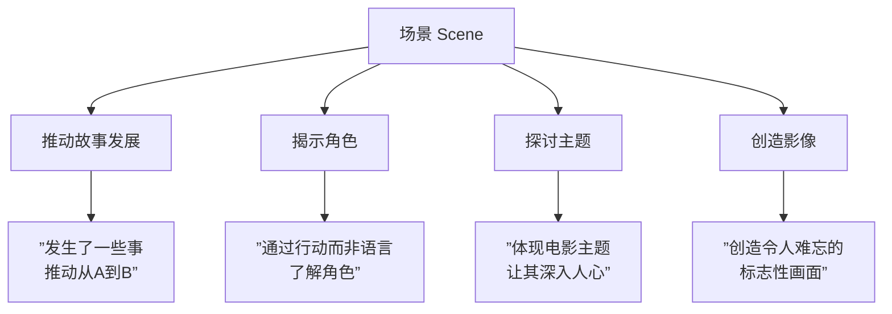
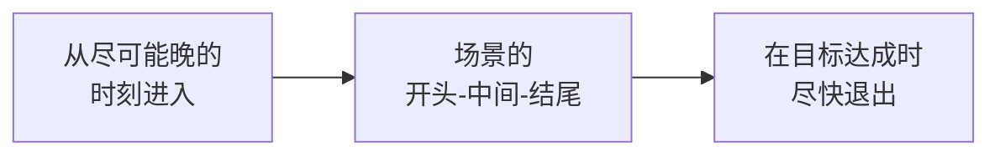

# 第25课：场景写作

## 学习目标

- 理解场景（Scene）的定义和功能
- 掌握场景的四个核心作用
- 学会场景的进入和退出技巧
- 掌握处理背景信息和避免"对话头"场景的方法

## 核心内容

### 什么是场景？

**场景（Scene）** 是一个自成一体的单元，发生在特定的时间和地点。时长从几秒到五六分钟不等，大多数场景在2-3分钟左右。

场景是剧本的**基石**——所有的故事都由场景拼接而成。

### 场景的四个核心功能

一个好的场景应该履行以下四个功能之一（伟大场景则同时包含多个）：

#### 1. 推动故事发展

- 角色采取行动、学到东西、决定尝试新事物
- 在非线性叙事中，依然需要推动观众从开头到中间再到结尾
- 在谋杀悬疑片中，这是填补线索空白的方式

#### 2. 揭示角色

揭示角色的最佳方式是通过**观察他们的行动**，尤其是：

- 他们做决定的方式
- 他们采取的行动类型
- 他们面对压力时的反应

> [!TIP]
> 揭示角色性格的首要方式，就是将他们置于越来越大的压力之下，观察他们如何反应。

#### 3. 探讨主题

- 场景应当体现电影的主题（爱、恨、牺牲、责任等）
- 通过角色的选择和行为来展现主题
- 通过画面来传递主题信息

#### 4. 创造影像

电影被称为"动态影像"是有原因的。一个好的画面可以：

- 传达大量信息
- 成为电影的标志性记忆
- 让观众屏息凝视

**经典影像案例：**

| 电影 | 画面 | 传达的信息 |
|------|------|-----------|
| **《早餐俱乐部》** | 五个青少年坐在地板上 | 他们发现彼此的共同点 |
| **《E.T.外星人》** | 男孩和自行车飞过月亮 | 友谊、魔法、冒险 |
| **《恋恋笔记本》** | 雨中重逢的恋人 | 重生与救赎 |
| **《泰坦尼克号》** | 罗斯在船头张开双臂 | 自由、爱让她飞翔 |

### 场景写作技巧

#### 1. 避免"对话头"场景

两个角色只是坐着聊天，很快就会变得无聊。**给角色安排一些事情做：**
- 在做饭时对话
- 在花园劳动时对话
- 打网球时对话

> [!EXAMPLE]
> **好的例子：** 在《妙女神探》中，角色在健身房里摔跤的同时进行对话。谁赢了摔跤，谁就赢得辩论——冲突被具象化。

#### 2. 处理背景信息（Exposition）

背景信息虽然必要但常常无聊，以下是化平淡为神奇的技巧：

| 技巧 | 说明 | 示例 |
|------|------|------|
| **放在片头字幕中** | 用视觉化方式呈现 | 开场蒙太奇 |
| **通过对话展现** | 角色之间自然交流 | 避免独白 |
| **分散在剧本各处** | 不要一次性倾倒 | 逐片揭示 |
| **由有趣的角色传达** | 让角色本身有趣 | 《泰坦尼克号》中那个预测船将沉没的乘客 |
| **加入冲突** | 在紧张对峙中交代 | 《加勒比海盗》中伊丽莎白被枪指着解释条约 |

#### 3. 蒙太奇（Montage）

蒙太奇是多个场景片段的拼接，用于：

- 压缩信息为易消化的小块
- 跳过较长时间段（如几个月的相处）
- **不能**用来跳过冲突——冲突必须正面写出来

**经典蒙太奇案例：** 《飞屋环游记》开头5分钟的蒙太奇讲述了一生的爱情故事；《洛奇》的训练蒙太奇；《守望者》的超级英雄历史蒙太奇。

### 场景结构建议

1. **场景要有开头、中间和结尾**——把它看作一个迷你结构
2. **从最后的时刻开始**，尽快进入核心
3. **在目标达成时尽快结束**——当你完成场景目标时，就是该结束的时候

> [!TIP]
> 我发现自己经常需要删除场景的前一页半，因为我总是花太长时间才进入正题。从"最后的时刻"开始，能帮你删掉多余的部分。

## 实践与反思

### 练习：场景分析

选一个你记得的电影场景，回答以下问题：

1. 这个场景发生在哪里？什么时候？
2. 这个场景推动了什么故事发展？
3. 通过这个场景，我们了解到角色的什么特质？
4. 这个场景探讨了什么主题？
5. 这个场景中有没有令人难忘的画面？

参考答案（以《蜘蛛侠》2002年被咬场景为例）

这个场景发生在实验室参观中：
- **推动故事**：被蜘蛛咬是整部电影的起因
- **揭示角色**：彼得聪明、呆萌、害羞、爱着玛丽·简；玛丽·简善良；哈利勇敢
- **探讨主题**：能力与责任的主题开始浮现——受欢迎的孩子滥用权力
- **创造影像**：实验室角落的蜘蛛网，营造紧张气氛
- **处理背景**：参观的科学家自然地交代了蜘蛛的特性（跳跃能力、网的强度、感知）

---

**关键术语回顾**：Scene（场景）、Exposition（背景信息/交代）、Montage（蒙太奇）、Dialogue Head（对话头场景）、Imagery（意象/画面）

相关课程：[[0024-beginnings-and-endings|第24课：开头与结尾]] | [[0026-treatments-and-outlines|第26课：Treatments 与 Outlines]]