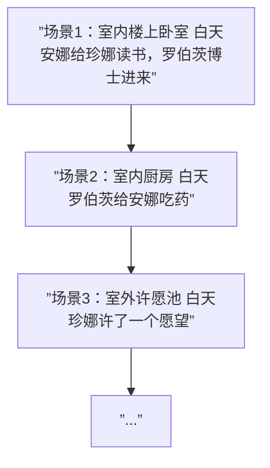
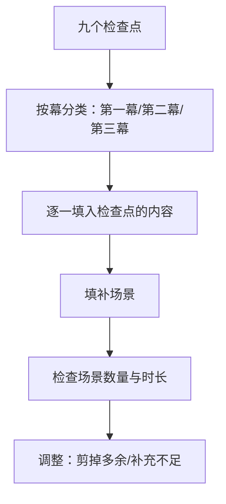

# 第26课：Treatments 与 Outlines

## 学习目标

- 理解 Treatment（剧本大纲）和 Outline（提纲）的定义
- 掌握两者之间的区别和各自用途
- 学会用九个检查点为基础构建提纲
- 了解不同风格的大纲写作方法

## 核心内容

### Treatment vs Outline

```mermaid
flowchart TB
    subgraph ”写作前的规划工具”
        direction LR
        T[Treatment<br/>剧本大纲] --- O[Outline<br/>提纲]
    end
    
    T --> T1[”2-5页<br/>像短篇小说一样可读”]
    T --> T2[”营销文档<br/>制片人/代理人会看”]
    
    O --> O1[”详细路线图<br/>只给自己看”]
    O --> O2[”场景级分解<br/>指导写作”]
```

| 维度 | Treatment（剧本大纲） | Outline（提纲） |
|------|----------------------|-----------------|
| **长度** | 2-5页 | 3-20页不等 |
| **受众** | 代理人、制片人（营销文档） | 只有你自己 |
| **形式** | 像短篇小说一样可读 | 场景列表，可繁可简 |
| **时态** | 现在时 | 不拘形式 |
| **内容** | 完整的故事概述 | 逐场景的分解 |
| **完成时机** | 可以在剧本完成后精修 | 写作开始前完成 |

### Treatment 的要点

**Treatment 是一份完整的、可读的故事概述，就像一篇短篇小说。**

1. **长度**：2-5页
2. **时态**：用**现在时**书写
3. **风格**：读起来应该像短篇小说一样流畅
4. **内容**：可以包含关键场景和对话，这些将直接进入剧本
5. **目的**：既是**自己的路线图**，也是**提交给代理人的营销文件**

> [!WARNING]
> 如果你发现Treatment写到60页——那不如去写小说。Treatment的关键是"短而完整"，确保你关注了整个故事，而不只是第一幕。

### Outline 的两种风格

#### 风格一：精简型（每个场景1-2句话）



**特点：**
- 每个场景用一行左右描述
- 只记录关键信息：地点、在场人物、发生的事情
- 你自己知道细节和意图——大纲只是提醒

#### 风格二：详细型（尽可能多的细节）

**特点：**
- 包含对话片段、象征元素、情感注释
- 在创意状态时把所有灵感记录下来
- 甚至包含角色的动机和潜台词

> [!TIP]
> 两种风格没有对错之分！我（讲师）现在的做法介于两者之间：对关键场景做更详细的笔记，对过渡性场景保持简洁。

### 如何构建你的 Outline



**步骤：**

1. **从九点检查点开始**：用之前课上的内容填好九个检查点
2. **按幕分类**：第一幕、第二幕、第三幕
3. **填入每个检查点的内容**
4. **填补空白**：添加连接检查点之间的场景
5. **用场景估算时长**：每个场景约2分钟（粗略估算）
6. **检查与调整**：
   - 如果第一幕的场景加起来超过30分钟——需要删减
   - 如果内容太少——还有空间添加更多细节

> [!WARNING]
> 在大纲阶段做删改的成本远低于实际写作阶段。放弃大纲中的几页内容比放弃30页写好的剧本要容易得多。

### 一个实用的练习

**练习概述一部与你想要写的剧本风格相似的电影：**

1. 看一部和你目标类型/节奏相似的电影
2. 写下它所有场景的概要
3. 这会帮助你了解：
   - 该类型电影大概有多少个场景
   - 场景的节奏和长度分布
   - 你喜欢和不喜欢的技术手法

> [!TIP]
> 补充材料中包含了对《第六感》的大纲示例，是我在第三次观看时为学习反转结局而做的笔记。这是了解"目标导向学习"如何帮助你构建自己故事大纲的好方法。

## 实践与反思

### 练习：开始你的 Outline

1. 基于之前的九点检查点，按第一幕、第二幕、第三幕列出来
2. 在每个检查点之间，想象需要哪些场景来连接它们
3. 粗略估算你的第一幕有多少场景，时长大约是多少

<details>
<summary>场景估算参考</summary>

- 一部2小时电影约有60个场景（每个约2分钟）
- 节奏较慢的电影（如《杯酒人生》）场景数较少
- 节奏快的电影场景数更多，单个场景更短
- 第一幕大约占30分钟，约15个场景

</details>

---

**关键术语回顾**：Treatment（剧本大纲）、Outline（提纲/场景分解）、Scene Breakdown（场景分解）、Story Structure Checkpoints（故事结构检查点）

相关课程：[[0025-scenes|第25课：场景写作]] | [[0020-three-act-structure|第20课：三幕结构]]

---

## Module 3 总结

恭喜你完成了 Module 3！你已经掌握了从 Logline 到 Outline 的完整剧本规划工具链：

| 工具 | 长度 | 用途 |
|------|------|------|
| Logline | 1-2句话 | 故事核心的浓缩 |
| Pitch | 几分钟 | 口头推介故事 |
| Synopsis | 1页 | 书面故事概览 |
| Treatment | 2-5页 | 完整的故事蓝图 |
| Outline | 3-20页 | 逐场景的写作指南 |

接下来：Module 4 将进入实际的剧本写作！