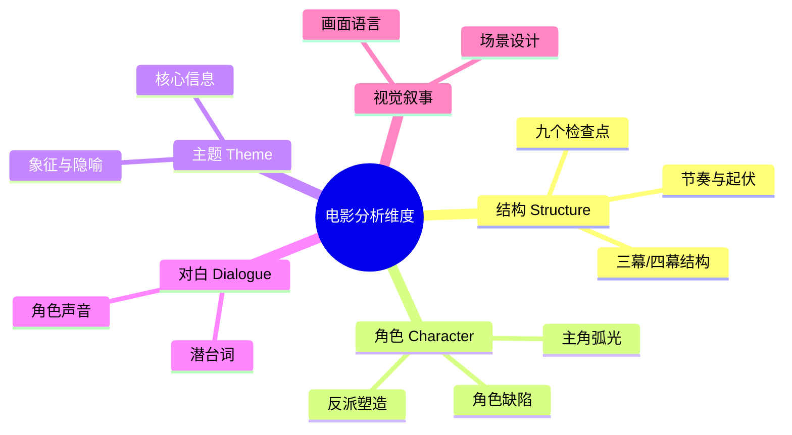

# 第40课：电影分析入门

## 学习目标

- 理解从编剧视角分析电影与被动观影的区别
- 掌握分析电影的关键维度（结构、角色、主题、对白）
- 建立"为什么这样设计"的批判性思维方式
- 了解 Module 6 电影分析的整体框架

## 核心内容

### 从被动观影到主动分析

> [!TIP]
> 提升编剧水平的最佳途径就是**多看电影**——但必须以**批判性的眼光**来看待它们。这需要付出更多努力，而不是仅仅坐在那里被动地观看。

分析电影时，你需要思考：

- **是什么让这部电影独特？** 它与众不同的地方在哪里？
- **如果是不喜欢的电影**——想想原因是什么，有哪些可以改进的地方？
- **如果你是编剧**——你会怎么做不一样？

### 分析框架

### Module 6 电影类型概览

本节课是 Module 6 的引言，后续每一课将深入分析一部特定类型的经典电影：

| 课次 | 电影 | 类型 | 核心分析重点 |
|------|------|------|-------------|
| 41 | 《肖申克的救赎》 | 剧情片（Drama） | 三幕结构、叙事视角、伏笔与呼应 |
| 42 | 《沉默的羔羊》 | 惊悚片（Thriller） | 角色塑造、紧张感营造、演员与剧本的互动 |
| 43 | 《狮子王》 | 家庭/动画片（Family） | 英雄之旅、主题传达、类型混合 |
| 44 | 《电子情书》 | 浪漫喜剧（Rom-Com） | 双主角结构、顿悟时刻、类型惯例 |
| 46 | 《蜘蛛侠》（2002） | 超级英雄（Superhero） | 起源故事、角色缺陷、标志性画面 |
| 47 | 《第五元素》 | 科幻片（Sci-Fi） | 世界构建、节奏控制、类型混合 |

> [!WARNING] 注意：第45课为 Timer 专题，无双语字幕文件，跳过。

### 如何最大化分析收益

> [!EXAMPLE] **推荐的观影与分析方法**
> 1. **先看电影，再看分析**——因为分析中会揭露结局
> 2. **与朋友一起讨论**——互相交流想法，往往能发现独自观影时忽略的细节
> 3. **记录你的感受**——哪些场景打动你？哪些让你感到无聊？为什么？
> 4. **保持开放心态**——你可能和讲师意见不合，这完全正常

### 开放心态的重要性

> [!IMPORTANT]
> 分析一部电影几乎总有**不止一种方式**。你从电影中获得的体会有时会与讲师的观点相反。这是完全可以接受的——因为这个世界有着各种各样的电影观众。听听不同看法本身就是一种收获。

## 实践与反思

### 分析练习框架

在进入后续具体电影分析之前，可以先练习以下通用分析流程：

1. **第一遍**：以普通观众身份观看，记录第一感受
2. **第二遍**：以编剧身份观看，关注结构、角色弧光、关键转折
3. **分析笔记**：针对以下问题写出你的答案
   - 这部电影的主角是谁？ta的缺陷是什么？
   - 故事的激励事件（Inciting Incident）是什么？
   - 转折点在哪里？主角的顿悟何时发生？
   - 主题是什么？如何通过情节传达？

### 自测题

点击展开答案

**Q：从编剧视角看电影，和普通观众有什么不同？**
A：普通观众被动接受故事，而编剧主动分析——思考为什么这样设计、是什么让电影独特、有哪些可以改进的地方。

**Q：Module 6 覆盖了哪些电影类型？**
A：剧情片、惊悚片、家庭/动画片、浪漫喜剧、超级英雄片、科幻片。

**Q：看分析之前为什么要先看电影？**
A：因为分析中会揭露剧情和结局，先看电影可以获得完整的、无剧透的观影体验。

**Q：如果不同意讲师对某部电影的评价怎么办？**
A：这完全正常——分析电影几乎总有不止一种方式。不同视角恰恰是有价值的。

### 本课总结

电影分析是一项可以训练的**技能**。通过系统性地从结构、角色、主题、对白等维度审视电影，你不仅能加深对故事的理解，更能将这些洞察转化为自己创作的养料。Module 6 将带领你通过七部不同类型的经典电影，逐步掌握这套分析工具。

在进入具体分析之前，建议回顾 [[0020-three-act-structure|三幕结构]] 和 [[0015-heros-journey|英雄之旅]] 的知识，它们将是后续分析的重要理论基础。

---

**关键术语回顾**：电影分析（Film Analysis）、批判性眼光（Critical Eye）、激励事件（Inciting Incident）、角色弧光（Character Arc）

**下一课**：[[0041-shawshank-redemption|第41课：剧情片分析——《肖申克的救赎》]]