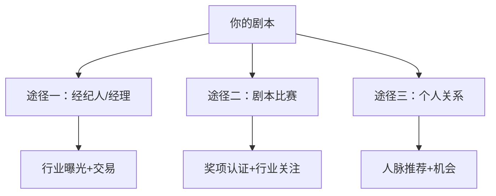

# 第48课：如何让你的剧本被看到

## 学习目标

- 了解将剧本推向市场的三大途径
- 掌握查询信（Query Letter）的写法
- 区分经纪人与经理的角色差异
- 了解如何选择剧本比赛并提交作品

## 核心内容

### 推广前的准备工作

在开始投递剧本之前，确保你已经准备好以下材料：

1. **剧本梗概（Logline）** ——经打磨的一两句话概要
2. **完整、经过润色的剧本** ——已经过多轮重写
3. **查询信（Query Letter）** ——联系行业人士的敲门砖

### 查询信（Query Letter）怎么写

查询信是联系制片人、经纪人（Agent）或经理（Manager）的信件，说明你拥有的内容以及他们为什么需要看。

**查询信结构：**

| 部分 | 内容 |
|------|------|
| 开头 | 专业的问候语 |
| 主体 | 你的故事梗概 |
| 结尾 | 专业的结束语 |
| 可选 | 简短的自我介绍（仅当你获得过知名奖项或有特殊资历） |

**什么情况下应该在查询信中提及个人背景？**

- 获得过有声望的剧本比赛奖项
- 有与故事主题相关的特殊经历（例如写主题公园故事时，你曾在迪士尼担任幻想工程师）

> [!TIP]
> 保持简洁！查询信不需要长篇大论，重点是引起对方的兴趣。

### 三大推广途径

### 经纪人（Agent） vs. 经理（Manager）

| 区别 | 经纪人（Agent） | 经理（Manager） |
|------|----------------|-----------------|
| **核心职能** | 促成交易 | 长期职业规划 |
| **出现时机** | 你有热度时 | 从早期开始培养 |
| **关注点** | 卖出你现有的作品 | 发展你的写作技能 |
| **能否达成交易** | 能 | 不能 |
| **能否参与制作** | 不能 | 可以 |

**经典比喻：**
- **找经纪人**像"短暂恋情"——他们关注的是你当下的热度
- **找经理**像"结婚"——他们关注你的长期发展

> [!WARNING]
> 如果有人向你收取"阅稿费"，要特别小心。真正的管理公司不会收取阅读作品的费用——他们靠你未来交易的10%-15%佣金盈利。

#### 寻找经纪人的建议

1. **做调查**——找到代表你喜欢的作品的经纪人
2. **确保你对他有好感**——你们会频繁打交道
3. **确认他们喜欢你的写作风格**——不要让他们把你推向不喜欢的道路
4. **确认他们有推广你的计划**——他们的工作是制定策略

> 当你的职业生涯有进展（赢得重要比赛、获得奖项）时，经纪人会自动找上门。在这之前，经理是更好的起点。

### 剧本比赛（Screenplay Competitions）

美国有成百上千的剧本比赛，国际上的更多。

**主要的大型比赛：**

| 比赛名称 | 特点 | 
|----------|------|
| **尼科尔编剧奖（Nicholl Fellowship）** | 由奥斯卡委员会主办，获胜者获奖金和为期一年的写作奖学金，行业高管审阅所有决赛作品 |
| **Final Draft 大突破比赛（Final Draft Big Break）** | 年度大赛，获胜者获得奖金和行业曝光，大部分获奖者能成功找到经纪人 |
| **剧本管道比赛（Script Pipeline）** | 有现金奖励，许多行业高管会阅读你的作品 |
| **迪士尼ABC写作奖（Disney/ABC Writing Award）** | 获胜者被聘用到ABC工作，适合对电视编剧感兴趣的人 |

> [!TIP]
> 即使不获胜，进入四分之一决赛或半决赛也足以引起行业关注！

#### 参赛注意事项

1. **仔细阅读投稿指南**——遵守所有格式要求
2. **准备好费用**——大多数比赛约50美元左右（上下浮动20美元）
3. **检查是否需要盲审版本**——某些比赛要求提交不包含名字的副本
4. **注意早鸟优惠**——提前几个月报名可以省钱
5. **提前计划**——不要在截止日期前一小时才提交

#### 关于比赛的补充

剧本比赛正在成为越来越重要的"破冰"工具——有些人赢得比赛时甚至没有经理或经纪人，他们就是通过比赛被发掘的。不要只盯着最大的比赛——如果你的剧本属于特定类型，参加专门类型的电影节也同样有价值。

### 个人人脉的力量

如果你在洛杉矶或行业聚集地有朋友：

- **利用你的关系网**——朋友的朋友可能就是机会
- **尊重对方的时间**——人们不喜欢被索取，但乐于给予帮助
- **正确的方式**：请对方喝咖啡，请教行业问题，而不是直接要求帮忙

> 你能够结识的人脉，将成为推广剧本最重要的工具之一。

## 实践与反思

### 练习：写一封查询信

为你完成的剧本写一封简短（不超过一页）的查询信模板，包括专业问候、你的故事梗概和专业结尾。

查询信模板

尊敬的 [姓名]，

我是 [你的名字]，一位编剧。[用一两句话介绍你的背景，如果有获奖或相关经验]

我的最新剧本 [剧本标题] 是一部 [类型] 电影，故事讲述 [你的 Logline]。

[可选：如果你有相关资历，提及它]

感谢您的时间。如果您感兴趣，我乐于发送完整剧本供您审阅。

此致，
[你的名字]
[联系方式]

---

**关键术语回顾**：Agent（经纪人）、Manager（经理）、Query Letter（查询信）、Nicholl Fellowship（尼科尔编剧奖）、Script Coverage（剧本评估报告）

相关课程：[[0049-online-resources-for-screenwriters|第49课：编剧在线资源]] | [[0051-grand-finale|第51课：课程总结]]