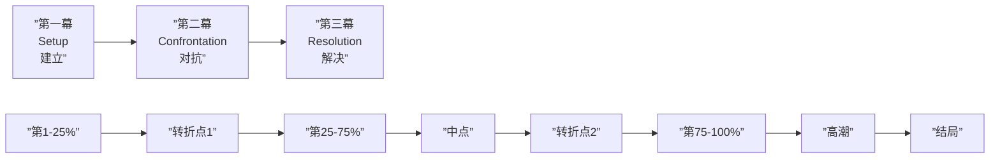

# 三幕结构参考

## 三幕概览

## 第一幕：建立（约 25%）

| 元素 | 说明 | 示例（星球大战） |
|------|------|------------------|
| **平凡世界** | 展示主角的日常生活 | Luke 在塔图因农场 |
| **吸引点（Hook）** | 开场抓住观众 | 机器人带来 Leia 的信息 |
| **激励事件** | 打破平衡的事件 | R2-D2 的信息、Obi-Wan 出现 |
| **关键问题** | 故事的核心问题 | Luke 能否成为绝地武士？ |
| **第一幕转折点** | 主角决定踏上旅程 | Luke 的家被毁，决定跟 Obi-Wan 走 |

## 第二幕：对抗（约 50%）

| 元素 | 说明 | 示例（星球大战） |
|------|------|------------------|
| **新世界** | 主角进入未知领域 |  Millennium Falcon、酒吧 |
| **冲突升级** | 困难越来越大 | 死星的追击 |
| **盟友与敌人** | 遇到新角色 | Han Solo、Leia、Vader |
| **中点转折** | 故事中间的重大变化 | 被死星俘获，发现弱点 |
| **一切尽失** | 最低谷的时刻 | Obi-Wan 被 Vader 杀死 |
| **第二幕转折点** | 主角重新振作 | Luke 决定攻击死星 |

## 第三幕：解决（约 25%）

| 元素 | 说明 | 示例（星球大战） |
|------|------|------------------|
| **最终准备** | 主角准备面对最后挑战 | X-Wing 编队出发 |
| **高潮** | 最终对决 | 死星大战，Luke 使用原力 |
| **结局** | 新常态的展现 | 颁奖仪式，大家欢呼 |

## 检查清单

> [!QUESTION] 你的故事结构检查
> - [ ] 第一幕是否在 25% 左右结束？
> - [ ] 主角在第一幕结尾主动做出决定了吗？
> - [ ] 第二幕冲突是否比第一幕更大？
> - [ ] 中点有转折吗？
> - [ ] 主角在第二幕经历了最低谷吗？
> - [ ] 第三幕的高潮是否回答了故事的核心问题？
> - [ ] 结局是否展示了主角的变化？

结构问题诊断

- **开头太慢** → 第一幕太长，需要更早引入激励事件
- **中间疲软** → 第二幕缺少冲突升级或中点转折
- **高潮不够高** → 第三幕的高潮需要更高的风险和情感投入
- **结局拖沓** → 高潮之后尽快收尾

