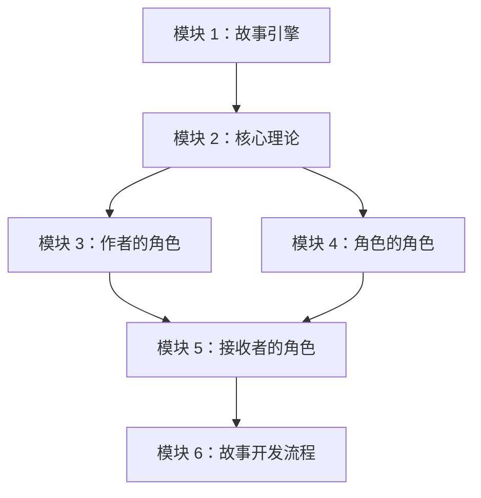
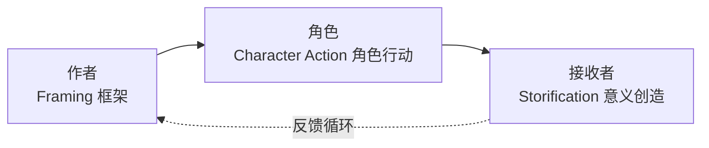

# 课程地图

## 推荐学习路径



## 模块依赖关系

| 模块 | 前置要求 | 核心产出 |
|------|---------|---------|
| 模块 1 | 无 | 课程概览与故事引擎比喻 |
| 模块 2 | 模块 1 | 知识缺口理论体系 |
| 模块 3 | 模块 2 | 作者的框架工具集 |
| 模块 4 | 模块 2 | 角色行动的设计工具 |
| 模块 5 | 模块 2 + 3 + 4 | 接收者意义的创造 |
| 模块 6 | 全部前置 | 完整故事开发流程 |

## 课程的三层架构



## 模块 3 内部依赖

```mermaid
flowchart TD
    subgraph ”作者的框架工具”
        KQ[关键问题动态] --> HF[好莱坞公式]
        KQ --> AP[亚里士多德原理]
        AP --> PR[特权与启示]
        PR --> CF[冲突四层次]
        CF --> MC[有意义冲突]
        CP[角色计划] --> NT[叙述者]
        SW[故事世界] --> BS[背景故事]
    end
```

## 模块 4 内部依赖

```mermaid
flowchart TD
    subgraph ”角色的行动工具”
        PC[情节 vs 角色] --> PA[主角与反角]
        PA --> CM[角色动机]
        CM --> IO[内弧与外弧]
        IO --> AD[行动与对话]
        AD --> ST[隐匿]
    end
```

## 模块 5 内部依赖

```mermaid
flowchart TD
    subgraph ”接收者的意义创造”
        RR[接收者的角色] --> SA[超越目标]
        RR --> CG[角色成长]
        RR --> TL[真实谎言]
        RR --> MA[隐喻与寓言]
        MA --> MB[道德论证]
        MB --> RC[识别与文化典故]
    end
```

## 速查：知识点全景图

| 编号 | 知识点 | 类别 | 难度 |
|------|--------|------|------|
| 01-02 | 故事引擎与三种角色 | 基础 | ★☆☆ |
| 03-04 | 叙事 vs 故事、Storification | 核心理论 | ★★★ |
| 05-07 | 知识缺口、潜台词、分类学 | 核心理论 | ★★★ |
| 08-09 | 关键问题、好莱坞公式 | 框架工具 | ★★☆ |
| 10 | 亚里士多德原理 | 框架工具 | ★★☆ |
| 11 | 特权与启示 | 框架工具 | ★★☆ |
| 12-13 | 冲突四层次、有意义冲突 | 框架工具 | ★★☆ |
| 14 | 角色计划 | 框架工具 | ★☆☆ |
| 15-17 | 叙述者、故事世界、背景故事 | 框架工具 | ★★☆ |
| 18-19 | 情节 vs 角色、主角与反角 | 角色工具 | ★★☆ |
| 20 | 角色动机 | 角色工具 | ★★★ |
| 21-23 | 内弧外弧、行动对话、隐匿 | 角色工具 | ★★☆ |
| 24-30 | 接收者相关知识点 | 意义创造 | ★★★ |
| 31-34 | 故事开发流程 | 实战应用 | ★★☆ |

---

**下一步**：从 [[lessons/0001-dream-engine|第01课：欢迎来到故事引擎]] 开始学习。