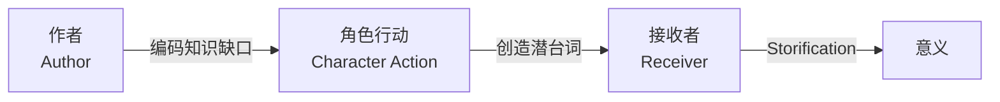

# 第01课：欢迎来到故事引擎

## 学习目标

- 了解讲师 David Baboulin 的背景与课程价值
- 理解"故事引擎"的比喻
- 建立课程学习的整体框架

## 讲师是谁？

David Baboulin 的身份多重：

- **博士**——故事理论学术研究者
- **作家**——出版十余本书
- **电影制片人 & 剧本顾问**——为数十部电影电视剧提供咨询
- **国际演讲者**——面向全球的作家和电影人演讲

> [!QUOTE] David 自述
> 我能走到今天，不是因为我最会写故事，也不是因为我拥有最棒的故事点子——而是因为我**理解故事是如何获得力量来抓住并吸引观众的**。

## 故事引擎的比喻

这门课的核心比喻是**故事引擎**：

好的故事不是偶然发生的——它是一台精心设计的引擎，每个部件都协同工作，在接收者心中创造出强烈的情感体验。

## 故事的竞争优势

David 指出：在影视行业中，真正理解故事运作机制的人**非常少**。当你掌握了这些知识：

- 你会成为团队中解决故事问题的**权威人物**
- 制片人、导演、出版人、演员都会来找你
- 你将成为确保项目发挥最大潜力的**关键人物**

> [!TIP] 核心心态
> 这门课不是教你去"套公式"——而是让你理解故事运作的底层原理，让你能够自信地审视自己的故事，知道它为什么有效、为什么无效。

## 课程结构

这门课本身就是一段**英雄之旅**：

| 阶段 | 内容 |
|------|------|
| 出发 | 模块 1-2：基础概念与核心理论 |
| 考验 | 模块 3-5：作者、角色、接收者的深入工具 |
| 归来 | 模块 6：故事开发流程实战 |

## 推荐资源

观看课程附带的 Frozen 短片（80秒），感受一个精炼故事如何展现完整的故事动力学：

> **Frozen** (2013) —— 迪士尼的经典短片，全片80秒，完美展示了本章将要讲解的所有故事原理。你可以在 YouTube 上找到它。

## 回顾清单

- [ ] 我理解了"故事引擎"这个概念
- [ ] 我知道课程的三层架构：作者→角色→接收者
- [ ] 我理解了掌握故事理论的竞争优势

---

**下一步**：继续学习 [[0002-three-roles|第02课：故事的三种角色]]