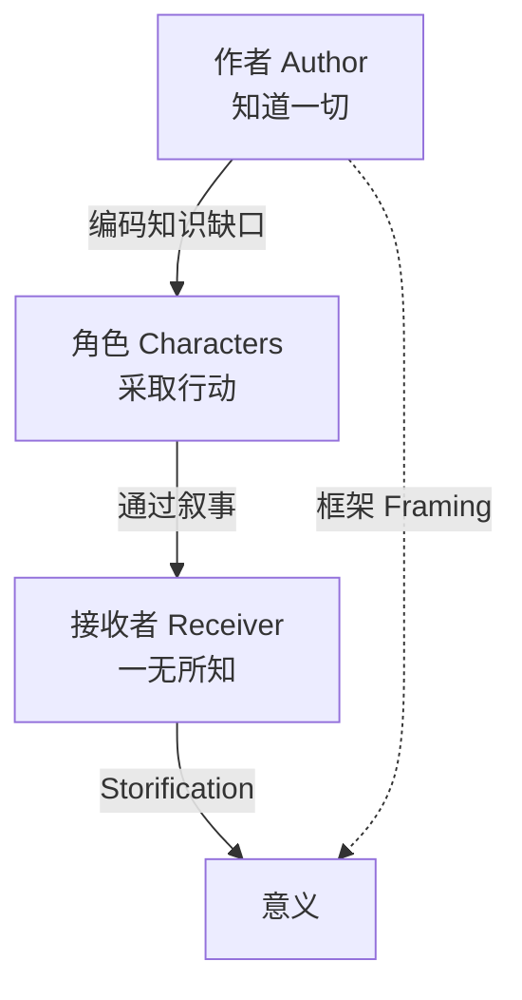

# 第02课：故事的三种角色

## 学习目标

- 理解故事中的三种核心角色：作者、角色、接收者
- 了解三者之间的关系与知识缺口的分布
- 建立学习本课程的全局视角

## 故事的三角

每一则故事，无论长短，都包含三个必不可少的角色：

### 1. 作者 (Author)

作者是整个故事世界的"神"。作者知道故事中发生的一切，但在叙事过程中选择性地释放信息。

作者的工作：
- **框架 (Framing)**：为观众定位方向，设定语境
- **编码知识缺口**：在信息中嵌入"洞"
- **选择叙述者**：决定谁来讲这个故事

> [!NOTE] 作者即第一叙述者
> 即使故事中没有明显的叙述者，**作者始终是第一叙述者**。因为故事一开始就是一个巨大的知识缺口——作者什么都知道，接收者什么都不知道。

### 2. 角色 (Characters)

角色在故事世界中生活、行动，**不知道有观众在看他们**。观众如同透过一堵"第四面墙"窥视他们的生活。

角色的工作：
- **采取行动**：推动故事前进
- **做出决定**：在冲突中选择
- **对话与互动**：传递信息（也掩盖信息）

这是故事的"模仿"(Mimesis)——通过角色的行动来呈现故事。

### 3. 接收者 (Receiver)

接收者（观众/读者）在故事开始前**一无所知**。他们的工作是：

- **接收信息**：从叙事中获取碎片
- **填补缺口**：用自己的知识填补知识缺口
- **创造意义**：形成自己的理解——这就是 Storification

> [!TIP] 关键洞见
> 接收者不是被动的容器。他们主动地**参与故事的构建**。你的故事不是在页面上——而是在接收者的脑海中。

## 为什么这个三角如此重要？

传统的故事理论只关注**框架**（情节结构、三幕、英雄之旅等）。但这个课程告诉你：

- **框架**（作者的工作）支撑
- **角色行动**（角色的工作）传递
- **Storification**（接收者的工作）创造真正的意义

三者缺一不可。

## 三种知识缺口

每个角色之间的连接都通过知识缺口实现：

| 缺口位置 | 类型 | 示例 |
|---------|------|------|
| 作者 vs 角色 | 特权/启示 | 作者知道角色不知道的秘密 |
| 角色 vs 角色 | 隐匿/计划 | 一个角色对其他角色隐瞒信息 |
| 作者 vs 接收者 | 所有缺口类型 | 整个故事建立在此之上 |

## 回顾清单

- [ ] 我能解释作者、角色、接收者三者的关系
- [ ] 我理解每个角色各自承担的工作
- [ ] 我知道知识缺口如何分布在三者之间

---

**下一步**：继续学习 [[0003-narrative-vs-story|第03课：叙事 vs 故事]]