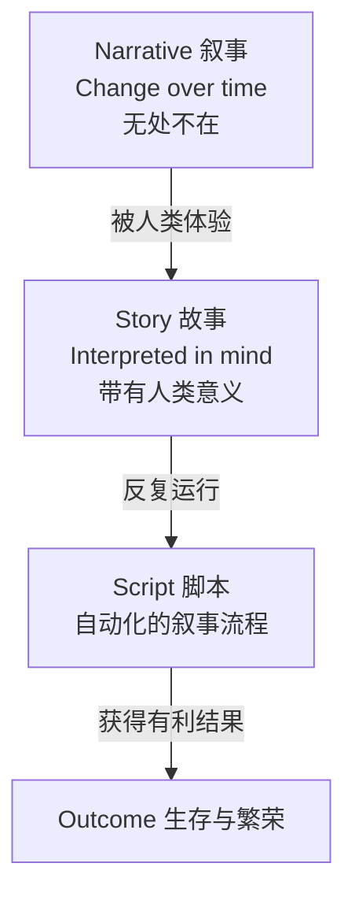

# 第03课：叙事 vs 故事

## 学习目标

- 准确区分"叙事"(Narrative)和"故事"(Story)
- 理解自传体叙事记忆的概念
- 掌握"脚本"(Scripts)理论与学习的本质

## 核心定义

这是全课程中**最重要的两个定义**：

> **叙事 (Narrative)**：任何形式的时间中的变化（change over time）。
>
> **故事 (Story)**：被人类心智解读后存储起来的叙事。

```mermaid
flowchart LR
    subgraph ”外部世界”
        N[叙事<br/>Change over time]
    end
    subgraph ”人类心智”
        S[故事<br/>被解读的叙事 + 人类意义]
    end
    N -->|被人类体验| S
```

### 叙事无处不在

行星旋转、潮起潮落、蜘蛛织网、狮子追捕斑马、孩子们踢球、父母做饭……

这些都在发生着**时间中的变化**——这就是叙事。它比人类更古老，它定义了人类生存的环境。

### 故事只存在于心智中

当叙事被人类经历，被解读为**人类文化意义上的记忆**，它就变成了故事。

> [!WARNING] 常见误解
> "知识"并不存在于外部世界。外部世界只有信息。**知识只存在于心智中**——是心智将信息解读为有意义的形式。

## 自传体叙事记忆

人类成为地球上的优势物种，原因之一是我们**极其擅长处理叙事**。

我们识别和理解自然界中的各种叙事，并将其存储在一个特殊的记忆形式中——**自传体叙事记忆 (Autobiographical Narrative Memory)**，也就是**故事**。

> [!QUOTE] 记忆即故事，故事即记忆
> 我们创造的故事就是我们拥有的记忆。我们拥有的记忆就是我们讲述的故事。我们用智力来混合搭配这些记忆，创造出新的故事。

## 脚本理论 (Scripts)

你的生活由许多"脚本"构成：

| 脚本类型 | 示例 |
|---------|------|
| 简单日常 | 泡茶、洗澡、在餐厅吃饭 |
| 周期性活动 | 圣诞节庆祝、度假旅行 |
| 重大事件 | 就医流程、经营关系、抚养孩子 |

每个脚本都是一段**叙事流程**，你运行它是为了**获得有利的结果**。

### 脚本替代思考

- 当你**第一次**做某事时——比如第一次搭火车——你会感到兴奋/情绪化。因为你在**学习新的叙事**。
- 当你第50次通勤上班时——它不再令人兴奋。因为脚本已经嵌入记忆，你只是在**自动运行**它。

> [!TIP] 对写作者的启示
> 学习的本质就是：吸收理解（或发明创造）一个新的叙事流程。如果一段叙事在逻辑上成立，你的大脑会**自动**把它存储为记忆——你无法阻止它。

## 知识 vs 叙事

> 知识主要只存在于**叙事语境**中。直到某物在叙事流程中展现了它的作用，它对我们来说才有意义。

以渔网为例：
1. **它是什么**：一堆绳子 → 标签
2. **它在叙事中做什么**：挂在船后拖行，从水中捕鱼 → 功能
3. **它对人类意味着什么**：桌上的鱼晚餐 → 营养、生存 → **意义**

> [!QUESTION] 自检思考
> 回想你最近学到的某个新概念。你能用"标签 → 功能 → 意义"三层结构来分析它吗？

## 总结



**叙事的定义**：任何形式的时间中的变化。
**故事的定义**：任何包含知识缺口的、经过心智解读的信息传递。

## 回顾清单

- [ ] 我能区分"叙事"和"故事"的定义
- [ ] 我能解释为什么"知识只存在于心智中"
- [ ] 我能用脚本理论解释"为什么第一次做某事令人兴奋"
- [ ] 我理解了"学习的本质是吸收新的叙事流程"

---

**下一步**：继续学习 [[0004-storification|第04课：Storification——大脑的自动意义创造]]