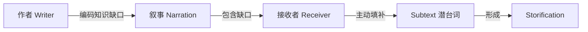

# 第06课：潜台词——填入缺口的知识

## 学习目标

- 逆转对"故事由什么构成"的认知
- 理解"渔网比喻"
- 掌握 Subtext 的真正定义
- 分析六词小说的知识缺口

## 渔网比喻：反转你的思维

> 如果我拿着一面渔网问你：渔网是由什么构成的？
>
> 你大概会说——绳子。
>
> 不对。渔网是由**洞**构成的。如果没有洞，渔网就是一块木板——什么都捕不到。

故事也是一样：

> 故事不是由你写下的信息构成的——**故事是由知识缺口构成的**。

你写下的信息（情节、对话、描述）**只是用来框定知识缺口的框架**——就像渔网的绳子只是帮你找到洞在哪里。

```mermaid
flowchart LR
    subgraph ”渔网”
        A1[绳子 → 框定] 
        A2[洞 → 捕获]
    end
    subgraph ”故事”
        B1[信息 → 框定]
        B2[知识缺口 → 捕获读者]
    end
```

## 六词小说：最短的故事分析

据说这是海明威(Ernest Hemingway)写下的最短小说——仅六个词：

> **For sale: Baby shoes, never worn.**
>
> **出售：婴儿鞋，从未穿过。**

### 绳子和洞

**绳子（你得到的信息）**：
- 有人在卖婴儿鞋
- 鞋子从未穿过

**洞（知识缺口）**：
- 为什么要卖？
- 为什么鞋子从未穿过？
- 那孩子怎么了？

**你填入的潜台词**：
- 婴儿没有活下来 → 悲剧
- 父母在悲伤中处理遗物
- 一段完整的故事被你自动构建出来

> [!TIP] 奇迹
> 这些"故事"——死亡、悲剧、悲伤的父母——没有一个字在六个词中出现。**是你把它们放进去的**。你在填补知识缺口的过程中创造了故事。

## Subtext 的真正定义

你可能在许多写作课程中听过"你要在潜台词(subtext)中写作"。

问题在于：**没人告诉你该怎么做。**

> [!NOTE] Subtext 的秘密
> **作者不处理 Subtext。**
>
> 作者处理的是**知识缺口**。你将自己的故事编码成知识缺口，然后接收者在缺口中**填入 Subtext**。
>
> Subtext = 填入知识缺口的知识。



### 你在写作课上听到的"用 subtext 写作"其实是：

> **用知识缺口写作。**

让接收者去完成那部分工作——他们最喜欢这样做了。

## 生活中的缺口 vs 故事中的缺口

| 场景 | 缺口 | 心理反应 |
|------|------|---------|
| 凌晨巨响 | 发生了什么？ | 焦虑、警觉、必须查清 |
| "她真是……" | 她到底是什么？ | 自动填补（你想歪了吧？） |
| 谁会赢得比赛？ | 结果未定 | 期待、紧张 |
| 礼物盒 | 里面是什么？ | 好奇、兴奋 |

所有情感都来自**缺口**，而不是来自信息本身。

## 自检练习

> [!QUESTION] 分析练习
> 选一个你喜欢的故事（电影、小说、短篇），找出其中最大的三个知识缺口。它们分别让观众产生了什么情感？

<details>
<summary>参考示例：以《冰雪奇缘》预告片为例</summary>

**缺口1：** 雪人把鼻子（胡萝卜）弄掉了
→ 情感：好笑，但"然后呢？"

**缺口2：** 雪人要拿回鼻子，但麋鹿也想要同一根胡萝卜
→ 缺口打开：谁能得到它？
→ 情感：紧张、期待

**缺口3：** 雪人眼看要失败了（唯一可能的结局？）
→ Peripeteia 转折：麋鹿不是要吃胡萝卜，它想玩"捡回来"的游戏！
→ 情感：惊喜、温暖、好笑

</details>

## 回顾清单

- [ ] 我能用渔网比喻解释"故事由知识缺口构成"
- [ ] 我能分析六词小说的"绳子"和"洞"
- [ ] 我理解了 Subtext = 填入知识缺口的知识
- [ ] 我明白了"作者不处理 subtext，作者处理知识缺口"

---

**下一步**：继续学习 [[0007-gap-taxonomy|第07课：知识缺口分类学——故事的"原色"]]