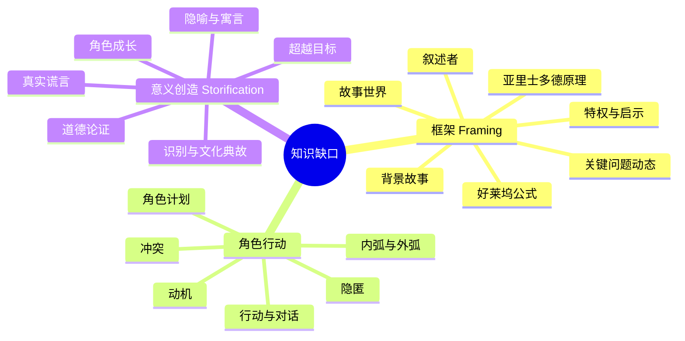

# 第07课：知识缺口分类学——故事的"原色"

## 学习目标

- 了解知识缺口的完整分类体系
- 掌握三类核心缺口：框架、角色行动、Storification
- 深入理解特权(Privilege)与启示(Revelation)

## 故事的"原色"

David Baboulin 花了十多年的学术研究，定义了所有知识缺口——他称之为故事的 **"原色"(Primary Colors of Story)**。

就像红黄蓝可以调出所有颜色一样，这些知识缺口可以构成所有故事。



## 三类知识缺口

### 第一类：框架 (Framing)

与**作者**的工作相关——为观众定位、指明方向。

| 缺口类型 | 是什么 | 作用 |
|---------|-------|------|
| 关键问题动态 | 激励事件引发问题，高潮回答 | 为整部作品设定方向 |
| 好莱坞公式 | 三幕结构中的转折点 | 提供节奏和结构 |
| 亚里士多德原理 | Hamartia → Anagnorisis → Peripeteia | 事件级的故事动力 |
| 特权与启示 | 观众知道得更多/更少 | 创造悬疑或惊喜 |
| 叙述者 | 叙事情息的选择性释放 | 控制信息的释放 |
| 故事世界 | 世界规则和设定 | 界定可能性边界 |
| 背景故事 | 过去事件的选择性揭示 | 增加深度和维度 |

### 第二类：角色行动

与**角色**的工作相关——行动中的角色创造知识缺口。

| 缺口类型 | 是什么 | 作用 |
|---------|-------|------|
| 冲突 | 内/外/制度/关系 | 测试角色动机 |
| 角色计划 | 角色有秘密计划 | 深层持久的知识缺口 |
| 动机 | 角色想要什么 vs 需要什么 | 驱动故事引擎 |
| 内弧与外弧 | 可见目标 vs 价值观转变 | 角色的双重旅程 |
| 行动与对话 | 角色做什么 vs 说什么 | 不一致性创造缺口 |
| 隐匿 | 隐藏信息或身份 | 秘密的故事力量 |

### 第三类：Storification（意义创造）

与**接收者**的工作相关——这是**最重要**的知识缺口类别。

| 缺口类型 | 是什么 | 作用 |
|---------|-------|------|
| 超越目标 | 不仅回答关键问题，还超出预期 | 让故事令人满足 |
| 角色成长 | 角色学到/变成了什么 | 让故事有意义 |
| 真实谎言 | 虚构故事传递真实 | 让故事可信 |
| 隐喻与寓言 | 故事在另一个层面上"是关于"什么 | 增加深度 |
| 道德论证 | 故事传递的道德立场 | 让故事有价值 |
| 识别与文化典故 | 观众认出模式/引用 | 创造连接感 |

## 理解缺口方向

每个知识缺口都可以从两个方向测量：

```mermaid
flowchart TD
    subgraph ”知识缺口方向”
        P[特权 Privilege<br/>观众知道更多] -->|紧张/悬疑| E1[Tension]
        R[启示 Revelation<br/>观众知道更少] -->|神秘/惊喜| E2[Surprise]
    end
```

### 特权 (Privilege)

观众知道某件事，但某个角色不知道。

**效果**：紧张、悬疑、等待的心情

> 例子：我们知道礼物盒里是什么，但收礼物的人不知道。我们知道门后有个杀手，但角色不知道。

### 启示 (Revelation)

观众不知道某件事，但某个角色知道。

**效果**：神秘、惊喜、揭开真相

> 例子：我们是侦探，和主角一起发现线索。或在结尾发现真相，《非常嫌疑犯》式的反转。

## 缺口的存在与消失

一旦故事结束，你告诉朋友说"这故事太棒了"，然后跟他们一起再去剧院看一遍——

- **第一遍**：所有缺口处于"启示"模式
- **第二遍**：相同的缺口现在处于"特权"模式——你知道会发生什么，但你朋友不知道。你享受着他们被缺口吸引的过程。

> [!TIP] 缺口的弹性
> 知识缺口不会因为被填满就消失——它们会从"启示"切换到"特权"。这就是为什么好故事值得反复观看。

## 回顾清单

- [ ] 我能说出三类知识缺口：框架、角色行动、Storification
- [ ] 我理解特权 vs 启示的区别
- [ ] 我理解为什么好故事值得反复观看（缺口切换方向）
- [ ] 我能识别一个故事中使用了哪些类型的缺口

---

**下一步**：进入模块 3，开始学习 [[0008-key-question|第08课：关键问题动态]]