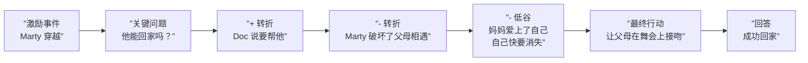

# 第09课：好莱坞公式与转折点

## 学习目标

- 理解三幕结构如何围绕关键问题运转
- 学会识别转折点 (Turning Points) 和它们的正负交替
- 理解子情节和场景也具有相同的结构
- 知道何时在创作中运用这个公式

## 公式的骨架

**好莱坞公式 (Hollywood Formula)** 并不是一个花哨的创意工具——它是一个**问题解决工具**。当你卡住了，或者需要修改一段不流畅的草稿时，这个公式是你的救星。

它的核心很简单：三幕结构建立在前一课的关键问题之上。

```mermaid
flowchart TD
    subgraph ”Act 1: 建立”
        A1[设定 Setup] --> A2[激励事件<br/>Inciting Incident]
        A2 --> KQ[提出关键问题]
    end
    subgraph ”Act 2: 冲突”
        KQ --> B1[第一个转折点<br/>Turning Point +]
        B1 --> B2[中间点<br/>Mid-Act Turning Point -]
        B2 --> B3[最低谷<br/>Low Point]
    end
    subgraph ”Act 3: 解决”
        B3 --> C1[最终战役<br/>Final Battle]
        C1 --> C2[回答关键问题]
    end
```

### 第一幕：建立

| 元素 | 功能 |
|------|------|
| 设定 (Setup) | 介绍角色、世界、常态 |
| 激励事件 (Inciting Incident) | 打破常态，强行将主角推入故事 |
| 关键问题 (Key Question) | 此时在观众心中明确提出 |

> 关键问题必须在第一幕结束时出现在观众心中。如果观众不知道问题是什么，他们就没有理由继续关注。

### 第二幕：冲突

第二幕是**转折点的舞蹈**——角色的命运在正负之间来回摆动：

| 转折点 | 方向 | 功能 |
|--------|------|------|
| 第一个转折点 | + | 看起来一切顺利，计划成形 |
| 中间转折点 | - | 事情开始出错，冲突加剧 |
| 最低谷 | - | 一切似乎都完了——但这是黎明前的黑暗 |

> [!NOTE] 正负交替
> 第二幕的本质是正负交替的波浪。如果故事从头到尾都在往上走，观众会觉得缺乏张力。如果一直在往下走，观众会感到绝望。关键在于**节奏 (Rhythm)**。

### 第三幕：解决

| 元素 | 功能 |
|------|------|
| 最终战役 (Final Battle) | 主角面对最大挑战 |
| 关键问题回答 | 答案揭晓，故事结束 |

## 案例：回到未来 (Back to the Future)



**关键转折点分析**：

- **中间转折点**（第二幕中点）：Marty 发现自己破坏了父母相遇——这意味着他可能会消失。这是负向转折，将风险提升到新高度。
- **最低谷**：妈妈（1955年的 Lorraine）爱上了 Marty 而不是 George。Marty 的手开始消失——时间在抹除他的存在。

## 子情节的相同结构

好莱坞公式的美丽之处在于它是**递归的 (Recursive)**——它适用于每一个层次：

```mermaid
flowchart TD
    subgraph ”整部电影”
        A[Act 1] --> B[Act 2] --> C[Act 3]
    end
    subgraph ”每条子情节”
        D[Act 1] --> E[Act 2] --> F[Act 3]
    end
    subgraph ”每场戏”
        G[Setup] --> H[Conflict] --> I[Resolution]
    end
```

### 子情节示例

回到未来中**Marty 父母相遇**的子情节：

| 幕 | 内容 |
|----|------|
| Act 1 - 设定 | 父母在 1955 年还未相遇 |
| Act 1 - 激励 | Marty 把 George 撞晕了，他必须代替父亲 |
| Act 2 - 冲突 | 妈妈爱上了 Marty，George 不敢行动 |
| Act 3 - 解决 | 舞会上 George 击倒 Biff，妈妈爱上 George |

这个子情节的结构完全镜像了主情节。每一层都在问同一个问题："Marty 能回家吗？"——只是在不同的尺度上。

### 场景级结构

每一个场景也可以看作一个小三幕结构：

1. **开场**：角色进入场景时有目标（想知道什么？）
2. **中间**：障碍出现，知识缺口被打开
3. **结尾**：缺口被填满或深化，引发下一个场景

> [!TIP] 场景检查法
> 如果一场戏的开场和结尾没有改变任何知识缺口的状态——它就没有存在的理由。删掉它。或者重写它，直到它至少打开或关闭一个缺口。

## 什么时候用好莱坞公式？

| 场景 | 怎么做 |
|------|--------|
| **写不下去** | 停下来画出三幕结构，找出当前位置，确定下一个转折点 |
| **修改草稿** | 检查每个转折点的位置。第一幕是不是太长了？第二幕的正负节奏对不对？第三幕的关键问题回答是否令人满意？ |
| **初稿创作** | 谨慎使用。公式是"回头时"的路标，不是"向前走"的轨道 |

> [!WARNING] 不要在初稿中使用公式
> 好莱坞公式最适合用来分析已经存在的东西——比如你的草稿，或者你喜欢的电影。在初稿创作中过度依赖公式会让故事变得机械和可预测。先写，用直觉。然后看公式，找问题。

## 自检问题

<details>
<summary>问题 1：分析一部电影的三幕结构</summary>

选一部你熟悉的电影，填写：
- 第一幕结束时所提的关键问题是什么？
- 第二幕中正负转折点各是什么？
- 第三幕中关键问题是如何回答的？
</details>

<details>
<summary>问题 2：你的子情节有结构吗？</summary>

如果你有一个故事（或正在构思一个），列出每一条子情节，检查它是否也拥有独立的三幕结构。如果一条子情节没有完整的结构——没有独立的关键问题——它可能应该被简化或合并。
</details>

## 回顾清单

- [ ] 我能清晰地解释好莱坞公式的三幕结构
- [ ] 我理解第二幕中正负转折点的交替节奏
- [ ] 我理解子情节和场景也具有相同的结构
- [ ] 我知道公式最适合用于修改和问题解决，而非初稿创作
- [ ] 我能用"场景检查法"判断一场戏是否有效

---

**下一步**：[[0010-aristotle|第10课：亚里士多德原理]]