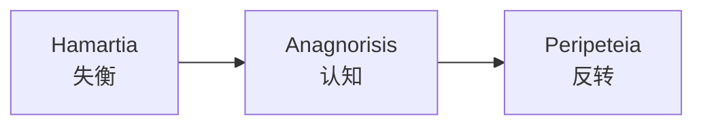

# 第10课：亚里士多德原理

## 学习目标

- 理解亚里士多德悲剧三要素：Hamartia、Anagnorisis、Peripeteia
- 了解这些原理可以应用于任何尺度——从整部电影到一个小笑话
- 理解 Catharsis 的本质
- 掌握"实现在角色身上"vs"实现在观众身上"的区别

## 三要素

亚里士多德在《诗学》中定义了悲剧的三个关键要素。听起来像学术概念，但它们实际上是每个故事转折背后的引擎：



### 1. Hamartia (失衡/误判)

世界被推出了平衡状态。通常翻译为"悲剧缺陷"，但更准确的理解是：

> **事情偏离了它应该发展的方向。**

这可以是：
- 一个角色做出了错误判断
- 外界力量强行改变了状态
- 世界从秩序走向混乱

### 2. Anagnorisis (认知/觉察)

角色（或观众）意识到事情比想象中更糟——或者完全不一样。

> **"哦，不……原来是这样。"**

这是知识缺口被打开或加深的时刻。

### 3. Peripeteia (反转/转折)

命运的逆转——向相反方向转变。这是知识缺口被填满的时刻。

> **结果完全出乎意料。**

## 经典案例：冰雪奇缘 (Frozen) 预告片

Baboulin 用了一个精妙的案例来分析《冰雪奇缘》预告片的一个镜头序列：

| 要素 | 画面 | 知识缺口变化 |
|------|------|-------------|
| Hamartia | 雪人 Olaf 的鼻子掉了 | "雪人的鼻子掉了，这不对"——世界失衡 |
| Anagnorisis | 一头驼鹿出现 | 观众意识到："等等，这野外的驼鹿会不会……？" |
| Peripeteia | 驼鹿想要捡回鼻子玩 Fetch | 反转！驼鹿不是要吃鼻子，而是想玩接球游戏 |

短短几秒钟，这个节奏创造了一个完整的微型故事：

```mermaid
flowchart TD
    subgraph ”预告片中的亚里士多德三要素”
        A[”Hamartia<br/>雪人鼻子掉了”] -->|”哦不”| B[”Anagnorisis<br/>驼鹿出现了！”]
        B -->|”等等……”| C[”Peripeteia<br/>驼鹿想玩接球！”]
        C --> D[”观众笑出声”]
    end
```

> [!NOTE] 三要素不需要悲剧
> 我们通常认为亚里士多德说的是"悲剧"，但这个节奏适用于喜剧、惊悚、爱情——任何类型的转折。关键是"失衡→认知→反转"的模式。

## Anagnorisis 的位置：角色 vs 观众

认知 (Anagnorisis) 可以发生在两个不同的位置，产生不同的效果：

### 与角色一起 (Shared)

角色和观众同时意识到真相。

> **例子：《罗密欧与朱丽叶》**——观众和角色一起得知对方已死，一起经历悲剧的降临。

效果：共情 + 同步的情感体验。

### 在观众身上 (Audience Only)

观众意识到真相，但角色不知道。

> **例子：《公民凯恩》(Citizen Kane)**——观众在结尾得知"玫瑰花蕾"的含义，但角色（调查记者）可能永远不知道。

效果：特权 (Privilege) + 深层的满足感。

```mermaid
flowchart TD
    subgraph ”认知位置对比”
        A[”Anagnorisis<br/>与角色一起”] -->|共情| B[”同步情感体验”]
        C[”Anagnorisis<br/>仅在观众”] -->|特权| D[”回顾式满足感”]
    end
```

## Catharsis (宣泄/净化)

Catharsis 是亚里士多德定义的情感终点。它的本质：

> **"谢天谢地，这没有发生在我身上。"**

这不是因为故事悲伤而产生的悲伤——而是因为故事中的痛苦让我们释放了对自身生活中类似痛苦的恐惧。

| 状态 | 说明 |
|------|------|
| **在故事中** | 角色经历了威胁、痛苦、损失 |
| **在观众中** | 我们安全地旁观，情感被激活 |
| **Catharsis** | 结束时我们感到解脱——不是我 |

> [!WARNING] Catharsis 不是同情
> 同情是"我为你感到难过"。Catharsis 是"我理解你的痛苦，但谢天谢地那不是我的痛苦"。后者更有力量，因为它直接触及观众的自我保护本能。

## 在任何尺度上使用

亚里士多德三要素可以应用于**任何尺度**：

| 尺度 | 例子 |
|------|------|
| **整部电影** | 激励事件 (Hamartia) → 中点认知 (Anagnorisis) → 最终反转 (Peripeteia) |
| **单场戏** | 角色进入有期待 (平衡) → 发现意外信息 (认知) → 计划改变 (反转) |
| **一句笑话** | "一个牧师走进酒吧……"(Hamartia) → "等等这是一家……"(Anagnorisis) → 抖包袱 (Peripeteia) |
| **一个节拍** | 表情变化 + 停顿 → 意识到什么 → 做出反应 |

> [!TIP] 尺度无关性
> 这个模式在 3 秒的搞笑视频和 3 小时的史诗电影中同样有效。一旦你掌握了基本节奏，就可以在任何层面上演奏它。

## 自检问题

<details>
<summary>问题 1：在一部你喜欢的电影中找出三要素</summary>

挑选一个场景，用 Hamartia-Anagnorisis-Peripeteia 的框架分析。你能在几分钟的片段中找到三要素的完整循环吗？
</details>

<details>
<summary>问题 2：在笑话中找到三要素</summary>

回忆一个你最喜欢的笑话。它的结构是否符合"失衡→认知→反转"？如果不符合，可能说明好笑的要素来自别处（比如角色冲突或按语双关）。
</details>

## 回顾清单

- [ ] 我能解释 Hamartia、Anagnorisis、Peripeteia 的含义和作用
- [ ] 我理解三要素可以应用于任何尺度
- [ ] 我能区分 Anagnorisis 发生在角色身上 vs 观众身上
- [ ] 我理解 Catharsis 的本质是 "谢天谢地不是我"
- [ ] 我能在日常生活的小故事或笑话中识别三要素

---

**下一步**：[[0011-privilege-revelation|第11课：特权与启示]]