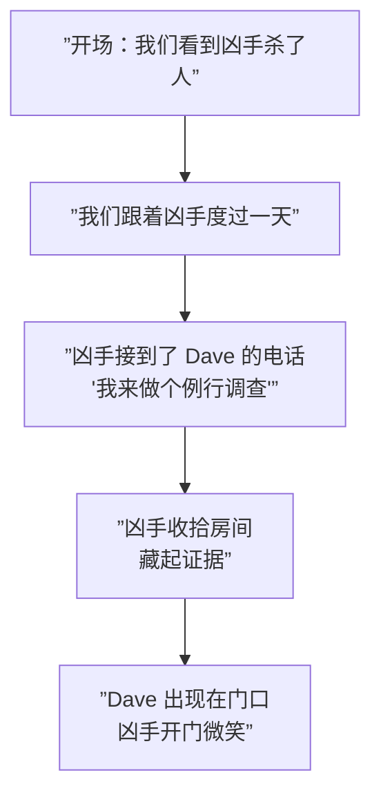
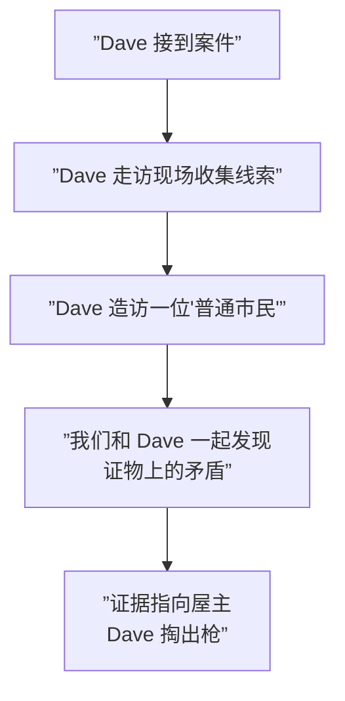

# 第11课：特权与启示

## 学习目标

- 理解 Privilege 和 Revelation 的本质区别
- 掌握同一个故事可以通过两种方式讲述产生完全不同的效果
- 理解重看/重读时知识缺口的转变
- 知道如何在自己的故事中有意识地平衡两者

## 知识缺口的两极

所有知识缺口都可以从方向上划分为两类：

| 类型 | 谁不知道？ | 谁拥有信息？ | 效果 |
|------|-----------|-------------|------|
| **特权 (Privilege)** | 角色不知道 | 观众知道 | 紧张、悬疑、等待 |
| **启示 (Revelation)** | 观众不知道 | 角色（或故事）知道 | 神秘、惊喜、揭开 |

```mermaid
flowchart TD
    subgraph ”知识缺口方向”
        P[”特权 Privilege<br/>观众知道 → 角色不知道”] --> E1[”效果：紧张 Tension<br/>'别开门！'”]
        R[”启示 Revelation<br/>观众不知道 → 角色/故事知道”] --> E2[”效果：惊喜 Surprise<br/>'什么？！']
    end
```

## 同一个故事，两种讲法

Baboulin 用一个经典的例子展示了同样一个故事可以产生完全不同的效果——只取决于你给了观众多少信息。

### 场景设定

> 警探 Dave 在调查一起谋杀案。

### 版本 A：特权 (Privilege)

我们跟着**凶手**。



**效果**：每一秒都是煎熬。Dave 在调查一个我们**知道**就是凶手的人。当他坐在凶手客厅里喝茶时，我们想尖叫："你不知道他杀了人！快走！"

### 版本 B：启示 (Revelation)

我们跟着**警探 Dave**。



**效果**：和 Dave 一起推理，一起怀疑，一起在最后一刻才发现真相。惊喜——"原来是他！"

### 同一个故事，完全不同的体验

| 版本 | 体验 | 时长 | 重复观看价值 |
|------|------|------|------------|
| 特权 | 紧张、煎熬 | 在等待中感觉时间很长 | 高——你知道细节在哪里 |
| 启示 | 好奇、惊喜 | 被牵着走感觉时间很快 | 较低——惊喜只会发生一次 |

## 礼物盒类比

想象一个包好的礼物盒：

- **启示**：你看着包装，好奇里面是什么。你打开它——惊喜！
- **特权**：你已经知道里面是什么，但你看着别人打开它。你等着看到他们的表情——紧张。

> 第一次看一个故事，大部分缺口都是启示。第二次看，同样的缺口变成了特权——你知道会发生什么，但看角色们走向命运仍然令人满足。

## 重看时的转变

这是理解知识缺口动力的关键洞见：

> **知识缺口不会消失——它们改变方向。**

```mermaid
flowchart LR
    subgraph ”第一次观看”
        A[”启示模式<br/>观众不知道”] -->|”惊喜！”| B[”缺口填满”]
    end
    subgraph ”第二次观看”
        C[”特权模式<br/>观众知道了”] -->|”看他们要来了……”| D[”紧张体验”]
    end
```

这就是为什么好故事值得反复观看：
- 第一次享受"是什么"的惊喜
- 第二次享受"他们要来了"的紧张
- 第三次注意到之前错过的细节

> [!NOTE] 翻转规律
> 但请注意：并不是所有缺口都会翻转。有些缺口（如《非常嫌疑犯》的终极反转）一旦被填满就无法再体验特权版本——因为你知道答案了，紧张感就消失了。极度依赖惊喜的故事承受不起重看的考验。

## 平衡的艺术

大多数好故事是 Privilege 和 Revelation 的**混合体**。

以《绝命毒师》为例：

| 缺口类型 | 内容 |
|---------|------|
| **特权** | 观众知道 Walter 是 Heisenberg，但 Skyler 和 Hank 不知道 |
| **启示** | 观众不知道 Gus Fring 的真实身份，和 Walter 一起发现 |
| **特权** | 观众知道 Walt 藏了毒，但 Marie 不知道 |
| **启示** | 观众不知道 Hank 何时会抓住 Walt |

> [!TIP] 检查你的故事
> 画出你的故事的知识缺口地图：哪些是特权（观众知道，角色不知道）？哪些是启示（观众不知道，随着故事展开而揭示）？如果你全是启示（不断扔出惊喜），观众会疲惫。如果你全是特权（观众永远比角色知道得多），观众会不耐烦。平衡是关键。

## 自检问题

<details>
<summary>问题 1：辨别类型</summary>

以下是几个故事设定，判断它们使用的是特权还是启示：
1. 我们跟着一个侦探进入房间，我们不知道里面有什么。
2. 我们跟着一个特工，我们知道他的同伙已经叛变，但他不知道。
3. 电影开场是一个男人在写信，我们不知道他在写给谁。
4. 我们看着一个人在下毒，然后他的朋友走进来喝了那杯水。

<summary>答案</summary>
1. 启示——我们和侦探一起发现
2. 特权——我们比特工知道得更多
3. 启示——我们不知道他在给誰写信
4. 特权——我们比那个朋友知道得更多
</details>

<details>
<summary>问题 2：重构故事</summary>

想一个你知道的故事，尝试用相反的知识缺口方向重新讲一遍。比如把原本用启示讲的恐怖故事改成特权的讲法——效果会有什么不同？
</details>

## 回顾清单

- [ ] 我能区分特权 (Privilege) 和启示 (Revelation)
- [ ] 我理解同一个故事可以用两种方式讲述
- [ ] 我理解重看时知识缺口从启示转向特权的机制
- [ ] 我知道极度依赖惊喜的故事重看价值较低
- [ ] 我能在自己的故事中有意识地平衡特权和启示

---

**下一步**：[[0012-conflict|第12课：冲突四层次]]