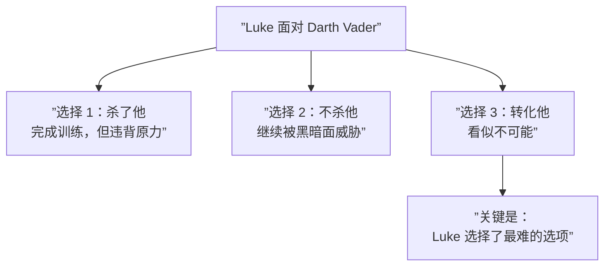
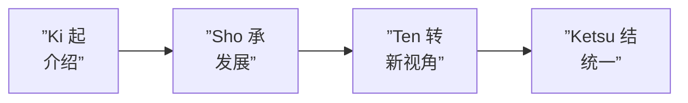

# 第13课：有意义冲突

## 学习目标

- 理解"有意义冲突"的本质是 Dilemma 而不是 Challenge
- 学会区分"奇观"和"有意义冲突"
- 了解 Kishotenketsu——完全没有冲突的日本叙事结构
- 掌握如何让角色在坏选择之间做决定

## 挑战 vs 两难

太多创作者——尤其是类型片（动作、冒险、奇幻）创作者——把"冲突"理解为"角色面对挑战"。这是一个危险的误解。

```mermaid
flowchart TD
    subgraph ”挑战 Challenge”
        A1[”登山者要爬一座山”] --> B1[”技术问题<br/>怎么办到？”]
        B1 --> C1[”可能很壮观<br/>但不是故事”]
    end
    subgraph ”两难 Dilemma”
        A2[”登山者的妻子说：<br/>'如果你去，我就带孩子离开'”] --> B2[”道德问题<br/>怎么选择？”]
        B2 --> C2[”这是故事”]
    end
```

| | 挑战 (Challenge) | 两难 (Dilemma) |
|---|-----------------|----------------|
| 本质 | "我能做到吗？" | "我应该选哪一个？" |
| 问题类型 | 技术/物理 | 道德/价值 |
| 观众反应 | 刺激但浅层 | 思考和共情 |
| 创造的知识缺口 | 结果导向 | 选择导向 |

> **挑战是奇观 (Spectacle)。两难是故事 (Story)。**

攀登珠穆朗玛峰本身不是一个故事——它是一个挑战。令人印象深刻，能看到壮观的画面。但当登山者的妻子说"如果你去，我就走"时，观众有了一个需要做出选择的人——一个不得不做决定的角色——这才是故事。

## Luke Skywalker：挑战 vs 两难的对比

George Lucas 的《星球大战》提供了一个完美的教学案例：

### 挑战层面（奇观）

Luke 和 Stormtroopers 战斗：
- 激光枪、光剑、爆炸
- 好看，刺激
- 但知识缺口只有："他能赢吗？"

> 这就像问"他能爬上那座山吗？"——一个简单的 yes/no 问题。

### 两难层面（故事）

Luke 面对 Darth Vader——他知道 Vader 是他的父亲：
- 选择一：杀死父亲——这会完成 Jedi 训练，但违背原力
- 选择二：不杀父亲——但这意味着继续被黑暗面威胁
- 选择三：尝试用爱转化父亲——这看起来不可能



这才是故事。**选择 1 和 2 都是"坏"选项**——这就是两难。

> [!NOTE] 选择 vs 选项数
> 两难 (Dilemma) 不要求在"好"和"坏"之间选择。"好"与"好"之间、"坏"与"坏"之间的选择才有力量。如果有一个显而易见的正确选项——那就不是两难，只是一个测试。

## Juno：所有选择都是坏的

Juno（2007 年电影）是有意义冲突的完美案例——因为 16 岁怀孕的主角面对的全是坏选项：

| 选项 | 为什么是坏的 |
|------|------------|
| 堕胎 | 个人、道德、社会压力 |
| 留下孩子 | 她是个孩子，无法承担养育责任 |
| 送给别人 | 情感上极其痛苦 |

> 目标不是找到"正确"的选项——因为不存在。目标是做出一个选择，然后面对这个选择的后果。故事就是在这个过程中产生的。

### Juno 的故事原理

Juno 有两个层次的冲突在同时运作：

```
外部层面：谁收养孩子？
内部层面：Juno 自己是否准备好了面对这个选择带来的成长？
```

外部层面有答案（找到收养家庭），内部层面没有简单的答案——这就是为什么这个电影有意义。

## Kishotenketsu：没有冲突的故事

不是所有故事都需要冲突。**Kishotenketsu (起承转结)** 是日本经典的四部分叙事结构：

| 部分 | 日语 | 含义 |
|------|------|------|
| Ki | 起 | 介绍设定 |
| Sho | 承 | 发展 |
| Ten | 转 | 转折——不是冲突，而是新视角 |
| Ketsu | 结 | 结论/统一 |



### Kishotenketsu 案例

一个经典例子：

> **起**：一个人坐在河边看鱼。
> **承**：他开始喂鱼，鱼越来越多。
> **转**：他发现鱼其实在吃他的倒影——他在喂自己。
> **结**：他笑了，继续坐着。

这个"故事"没有冲突。没有人阻拦他，没有内在挣扎，没有外部力量。但是有**知识缺口**——在"转"的部分，观众获得了新的认知。缺口被填满，产生了意义。

> [!WARNING] 冲突不是必需品
> Kishotenketsu 的存在证明了这个课程的核心论点：**故事的本质是知识缺口，而不是冲突。** 冲突是制造知识缺口最常用的工具，但不是唯一的工具。不要被"所有的故事都需要冲突"这句话限制。

## 自检问题

<details>
<summary>问题 1：区分挑战和两难</summary>

以下哪些是挑战 (Challenge)，哪些是两难 (Dilemma)？
1. 一个士兵要翻过一堵墙
2. 一个士兵必须在救战友和完成任务之间选择
3. 一个科学家要解决一个数学方程式
4. 一个科学家发现自己的研究会被用来制造武器

<summary>答案</summary>
1. 挑战——技术问题
2. 两难——两个价值冲突
3. 挑战——技术问题
4. 两难——道德冲突
</details>

<details>
<summary>问题 2：为你的故事增加两难</summary>

如果你正在写故事，检查你的主角面临的冲突：它主要是"挑战"还是"两难"？如果是挑战，尝试增加一个真正的两难——让角色在最坏和更坏之间选择。这会立即增加故事的深度。
</details>

## 回顾清单

- [ ] 我能区分"挑战"和"两难"
- [ ] 我理解挑战只能创造奇观，两难才能创造故事
- [ ] 我理解"在坏选项之间选择"是有意义冲突的核心
- [ ] 我了解 Kishotenketsu（起承转结）——没有冲突的叙事结构
- [ ] 我能识别自己的故事中哪些冲突是真正有意义的

---

**下一步**：[[0014-character-plans|第14课：角色计划]]