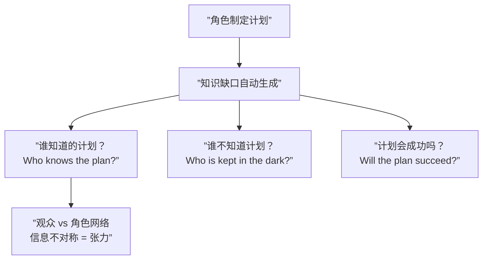

# 第14课：角色计划

## 学习目标

- 理解角色计划如何自动创造知识缺口网络
- 掌握"谁知道计划？谁不知道？"的问题框架
- 理解隐匿 (Subterfuge) 在计划中的作用
- 了解计划的动机比计划本身更重要

## 计划是故事引擎

当一个角色制定了一个计划——它立即创造了一个知识缺口网络。这是最高效的故事生成机制之一。



### 三个核心问题

| 问题 | 产生的效果 |
|------|-----------|
| **谁知道计划？** | 定义"知情阵营"和"不知情阵营"——立刻产生关系冲突 |
| **谁不知道计划？** | 创造特权 (Privilege) 缺口——观众替不知情的角色担心 |
| **计划会成功吗？** | 创造对未来结果的好奇——关键问题的燃料 |

## 案例：绝命毒师 (Breaking Bad)

《绝命毒师》是"角色计划"这一概念的教科书。

### Walter White 的秘密计划

| 计划层面 | 内容 |
|---------|------|
| **公开计划** | "我只是想为家人挣钱" |
| **秘密计划** | 成为 Heisenberg——隐藏的制毒帝国 |
| **隐藏动机** | 骄傲、自尊、恐惧、对平庸生活的报复 |

### 知识缺口网络

```mermaid
flowchart TD
    subgraph ”Walter 计划的知识缺口”
        A[”Walter 的秘密计划：<br/>成为 Heisenberg”] 
        B[”Skyler：不知道<br/>始终被蒙在鼓里”]
        C[”Hank：不知道<br/>一直在追查 Heisenberg<br/>却不知道就在身边”]
        D[”Jesse：知道部分<br/>但不完全理解 Walter 的动机”]
        E[”观众：知道全部”]
    end
    A --> B
    A --> C
    A --> D
    E --> B
    E --> C
```

这个网络产生了跨越整部剧的持久张力：

- **Skyler 线**：她什么时候会发现？她会怎么反应？（五季的悬疑）
- **Hank 线**：他追查 Heisenberg 却和最爱的姐夫住在一起——可怕的戏剧反讽
- **Jesse 线**：他知道 Walter 在制毒，但不知道 Walter 利用他到什么程度

> [!NOTE] 地下活动 (Subterfuge)
> 角色计划的最强形态是**秘密计划**——即"地下活动"(Subterfuge)。一个角色在表面做着 A 事情，但实际上在做 B。观众知道（特权），但其他角色不知道。这种信息不对称产生的张力是故事中最强大的力量之一。

## 计划的动机才是灵魂

一个计划的力量不来自计划本身——而来自**为什么要制定这个计划**。

| | 空洞的计划 | 有力的计划 |
|---|-----------|-----------|
| 内容 | "我们要偷银行" | "我们要偷银行，因为我需要钱给女儿治病" |
| 风险 | 纯粹的冒险 | 有真正的损失在赌注上 |
| 观众连接 | 谁会关心？ | 我理解他的迫不得已 |

> 没有动机的计划只是一串行动。有动机的计划是一个角色的选择——而观众会关心角色的选择。

### 检查你的角色计划

问自己以下几个问题来检查角色计划是否有足够的支撑：

1. **为什么是现在？**——为什么角色在这个时刻制定这个计划？
2. **为什么是这个人？**——为什么这个角色会制定这个特定的计划？（他的性格、经历、价值观）
3. **代价是什么？**——如果计划失败，角色会失去什么？
4. **如果成功了？**——计划成功后角色会变成什么样？（这往往是最重要的）

> [!QUESTION] 你的角色计划经得起检查吗？
> 如果角色的计划可以轻易被另一个完全不同的计划替代而不影响故事——那说明问题不在计划本身，而在动机。先找到角色的深层动机，计划自然会出现。

## 计划的尺度与持续时间

计划的规模决定了它能撑起多长的故事：

| 计划尺度 | 持续时间 | 案例 |
|---------|---------|------|
| 小计划 | 一场戏 | "我要跟他谈谈" |
| 中计划 | 一集/一章 | "我要偷那辆车" |
| 大计划 | 整部电影/一季 | "我要挣够钱给家人" |
| 超大计划 | 整个系列 | "我要建立我的帝国" |

> [!TIP] 嵌套计划
> 最精彩的剧本使用嵌套计划——一个小计划是更大计划的一部分。一个角色为今晚制定计划，但这个计划是他整季计划的一部分，而整季计划又是他整个人生计划的一部分。每一层有自己的知识缺口网络。

## 自检问题

<details>
<summary>问题 1：分析一个角色的计划</summary>

选一部你喜欢的剧集或电影，找出主角的核心计划：
- 计划是什么？
- 谁知道/不知道？
- 动机是什么？
- 这个计划产生了几个知识缺口？
</details>

<details>
<summary>问题 2：设计一个秘密计划</summary>

假设你要写一个故事，主角有一个秘密计划。画出知识缺口网络——哪些角色知情，哪些不知情。计划失败或被发现的后果是什么？观众从哪一个时间点开始知道计划？
</details>

## 回顾清单

- [ ] 我能解释角色计划如何创造知识缺口网络
- [ ] 我知道"谁知道的计划？谁不知道？计划会成功吗？"这三个核心问题
- [ ] 我理解秘密计划/地下活动 (Subterfuge) 创造最持久的张力
- [ ] 我知道计划的动机比计划本身更重要
- [ ] 我了解不同尺度的计划可以支撑不同长度的故事

---

**下一步**：[[0015-narrator|第15课：叙述者]]