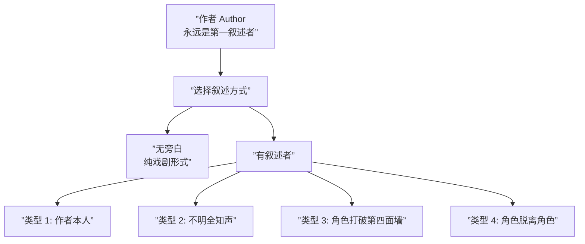

# 第15课：叙述者

## 学习目标

- 理解叙述者 (Narrator) 的本质是"任何承认观众存在的声音"
- 掌握四类叙述者及其效果
- 掌握叙述者的三项功能
- 理解不可靠叙述者如何创造知识缺口
- 了解 "少即是多" 的叙述原则

## 叙述者的本质

> **叙述者 (Narrator) 是故事中任何承认观众存在的声音。**

注意：作者**永远是第一叙述者**。当你坐下来写故事时，你说"我要告诉你一个故事"——这就是基本的叙述行为。即使故事以纯粹的戏剧形式呈现（没有旁白、没有画外音），作者仍然在通过结构、镜头、选择来"叙述"。



## 四类叙述者

### 类型 1：作者本人 (The Author)

作者直接对观众说话。这在传统的文学中常见（"亲爱的读者……"），但在现代影视中较少使用。

> 在《Magnolia》中，旁白者以故事作者/编的身份存在，直接对观众说话。

### 类型 2：不明全知声音 (Unidentified Omniscient)

一个无名的声音，全知地讲述故事。它不属于任何角色。

| 案例 | 效果 |
|------|------|
| **法国电影** | 常见手法——一个平静的声音讲述背景信息 |
| **The Royal Tenenbaums** | 旁白者不属于任何角色，用距离感增强故事的传奇感 |

### 类型 3：角色打破第四面墙 (Character Breaking the Fourth Wall)

角色直接看着镜头——或者直接对观众说话。

| 案例 | 效果 |
|------|------|
| **Elf (2003)** | Buddy 对着镜头说话，我们与他建立了直接的个人连接 |
| **House of Cards** | Frank Underwood 对着镜头解释他的计划——我们在他的脑海里 |

> 类型 3 的特殊效果：观众成为角色的同谋。我们不只是旁观者——我们是他唯一可信赖的人。

### 类型 4：角色脱离角色 (Character Disembodied)

角色从故事结束后的时间点回顾并讲述自己的故事。

| 案例 | 效果 |
|------|------|
| **American Beauty** | 主角 Lester Burnham 开场就说："我将在一年内死去。"——这是一个已经结束的角色回顾一切 |

关键：这个叙述者已经知道了结局。所以他说的每一句话都有特权的重量。

> [!TIP] 叙述者类型不是排它的
> 一个故事可以在不同时间使用不同的叙述者类型。电影《Eternal Sunshine of the Spotless Mind》在角色回忆和他对着录音说话之间切换。

## 叙述者的三项功能

### 功能 1：传递背景/展开信息 (Backstory/Exposition)

叙述者可以高效地传递背景信息，而不需要用笨拙的对话来塞入信息。

> **如何做**：叙述者直接告诉观众："这是一个叫 X 的人，他在这里住了十年……"

> [!WARNING] 不要依赖叙述者来展开
> 用叙述者展开背景很高效，但容易变成"信息倾卸"。只展示当前场景需要的最少信息——其他的，通过行动和对话展示。

### 功能 2：进入角色想法 (Inside Character's Mind)

让观众进入角色的脑海是叙述者最强的能力之一。我们不能用镜头拍"想法"。

> **Netflix's You**：主角 Joe 的旁白让我们直接进入他的头脑——他嘴里说"你好"但心里在想"你的脖子曲线真啊……"

这创造了两个层叠的故事：一是他嘴上说的话（他表面的自我），二是他内心的话（他真实的自我）。两层之间的**不一致**就是知识缺口。

### 功能 3：主动/欺骗叙述者 (Active/Deceptive Narrator)

叙述者可以**决定**告诉你什么和不告诉你什么。

> ** The Usual Suspects**：关键正在于——Kint 在撒谎。他在向警察讲述一个经过编的故事，而观众（和警察一起）直到最后才知道。

这创造了一个独特的知识缺口：
- 观众以为自己在接受真相
- 实际上叙述者在有选择地释放信息

## 不可靠叙述者 (Unreliable Narrator)

不可靠叙述者是一个特殊的变体——叙述者或是不正确、或是在撒谎。这创造了一个复杂的知识缺口网络：

```mermaid
flowchart TD
    subgraph ”不可靠叙述者的缺口”
        A[”叙述者自己<br/>可能搞错了”]
        B[”观众<br/>应该相信他吗？”]
        C[”真相<br/>实际发生了什么”]
    end
    A --”他说他看到了”--> B
    B --”猜测……”--> C
    A -.不一致.->    C
```

这比简单的"我藏信息"更复杂——因为我们不仅要问"他隐瞒了什么"，还要问"他自己的认知可靠吗"。

## 案例研究：用最少的话做到最多

在一个令人惊叹的电影分析中，Babouin 展示了 **Life is Beautiful （美丽人生）** 的叙述效率：

| 位置 | 话数 | 功能 |
|------|------|------|
| **开头** | 17 个字 | 设定故事，引入叙述者声音 |
| **结尾** | 26 个字 | 完故事，提供 Catharsis |
| **中间** | 0 个字 | 没有旁白，让故事自己讲述 |

> 整部电影只在开头用了 17 个字 + 结尾用了 26 个字。中间的全部情感冲击来自角色行动 + 观众自己完知识缺口。这是"少即是多"的终极演示。

## 自检问题

<details>
<summary>问题1：识别叙述者类型</summary>

你对一部电影或小说——它的叙述者属于四类中的哪一类？
它的叙述者主要执行了哪个功能（背景？进入思想？骗观众）？
</details>

<details>
<summary>问题2：试着删掉叙述者</summary>

假设你正在写一个有叙述者的故事——试着删掉所有叙述部分。故事还能成立吗？如果不能，说明你过度依赖叙述者传递信息。试着将这些信息转化为场景和行动。
</details>

## 回顾清单

- [ ] 我能解释叙述者的本质——"任何承认观众存在的声音"
- [ ] 我能区分四类叙述者：作者、全知声音、角色打破墙、角色脱离角色
- [ ] 我能说出叙述者的三项功能：背景、进入想法、主动骗
- [ ] 我理解不可靠叙述者创造了复杂的知识缺口
- [ ] 我知道"少即是多"——最少的叙述可以产生最大的力量

---

**下一步**：[[0016-story-world|第16课：故事世界]]