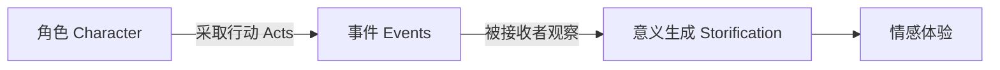

# 第18课：情节 vs 角色

## 学习目标

- 理解 Mimesis 的核心含义：角色通过行动传递故事
- 区分"情节作为框架"与"角色行动作为故事"
- 掌握突破写作瓶颈的根本方法：从角色出发

## Mimesis：故事的本质是角色在行动

亚里士多德在《诗学》中提出的核心概念 **Mimesis**（摹仿/再现），常被误解为"对现实的模仿"。但在故事语境中，它的真正含义是：

> **Mimesis = 角色采取行动，故事通过这些行动被传达给接收者。**

换句话说，故事不是被"讲述"的，而是被角色"做出来"的。



这与 **Diegesis**（讲述/叙述）形成对比——后者是叙述者直接告诉接收者发生了什么。Mimesis 让接收者**亲眼看到**角色行动，从而自主构建意义。

## 情节是框架，角色行动是故事

传统故事理论倾向于将 plot 视为故事的骨架——但这是危险的简化。

| 层面 | 定义 | 作用 |
|------|------|------|
| **Plot（情节）** | 事件的时间顺序和因果关系 | 框架——提供结构和节奏 |
| **Character Action（角色行动）** | 角色在情境中的选择和反应 | 故事——产生意义和情感 |

> [!NOTE] 关键区分
> Plot 告诉你**发生了什么**，角色行动告诉你**为什么这很重要**。

### 渔网比喻的延伸

在第06课中我们学到：故事是由知识缺口构成的。现在我们可以更进一步：

- **Plot** = 渔网的绳子——它框定缺口的边界
- **Character Action** = 鱼穿过绳子进入网中的过程——它创造缺口并驱动填补

```mermaid
flowchart TD
    subgraph ”传统观点”
        A1[Plot 事件] --> A2[决定角色反应]
    end
    subgraph ”本课程观点”
        B1[角色本质] --> B2[角色在情境中行动]
        B2 --> B3[行动创造事件序列]
        B3 --> B4[事件序列 = Plot]
    end
```

## 为什么大部分作家会卡住？

最常听到的写作困境是：

> "我有一个很好的故事概念，但我不知道接下来会发生什么。"

这句话暴露了问题所在：这位作家在思考**情节**，而不是在思考**角色**。

### 卡住的原因

- 你在问："接下来应该发生什么事件？"
- 你把自己当作一个"事件安排者"
- 你脱离了角色的内在逻辑
- 你的大脑开始编造**不自然**的情节转折

### 解药

- 不问"接下来发生什么"，而是问**"在这个情境下，这个角色会做什么？"**
- 当一个角色采取行动，问**"另一个角色会如何反应？"**
- 角色的本质（性格、欲望、恐惧）决定了TA的行动，而行动的总和就是你的情节

> [!TIP] 突破瓶颈的核心方法
> 如果你卡住了，不要去想 plot。回到你的角色：
>
> 1. 这个角色**最想要**什么？
> 2. 在这个场景中，TA 的**目标**是什么？
> 3. 如果 TA 按照自己的本性行事，TA 会**做什么**？
> 4. 这个行动会如何**影响**其他角色？
> 5. 其他角色会如何**反应**？

## 角色驱动型 vs 情节驱动型故事

这是一个常见的二分法，但真正的理解应该是：

| 特征 | 角色驱动 | 情节驱动 |
|------|---------|---------|
| 表面 | 角色内在冲突为核心 | 外部事件为核心 |
| 底层机制 | 角色行动创造事件 | 事件逼迫角色行动 |
| 本质区别 | **不存在**——两种情况都是角色在行动 |

> [!NOTE] 更深层的真相
> 真正优秀的"情节驱动型"故事，其情节之所以有力，正是因为情节中的每一个事件都**逼迫角色做出艰难的选择和行动**。事件的压力必须通过角色的反应才能转化为故事。

## 案例：Frozen 短片中的角色 vs 情节

回到课程开篇的 Frozen 短片（80秒）来看角色 vs 情节的关系：

**表面情节（框架）**：
- 雪人 Olaf 丢失了鼻子（胡萝卜）
- 麋鹿 Sven 也找到了同一根胡萝卜
- 两者争夺胡萝卜

**角色行动（故事）**：
- Olaf 的行动：追回鼻子 → 困境中不断尝试
- Sven 的行动：盯着胡萝卜 → 表现出想要它的欲望
- **转折**：Olaf 最终放弃，把胡萝卜给 Sven → Sven 却把它放回 Olaf 脸上

**真正的故事**不在于"谁得到胡萝卜"，而在于角色的行动揭示了什么——Sven 从来没有想要吃胡萝卜，它想要的是**和 Olaf 一起玩"捡回来"的游戏**。这个认知缺口由角色行动来揭示和填补。

## 自检练习

> [!QUESTION] 分析练习
> 回顾你正在创作或最熟悉的一个故事。列出前三个主要故事情节事件，然后问自己：在每个事件中，角色做了什么**主动选择**？这些选择是否真正源于角色的本质？

<details>
<summary>参考思路</summary>

如果你的故事事件可以发生在任何角色身上（只要把角色名字换掉，故事仍然成立），那么你的情节可能**脱离**了角色的本质。

修正方法：回到角色，重新设计每个场景，确保事件是由角色的**欲望和恐惧**驱动的。

</details>

## 回顾清单

- [ ] 我理解了 Mimesis = 角色通过行动传递故事
- [ ] 我能区分"情节作为框架"和"角色行动作为故事"
- [ ] 我掌握了突破写作瓶颈的方法：从角色出发，不问"接下来发生什么"，问"这个角色会做什么"
- [ ] 我理解了 plot 是角色行动的总和，而不是独立于角色存在的结构

---

**下一步**：继续学习 [[0019-protagonist-antagonist|第19课：主角与反角]]