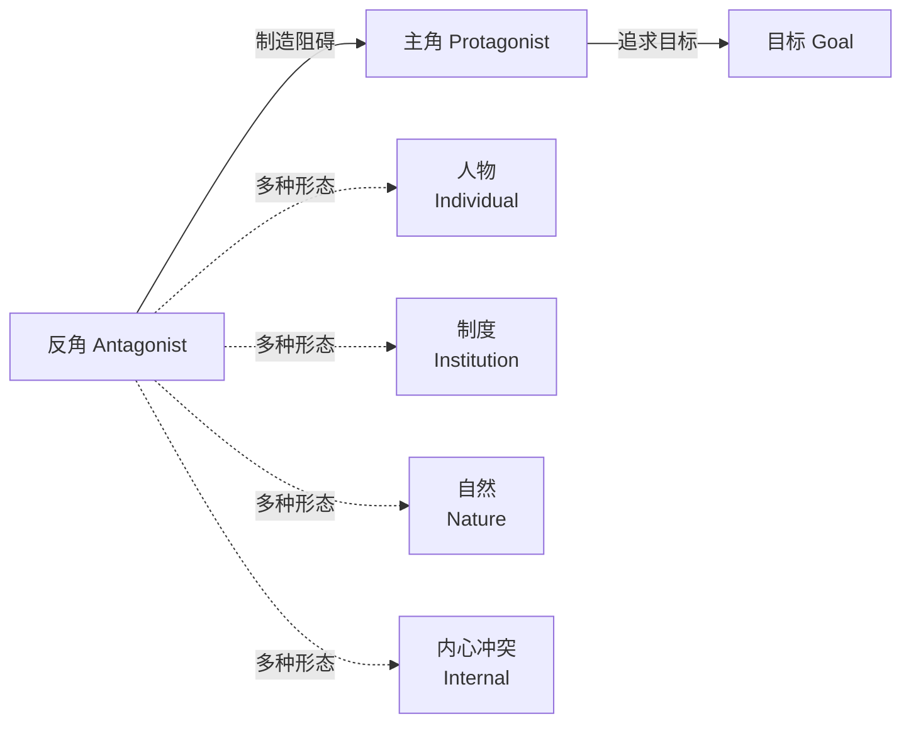
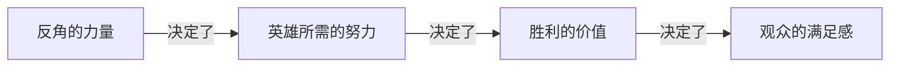

# 第19课：主角与反角

## 学习目标

- 理解主角与反角的本质关系
- 掌握"反角不必是坏人"的核心原则
- 认识没有传统反角的故事类型
- 理解"英雄的强度取决于对手的力量"

## 反角不是"坏人"

在许多写作者的第一直觉中，**Antagonist** = 坏人、反派、恶棍。这是最危险的简化之一。

> [!WARNING] 关键认知
> Antagonist 不是"坏人"——它是**阻碍主角达成目标的力量**。
>
> 这股力量可以是一个人、一群人、一个制度、一种自然力量，甚至可以是主角自己。



## 反角的动机必须可共情

看看《绝命毒师》(Breaking Bad) 的 Walter White：

- 他是一个制造冰毒的毒贩——从任何社会标准来看，他都是一个"坏人"
- 但他的动机是**共情可理解的**（empathizable）：身患绝症，想为家人留下一笔钱
- 观众**不认同**他的选择，但**理解**他为什么做出这些选择

> [!TIP] 反角塑造的核心原则
> **如果观众无法理解反角的动机，故事就失去了张力。**
>
> 最有力的反角，是那些让观众在某个层面上**部分同意**他们的角色。
>
> 一个纯粹邪恶、没有任何可理解动机的反角，只会让故事变得浅薄。

### 为什么动机必须可共情？

因为知识缺口需要**有价值的信息**来填补。如果反角只是一个"无缘无故的坏人"，那么：

- 角色之间的知识缺口变得单一（他会在什么时候再次作恶？）
- 观众没有兴趣去探索反角的内心世界
- 故事失去了深度和层次

## 没有反角的故事

并非所有故事都需要一个传统意义上的 antagonist。看看这些例子：

| 故事 | 取代反角的元素 |
|------|--------------|
| **Amelie (天使爱美丽)** | 内心孤独 + 帮助他人的渴望 |
| **Juno (朱诺)** | 意外怀孕带来的生活困境 + 自我成长 |
| **Mary Poppins (欢乐满人间)** | 家庭功能的缺失 + 需要被修复的关系 |

在这些故事中，"阻碍力量"不是某个具体的反派角色，而是：

1. **内在冲突 (Internal Conflict)**：角色与自己的恐惧、信念、局限作斗争
2. **制度性冲突 (Institutional Conflict)**：社会规则、家庭传统、职场文化成为阻碍
3. **两难困境 (Dilemma)**：没有"坏人"，但角色必须在两个有价值的选择之间做出艰难抉择

```mermaid
flowchart TD
    subgraph ”没有传统反角的故事”
        A[主角] -->|内在冲突| B[自己与自己]
        A -->|制度冲突| C[社会/家庭/职场]
        A -->|两难困境| D[选择A ⇄ 选择B]
    end
```

> [!NOTE] 这对写作者意味着什么
> 如果你正在构思的故事没有"坏人"，不用担心。你只需要明确：**什么力量在阻碍你的主角？** 这个力量不需要有人格——但它必须真实、强大、难以克服。

## 英雄的强度取决于对手的力量

有一个黄金法则：**A hero is only as strong as the demands placed on them.**

- 如果反角很弱，主角的胜利毫无意义
- 如果阻碍很小，主角的成长无法令人信服
- 如果冲突很浅，故事的满足感就很低



### 应用原则

在塑造反角或阻碍力量时，问自己：

1. 这个阻碍力量是否**真正威胁**到主角的核心价值？
2. 主角是否必须**付出巨大代价**才能克服它？
3. 克服之后，主角是否**不再是**原来的自己？

如果三个答案都是"是"，你的故事就有了坚实的基础。

## 自检练习

> [!QUESTION] 分析练习
> 选择你最喜欢的一个"反派"角色。列出TA的动机，并分析这些动机是否可共情。如果完全不可共情，这个角色为什么仍然有效（或无效）？

<details>
<summary>参考示例：灭霸 (Thanos, Avengers: Infinity War)</summary>

动机：认为宇宙资源有限，消灭一半生命可以拯救剩下的生命。

是否可共情：在逻辑层面上是**可理解的**（资源有限确实是现实问题），但在道德层面上是**不可接受的**（屠杀不是解决方案）。

为什么有效：因为他的动机触及了一个真实的问题，让观众在"他的逻辑有道理"和"他的做法是罪恶的"之间产生张力。这种内部矛盾使反角变得有深度。

</details>

> [!QUESTION] 创作练习
> 如果你正在创作一个故事，但还没有明确的反角——请写下阻碍主角的"力量"。它是一个人？一个信念？一个社会规则？还是主角自己？

## 回顾清单

- [ ] 我理解了 Antagonist = 阻碍主角的力量，不一定是"坏人"
- [ ] 我掌握了反角动机必须可共情的原则
- [ ] 我认识了没有传统反角的故事类型（内在冲突、制度冲突、两难困境）
- [ ] 我理解了"英雄的强度取决于对手的力量"

---

**下一步**：继续学习 [[0020-character-motivation|第20课：角色动机]]