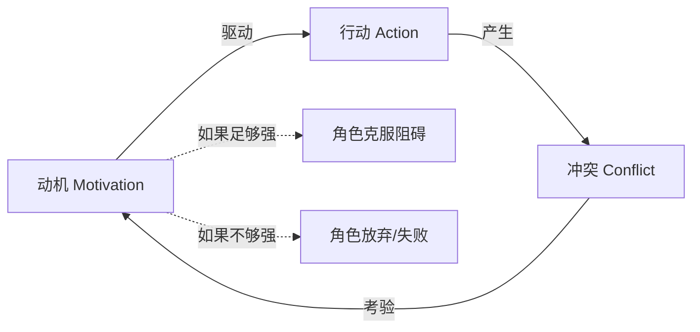

# 第20课：角色动机

## 学习目标

- 理解动机作为故事核心引擎的地位
- 掌握"想要 vs 需要"的二分法
- 通过 Frozen 短片分析动机如何创造故事
- 理解"动机不匹配"作为故事驱动力

## 动机是故事的核心引擎

在第18课中我们建立了：**Mimesis = 角色采取行动**。现在的问题是：**角色为什么行动？**

答案就是 **Motivation（动机）**。

> [!NOTE] 核心命题
> **每一个故事 = 一个被驱动的角色，在追求实现某个满足状态的过程。**
>
> 没有动机，就没有行动。没有行动，就没有故事。



## 作者的工作：考验动机

如果你的角色想要某样东西，作为作者，你的工作不是"帮助TA得到它"——恰恰相反：

> **你的工作是考验这个动机到底有多强。**

创作者的任务清单：

| 考验维度 | 具体问题 |
|---------|---------|
| **强度** | 为了达成目标，TA愿意付出什么代价？ |
| **韧性** | 遇到挫折时，TA会继续坚持还是放弃？ |
| **代价** | TA愿意牺牲什么？关系？道德？生命？ |
| **转化** | 在追求过程中，TA的目标本身是否会改变？ |

> [!TIP] 动机的极限测试
> 如果你不确定角色的动机是否够强，问：**"如果TA得不到这个东西，最坏的结果是什么？"**
>
> 如果答案是"也没什么大不了的"，那这个动机不足以支撑一个故事。

## 想要 vs 需要：故事的核心张力

这是角色动机中最强大的工具之一：

| 概念 | 定义 | 问题 |
|------|------|------|
| **Want（想要）** | 角色的外显目标 | 角色在故事开始时想要什么？ |
| **Need（需要）** | 角色的内在成长 | 角色真正需要什么才能获得满足？ |

**故事的力量就在于"想要"和"需要"之间的不匹配。**

```mermaid
flowchart TD
    subgraph ”故事开始时”
        A[角色：我想要 X] -->|驱动外显行动| B[外部弧 Outer Arc]
    end
    subgraph ”故事过程中”
        C[冲突揭示] --> D[你真正需要的是 Y]
    end
    subgraph ”故事结束时”
        E[角色同时获得 X 和 Y<br/>或者选择 Y 放弃 X] --> F[真正的满足]
    end
```

## Frozen 短片深度分析

让我们用动机理论重新审视课程开篇的 Frozen 短片（80秒）。

### 角色动机拆解

**Olaf（雪人）——想要 vs 需要**

| 层面 | 内容 |
|------|------|
| Want | 拿回胡萝卜鼻子（这是他的外显目标） |
| Need | 被接纳、被允许在这个世界上存在 |
| 证据 | 当他发现 Sven 想要胡萝卜时，他选择放弃——但这不是因为他不需要鼻子，而是因为他在乎与 Sven 的关系 |

**Sven（麋鹿）——想要 vs 需要**

| 层面 | 内容 |
|------|------|
| Want（表面上） | 胡萝卜（看起来像食物） |
| Need（实际上） | 玩耍——和 Olaf 互动、建立连接 |
| 证据 | 最终的转折：Sven 把胡萝卜放回 Olaf 脸上，然后叼来一根树枝——"捡回来" |

### 动机不匹配 = 故事

> [!NOTE] 关键洞察
> 这个故事之所以"有故事"，不是因为"雪人想要鼻子"这个简单的动机——而是因为**两个角色的动机发生了不匹配**：
>
> - Olaf 以为 Sven 想要吃胡萝卜
> - Sven 其实想要玩"捡回来"的游戏
> - 这个**认知缺口**需要被揭示和填补
> - 当真相揭示时（Sven 把胡萝卜放回去），故事完成了

如果把动机改成完全匹配：Sven 直接拿起胡萝卜吃掉 → Olaf 再拿一根新的 → 结束。这仍然是一个"事件"，但**不是一个故事**。因为没有知识缺口，没有张力，没有满足。

## 应用：如何设计角色动机

### 第一步：明确 Want

> 你的角色在故事开始时，**明确地想要什么？**

要求：这个目标必须是**具体的**、**外显的**、**可被观众理解的**。

### 第二步：发现 Need

> 在故事的表层目标之下，你的角色**真正需要什么？**

要求：Need 往往是**抽象的**——安全感、被认可、归属感、自我价值。角色自己可能都没有意识到这个 Need。

### 第三步：创造不匹配

> Want 和 Need 之间的差距，就是你故事的空间。

- 有时候角色实现了 Want，但发现这不是自己真正需要的（《公民凯恩》）
- 有时候角色放弃 Want，选择 Need（《冰雪奇缘》Elsa 放下恐惧接纳自己）
- 有时候 Want 本身就是 Need 的体现，只是角色自己不知道（《黑客帝国》Neo 想要答案 = 需要理解自己的身份）

## 自检练习

> [!QUESTION] 动机分析
> 选择一个你熟悉的角色（电影、小说、剧集），明确列出TA的 Want 和 Need。这两者之间的差距是什么？这个差距是如何推动故事的？

<details>
<summary>参考示例：《星球大战》Luke Skywalker</summary>

**Want**: 离开 Tatooine，加入 Rebellion，成为英雄
**Need**: 理解自己与父亲的关系，接受自己的身份，成为真正的 Jedi

**差距**: Luke 最初认为"成为英雄"意味着打败坏人、拯救公主。但他真正需要的是面对自己的恐惧——也就是他父亲的黑暗面。这个差距贯穿了整个三部曲。

</details>

## 回顾清单

- [ ] 我理解了动机是故事的核心引擎
- [ ] 我能列出作者考验动机的四个维度（强度、韧性、代价、转化）
- [ ] 我掌握了 "Want vs Need" 的分析框架
- [ ] 我能识别动机不匹配如何创造故事
- [ ] 我能在自己的故事设计中应用"想要-需要"模型

---

**下一步**：继续学习 [[0021-inner-outer-arcs|第21课：内弧与外弧]]