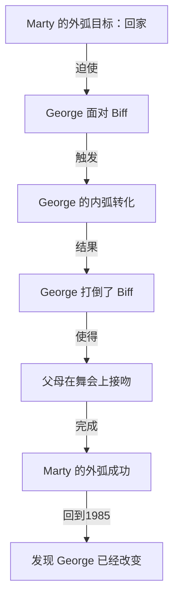

# 第21课：内弧与外弧

## 学习目标

- 区分外弧（Outer Arc）与内弧（Inner Arc）
- 理解为什么最强有力的故事需要双重弧线
- 掌握内弧是 storification 的真正载体
- 通过 Back to the Future 分析双层弧线

## 两个弧线

一个角色的旅程总是包含两个层面：

| 弧线 | 定义 | 可观察性 |
|------|------|---------|
| **外弧 (Outer Arc)** | 角色的**可见目标**——TA 试图在外部世界中实现什么 | 可以被所有角色观察到 |
| **内弧 (Inner Arc)** | 角色的**价值观、信念、身份的转化**——TA 在旅程中如何改变 | 只有观众/读者可以完整感知 |

```mermaid
flowchart TB
    subgraph ”完整的故事结构”
        direction TB
        A[外弧 Outer Arc] --> B[创造情节事件]
        C[内弧 Inner Arc] --> D[创造故事意义]
        B & D --> E[Storification]
    end
```

## 外弧：看得见的旅程

外弧是故事的**脊椎**——它提供了：

- 清晰的目标（"救公主"、"找宝藏"、"赢比赛"）
- 可追踪的进展（成功/失败/转折）
- 观众锚定注意力的焦点

> [!NOTE] 外弧的本质
> 外弧是**接收者最容易感知**的部分。当别人问你"这个电影讲什么"，你通常回答的是外弧：
>
> "一个 teenager 回到过去，要确保自己的父母相遇相爱。"
> —— Back to the Future 的外弧

外弧创造了**情节**。没有外弧，故事就没有前进的方向和动力。

## 内弧：看不见的旅程

内弧是故事的**灵魂**——它提供了：

- 角色成长的价值（从懦弱到勇敢、从自私到无私）
- 故事主题的具象化（"勇气就是面对恐惧"）
- 观众情感共鸣的锚点

> [!NOTE] 内弧的本质
> 内弧通常**不被故事中的其他角色所察觉**——只有观众/读者和角色自己知道。
>
> 这正是知识缺口的来源：观众可以看到角色的内心变化，而其他角色看不到，这种差异创造了戏剧张力。

内弧创造了**意义**。没有内弧，故事只是一个"事件列表"。

## 双重弧线：最强大的组合

```mermaid
flowchart LR
    subgraph ”外弧 Outer Arc”
        A1[目标 Goal] --> A2[行动 Action]
        A2 --> A3[障碍 Obstacle]
        A3 --> A4[胜利/失败]
    end
    subgraph ”内弧 Inner Arc”
        B1[旧信念] --> B2[挑战]
        B2 --> B3[转化]
        B3 --> B4[新身份]
    end
    A2 -.->|压力| B2
    B3 -.->|改变行动方式| A3
```

内外弧之间的互动关系：

- 外弧的**压力**考验内弧，逼迫角色面对自己的局限
- 内弧的**转化**改变角色的行动方式，进而影响外弧的走向
- 两者在故事的**高潮点**交汇——角色在外弧上做出最终行动，这个行动同时标志着内弧的完成

## 案例深度分析：Back to the Future

| 弧线 | 角色 | 内容 |
|------|------|------|
| 外弧 | Marty McFly | 回到1985年，确保自己的父母相遇结婚 |
| 内弧 | George McFly | 从懦弱无能 → 找到勇气的信念转化 |

### 外弧详细

Marty 的外弧是**生存驱动**的：如果他不能在1955年让 Lorraine 和 George 相爱，他自己将不复存在。

- 目标极其清晰：让父母在"Enchantment Under the Sea"舞会上接吻
- 进展可追踪：从失败（Lorraine 喜欢上 Marty）→ 逐步修正 → 最终成功
- 时间限制增加紧迫感：闪电击中钟楼的精确时刻

### 内弧详细

故事的真正情感核心不在 Marty 身上——**而在 George McFly 身上**。

> [!TIP] 关键洞察
> 表面上看，Marty 是主角——但故事**真正的内弧承载者是 George**。

George 的转化：

1. **起点**：被 Biff 欺凌的懦弱高中生，不敢反抗，放弃写作梦想
2. **考验**：Marty 的介入逼迫 George 面对 Biff（"你是想让我上去打他一顿，还是你自己来？"）
3. **转化时刻**：George 最终一拳打倒 Biff，在舞会上自信地拥抱 Lorraine
4. **终点**：1985年的 George 成为了自信的作家，有了幸福的家庭

### 内外弧的整合



### 故事的意义在哪里？

如果 Back to the Future 只有外弧（Marty 成功回家），它仍然是一部合格的科幻冒险片——但不会是经典。

让它成为经典的是**内弧**：一个被生活压垮的男人，在来自未来的少年的帮助下，重新找回了自己的勇气和信念。这才是观众真正被感动的原因。

> **外弧让你想知道"接下来会发生什么"；内弧让你在意"这对他来说意味着什么"。**

## Storification 的真正载体

回到课程的核心概念：**Storification（意义生成）**。

接收者在故事结束后并不会停留在"事件记忆"上——他们会把故事转化为**对自己有意义的信念**：

- "勇气是可以选择的"
- "改变永远不晚"
- "做真实的自己才是力量的来源"

这些信念来自哪里？不是来自外弧的情节事件——**而是来自内弧的角色转化**。

> [!WARNING] 对写作者的警示
> 如果你只设计了外弧（发生了 A，然后 B，然后 C），你创造了情节，但没有创造 storification 的载体。
>
> 只有当事件**改变了角色**，接收者才能从中提取意义。内弧才是 storification 的真正载体。

## 自检练习

> [!QUESTION] 双重弧线分析
> 回想一个让你深受感动的故事。它有一个清晰的外弧（主角试图达成什么目标），但它也有一个内弧（主角在信念上经历了什么变化）。写下这两个弧线。

<details>
<summary>参考示例：《瞬息全宇宙》(Everything Everywhere All At Once)</summary>

**外弧**：Evelyn 必须穿越多重宇宙，收集能力，击败 Jobu Tupaki。

**内弧**：Evelyn 从"我只想控制一切、证明自己是对的"→ 学会 "接纳混乱、用善良代替控制"。

**交汇点**：高潮处 Evelyn 放弃"战斗"（外弧上的失败），选择同理心（内弧的完成），却反而化解了冲突。

</details>

## 回顾清单

- [ ] 我能清晰区分外弧（可见目标）和内弧（价值观转化）
- [ ] 我理解了为什么最强有力的故事需要双重弧线
- [ ] 我掌握了内外弧之间的互动关系（外弧制造压力，内弧提供意义）
- [ ] 我理解了内弧是 storification 的真正载体
- [ ] 我能通过 Back to the Future 的案例解释双重弧线

---

**下一步**：继续学习 [[0022-action-dialogue|第22课：行动与对话]]