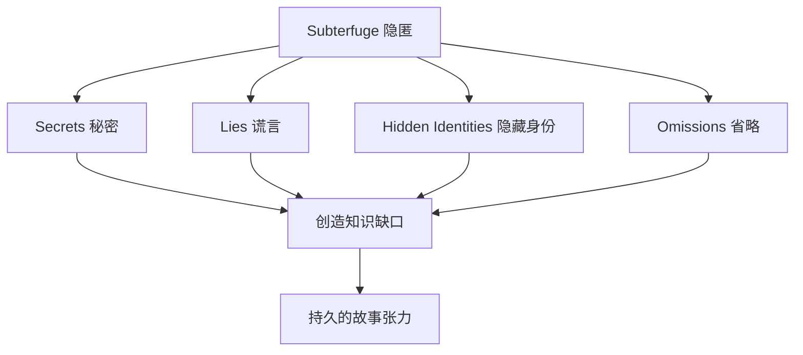

# 第23课：隐匿

## 学习目标

- 理解 Subterfuge（隐匿）作为故事引擎的核心机制
- 掌握隐匿的四层模型
- 分析 Breaking Bad 中 Heisenberg 身份的知识缺口
- 理解"特权 vs 启示"如何在隐匿中制造持久张力

## Subterfuge：最持久的知识缺口

在所有创造知识缺口的技术中，**Subterfuge（隐匿/秘密）** 是最强大的之一。一个精心设计的秘密可以支撑整个故事——从第一页到最后一页。

> [!NOTE] Subterfuge 的定义
> Subterfuge = 一个角色（或叙述者）故意隐藏信息，制造知识缺口。
>
> 它可以表现为：
> - **Secrets（秘密）**：角色知道某些事，但选择不说
> - **Lies（谎言）**：角色故意给出错误信息
> - **Hidden Identities（隐藏身份）**：角色以虚假的面目出现
> - **Omissions（省略）**：角色回避某些话题



## 隐匿的四层模型

Subterfuge 可以在故事的四个不同层面上运作。每一层都在接收者心中制造不同性质的知识缺口。

### 第一层：角色对其他角色有秘密

这是最基础的隐匿形式。

- 一个角色知道某件事，但其他角色不知道
- **知识缺口位置**：角色之间
- **接收者的位置**：可能是特权（我们知道秘密），也可能是启示（我们和其他角色一样不知道）

**例**：《甄嬛传》中甄嬛的真实动机——其他妃嫔不知道，但观众是知道的。

### 第二层：角色对观众有秘密

故事中最大的"反转"来源。

- 角色知道某件事，但观众不知道
- **知识缺口位置**：角色与观众之间
- **接收者的位置**：启示（我们和其他角色一样被蒙在鼓里）

**例**：《第六感》(The Sixth Sense) —— Bruce Willis 的角色已经死亡，但观众直到结尾才知道。

### 第三层：叙述者不可靠（对读者撒谎）

这是最精妙的隐匿形式之一。

- 叙述者本身在向接收者提供**有偏差的**信息
- **知识缺口位置**：叙述者与接收者之间
- **接收者的位置**：最初是启示（我们相信叙述者），后来是特权（我们发现叙述者在撒谎）

**例**：《洛丽塔》中 Humbert Humbert 的叙述——他试图美化自己的行为，但接收者逐渐发现叙述的不可靠。

> [!TIP] 不可靠叙述者的力量
> 不可靠叙述者之所以强大，是因为它创造了一个**元层次的知识缺口**：接收者不仅要填补故事中的情节缺口，还要判断叙述本身的可信度。这迫使接收者成为更主动的故事参与者。

### 第四层：作者对接收者隐瞒上下文

- 作者选择性地**延迟提供**关键信息
- 这不是角色或叙述者的"欺骗"，而是作者的**叙事策略**
- **知识缺口位置**：作者与接收者之间
- **接收者的位置**：完全未知（我们甚至不知道自己不知道）

**例**：《权力的游戏》第一季——观众直到结尾才知道 Ned Stark 的真正计划。作者 Roland Barthes 称之为"Hermeneutic Code"（阐释编码）——故事围绕一个谜团展开，逐步释放信息。

```mermaid
flowchart LR
    subgraph ”四层隐匿模型”
        L1[第一层<br/>角色↔角色] -->|秘密| G1[角色之间的张力]
        L2[第二层<br/>角色↔观众] -->|反转| G2[惊喜与揭示]
        L3[第三层<br/>叙述者↔接收者] -->|不可靠| G3[元层次参与]
        L4[第四层<br/>作者↔接收者] -->|延迟信息| G4[探索与发现]
    end
```

## 案例深度分析：Breaking Bad 的 Heisenberg

《绝命毒师》(Breaking Bad) 是运用 subterfuge 的典范——整个系列的核心知识缺口由 Walter White 的秘密身份 Heisenberg 创造。

### 基本设定

| 信息 | 内容 |
|------|------|
| 公共身份 | Walter White —— 高中化学老师，身患肺癌，平凡的中年男人 |
| 秘密身份 | Heisenberg —— 地下冰毒制造者，冷酷、精明、危险 |
| 知道秘密的人 | Jesse（最初）、Skyler（后来发现）、Mike、Gus 等 |
| 不知道的人 | Hank（DEA 探员，Walter 的妹夫——直到最终季）、Walter Jr.、Marie |

### 特权与启示的动态变化

```mermaid
flowchart TD
    subgraph ”初期（第1-2季）”
        A1[观众：知道 Heisenberg = Walter] -->|特权| B1[紧张：Hank 就在现场却不知道]
        A2[Hank：完全不知情] -->|启示| B1
    end
    subgraph ”中期（第3-4季）”
        C1[Skyler：发现真相] -->|从启示到特权| D1[更多角色进入特权]
    end
    subgraph ”最终季”
        E1[Hank：终于发现] -->|终极反转| F1[所有主要角色都知道]
        F1 --> G1[知识缺口关闭<br/>故事进入最后阶段]
    end
```

> [!NOTE] Heisenberg 的秘密为何如此持久
> Breaking Bad 能够围绕一个秘密维持 60+ 集的张力，原因在于：
>
> 1. **秘密的价值极高**：如果暴露，Walter 将失去一切——家庭、自由、生命
> 2. **知道的人逐步增加**：每增加一个"知情者"，都创造新的紧张源
> 3. **核心对立关系**：Hank（追捕 Heisenberg 的 DEA 探员）是 Walter 的家人——"我追捕的罪犯就在我的餐桌上"
> 4. **秘密本身在演变**：Walter 从"为了家人"到"为了自我"——秘密的含义在变化

### 四层模型在 Breaking Bad 中的应用

| 层次 | 体现 |
|------|------|
| 第一层（角色↔角色） | Walter 对 Hank 隐瞒身份 |
| 第二层（角色↔观众） | 在揭示 Walt 就是 Heisenberg 之前（第一季前半段），观众也不知道 |
| 第三层（叙述者不可靠） | Breaking Bad 没有传统叙述者，但 Walter 经常对 Jesse 撒谎 |
| 第四层（作者延迟信息） | "Gus 的真正动机"——作者逐步释放信息，持续制造悬念 |

## 隐匿的代价

虽然 subterfuge 是强大的故事引擎，但它需要**代价**。

> [!WARNING] 隐匿的代价
> 每一个秘密都需要被**揭示**——否则接收者会感到被欺骗。
>
> 秘密越大，揭示的时刻就必须越重要。如果你建立了一个巨大的秘密，却用一个微小的揭示来收尾，你的故事将功亏一篑。

### 设计秘密时的自检清单

1. **这个秘密是否被充分铺垫？** ——接收者应该能在揭示后回想前文，发现线索
2. **揭示的时刻是否具有足够的戏剧重量？** ——它应该是故事的一个重要节点
3. **揭示之后会怎样？** ——秘密揭示不应该是故事的终点，而应该是故事的新起点
4. **秘密的存在是否改变了角色的行为？** ——如果秘密对角色行为没有影响，它可能不需要存在

## 自检练习

> [!QUESTION] 隐匿分析
> 选择一个包含"大秘密"的故事。运用四层模型分析：
> 1. 秘密在哪一层运作？
> 2. 谁拥有特权信息？谁处于启示状态？
> 3. 秘密维持了多久？揭示的时刻如何？

<details>
<summary>参考示例：《寄生虫》(Parasite)</summary>

**第一层（角色↔角色）**：金家四人隐藏真实身份和关系，分别潜入朴家工作。这是影片前中段的核心张力来源。

**特权 vs 启示**：观众从一开始就知道金家的秘密——我们处于特权位置。看着朴家毫无察觉，产生了强烈的紧张感。

**揭示**：前管家发现秘密 → 两个家庭的在地下室的终极对峙。这个揭示不是故事的终点，而是第三幕的起点。

**作者延迟信息（第四层）**：前管家丈夫藏在地下室的信息被逐步释放——作者在影片进行到一半时才揭示这个更深的秘密。

</details>

## 回顾清单

- [ ] 我理解了 Subterfuge 是制造持久知识缺口的强大工具
- [ ] 我能识别隐匿的四层模型（角色↔角色、角色↔观众、叙述者↔接收者、作者↔接收者）
- [ ] 我能分析 Breaking Bad 中 Heisenberg 的秘密如何创造持久张力
- [ ] 我理解了特权与启示在隐匿中的动态关系
- [ ] 我掌握了设计秘密时的自检清单

---

**下一步**：继续学习 Module 5 的内容（即将推出）