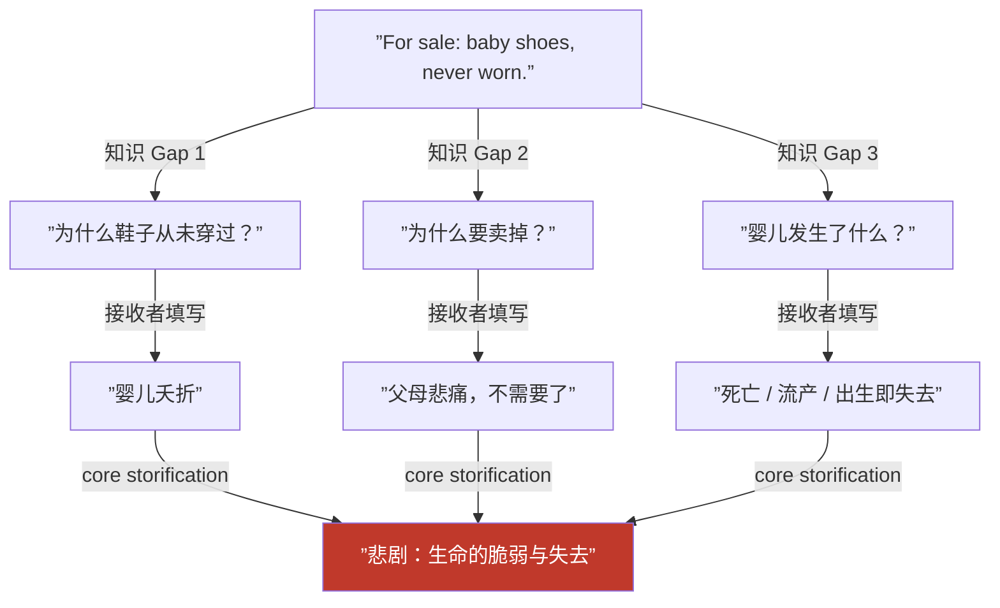
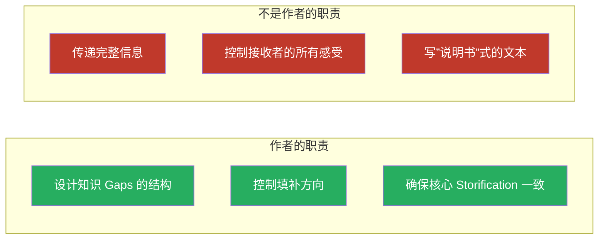

# 第24课：接收者的角色

## 核心命题

**没有接收者，就没有故事——只有信息。**

作者创造知识 gaps，但填补 gaps 的是接收者。Storification（意义化）不是发生在纸面上，而是发生在接收者的心智中。作者的职责不是"传递意义"，而是**为期待中的 storification 创造最佳条件**。

## 接收者不是被动的容器

传统模型认为作者发送"信息"，接收者接收"信息"。这是错的。

接收者主动参与意义建构：

- 每个知识 gap 都需要接收者调用自己的**生命经验**来填补
- 不同的接收者可能填补出不同的具体细节
- 但**精心设计的 gaps 会产生高度一致的 core storification**

> [!note]
> 作者控制的是 gaps 的结构和方向，而不是最终的 storification 本身。好的故事设计 = 精确控制 gaps 使得绝大多数接收者得出接近的 storification。

## 经典案例：Hemingway 的六字故事

> For sale: baby shoes, never worn.

这个文本没有任何情感词汇，但几乎所有接收者都会得到大致相同的 storification——悲剧、失去、未出生的孩子。

> [!question]
> 不同的读者对这个故事可能填补出不同的"具体细节"（是流产？是猝死？是出生后夭折？），但 core storification 却高度一致。为什么会这样？因为 Hemingway 设计的 gaps 限制了填补范围——所有合理的填补都通向"失去"这一核心。

## 接收者的多样性 vs 核心一致性

| 维度 | 可变（不同接收者） | 恒定（设计目标） |
|------|-------------------|-----------------|
| 具体细节 | 年龄、地点、时间 | 情感方向 |
| 情绪强度 | 个人经历影响阈值 | 核心情绪类型 |
| 道德判断 | 文化背景影响 | 道德立场倾向 |
| 画面想象 | 视觉偏好 | 场景关键元素 |

> [!tip]
> 作为作者，你的工作是：**在关键 gaps 上做精确设计，在非关键 gaps 上允许自由**。不是所有 gaps 都需要精确控制——有些留白反而是魅力。

## 接收者的三种填补方式

1. **经验填补**：调用自己的类似经历来理解角色的感受
2. **逻辑填补**：根据因果关系推断缺失环节（如"卖了鞋→婴儿没了→悲剧"）
3. **文化填补**：使用所处文化中的原型和模式来理解（如英雄旅程、牺牲救赎等模板）

这三种方式共同作用，让同一个故事在不同接收者心中产生独特的 storification。

> [!warning]
> 一个常见的错误是"过度写作"——作者害怕接收者无法理解，于是把所有东西都写出来。这实际上扼杀了 storification，因为接收者失去了参与填补的机会。好的故事是"说一半，留一半"。

## 作者的真正职责

## 【自我检测】

点击展开

**问题 1**：为什么说"没有接收者就没有故事"？

> 因为 storification 发生在接收者的心智中。作者创造的是信息结构和知识 gaps，而这些 gaps 必须由接收者用自己的经验来填补，才会产生意义。没有接收者的参与，文本只是一堆符号排列。

**问题 2**：Hemingway 六字故事中，哪些知识 gaps 是精确控制的？

> 三个核心 gap：(1) 鞋子从未穿过；(2) 鞋子在出售；(3) 这是婴儿的鞋。这三个事实的组合限制了填补方向，使任何合理的填补都导向"失去/死亡/悲剧"这一 core storification。

**问题 3**：过度写作为什么是危险的？

> 当作者把所有细节都写明时，接收者就没有需要填补的 gaps 了。此时故事变成了信息传递，失去了 storification 的深度。接收者没有参与感，也就不会产生深刻的情感共鸣。

---

## 回顾清单

- [ ] 我理解接收者是故事的共同创造者
- [ ] 我能在我的故事中识别出设计好的知识 gaps
- [ ] 我能区分"精确控制的关键 gap"和"允许自由的非关键 gap"
- [ ] 我避免过度写作，为接收者留出填补空间

---

**下一步：[第25课：超越目标](/lessons/0025-surpassing-aim.md)**